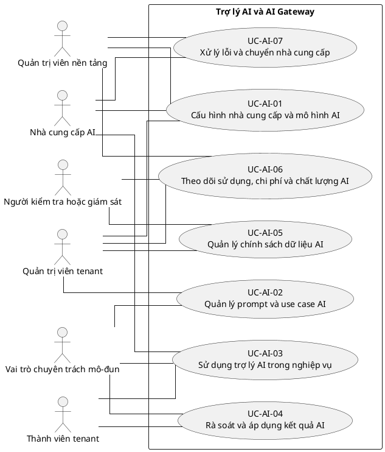

# UC-AI — Trợ lý AI và AI Gateway

## 1. Thông tin tài liệu

| Thuộc tính | Nội dung |
|---|---|
| Mã nhóm Use Case | `UC-AI` |
| Miền nghiệp vụ | Năng lực AI |
| Mức ưu tiên | Mở rộng có kiểm soát |
| Phiên bản mô hình | V4 — tinh gọn theo mục tiêu actor |

## 2. Mục tiêu

Cung cấp năng lực AI có cấu hình, kiểm soát dữ liệu, xác nhận con người và khả năng giám sát.

## 3. Nguyên tắc phân rã

> Mỗi Use Case dưới đây đại diện cho một mục tiêu nghiệp vụ có kết quả quan sát được. Các thao tác chi tiết được hợp nhất vào cột **Nội dung bao hàm**, luồng nghiệp vụ và quy tắc; không tiếp tục tách thành các Use Case nhỏ.

## 4. Danh mục Use Case chính

| Mã | Use Case | Actor chính/hỗ trợ | Kết quả nghiệp vụ | Nội dung bao hàm |
|---|---|---|---|---|
| `UC-AI-01` | **Cấu hình nhà cung cấp và mô hình AI** | `ACT-PLATFORM-ADMIN` — Quản trị viên nền tảng `ACT-TENANT-ADMIN` — Quản trị viên tenant `ACT-AI-PROVIDER` — Nhà cung cấp AI | Provider, model, secret, fallback và kết nối được cấu hình an toàn. | Danh sách provider, connection, model mặc định/theo use case, fallback và secret. |
| `UC-AI-02` | **Quản lý prompt và use case AI** | `ACT-TENANT-ADMIN` — Quản trị viên tenant `ACT-MODULE-SPECIALIST` — Vai trò chuyên trách mô-đun | Prompt template được tạo, version, kiểm thử và gắn module. | Tạo/sửa/version prompt, biến ngữ cảnh, test dữ liệu mẫu và phê duyệt. |
| `UC-AI-03` | **Sử dụng trợ lý AI trong nghiệp vụ** | `ACT-TENANT-MEMBER` — Thành viên tenant `ACT-MODULE-SPECIALIST` — Vai trò chuyên trách mô-đun `ACT-AI-PROVIDER` — Nhà cung cấp AI | Người dùng nhận kết quả AI cho tác vụ được phép. | Sinh nháp, tóm tắt, trích xuất, phân loại, dịch, viết lại, semantic search, Q&A và insight. |
| `UC-AI-04` | **Rà soát và áp dụng kết quả AI** | `ACT-TENANT-MEMBER` — Thành viên tenant `ACT-MODULE-SPECIALIST` — Vai trò chuyên trách mô-đun | Kết quả AI được chỉnh sửa, chấp nhận, từ chối hoặc phản hồi trước khi áp dụng. | Human review, edit, accept/reject, feedback và lưu provenance. |
| `UC-AI-05` | **Quản lý chính sách dữ liệu AI** | `ACT-TENANT-ADMIN` — Quản trị viên tenant `ACT-AUDITOR` — Người kiểm tra hoặc giám sát | Yêu cầu AI tuân thủ opt-in, role, module và bảo vệ dữ liệu nhạy cảm. | Opt-in/out, scope role/module, redaction, policy check, moderation và chặn dữ liệu. |
| `UC-AI-06` | **Theo dõi sử dụng, chi phí và chất lượng AI** | `ACT-TENANT-ADMIN` — Quản trị viên tenant `ACT-PLATFORM-ADMIN` — Quản trị viên nền tảng `ACT-AUDITOR` — Người kiểm tra hoặc giám sát | Lượt dùng, chi phí, hạn mức, lịch sử và chất lượng được giám sát. | Quota, cost, request history, retention, model evaluation và comparison. |
| `UC-AI-07` | **Xử lý lỗi và chuyển nhà cung cấp** | `ACT-AI-PROVIDER` — Nhà cung cấp AI `ACT-PLATFORM-ADMIN` — Quản trị viên nền tảng | Lỗi, timeout và fallback được xử lý mà không làm hỏng luồng nghiệp vụ chính. | Retry, timeout, circuit breaker, fallback provider/model và thông báo lỗi. |

## 5. Luồng nghiệp vụ cấp nhóm

1. Actor khởi phát một Use Case theo quyền và tenant context hiện hành.
2. Hệ thống kiểm tra xác thực, membership, permission, trạng thái tenant và module.
3. Hệ thống thực hiện luồng nghiệp vụ chính và các kiểm tra dữ liệu cần thiết.
4. Kết quả nghiệp vụ được lưu, thông báo cho bên liên quan và ghi audit khi thuộc danh mục bắt buộc.

## 6. Quy tắc nghiệp vụ cốt lõi

- Kết quả AI không được tự động tạo quyết định nhạy cảm nếu chưa có xác nhận con người.
- Dữ liệu gửi AI phải tuân theo tenant, role, consent và chính sách bảo mật.
- Lỗi AI không được chặn nghiệp vụ lõi khi có phương án thủ công.

## 7. Quan hệ với nhóm Use Case khác

[`UC-MODULE`](./07_UC-MODULE.md), [`UC-RBAC`](./04_UC-RBAC.md), [`UC-DOCUMENT`](./11_UC-DOCUMENT.md), [`UC-DASHBOARD`](./19_UC-DASHBOARD.md), [`UC-AUDIT`](./21_UC-AUDIT.md)

## 8. Use Case Diagram

## 9. Ghi chú truy vết từ V3

Các phần tử chi tiết của V3 thuộc nhóm này được giữ làm nguồn phân tích nhưng đã được hợp nhất vào Use Case chính, luồng, quy tắc hoặc yêu cầu hệ thống. Không xem số lượng phần tử V3 là số lượng Use Case nghiệp vụ của V4.