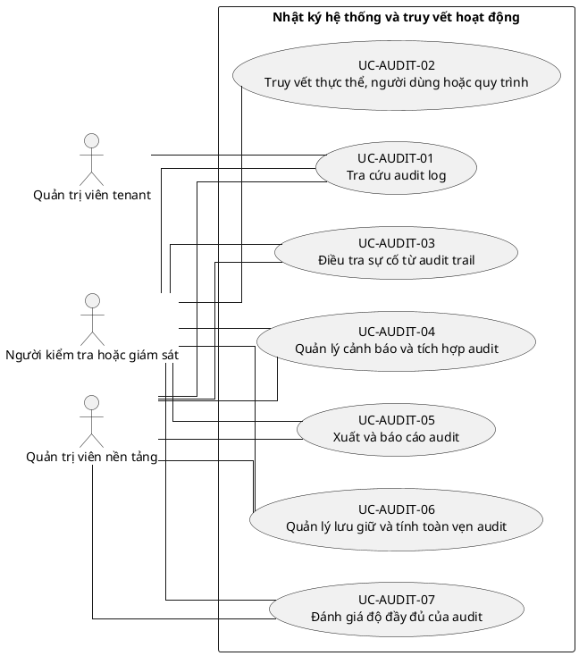

# UC-AUDIT — Nhật ký hệ thống và truy vết hoạt động

## 1. Thông tin tài liệu

| Thuộc tính | Nội dung |
|---|---|
| Mã nhóm Use Case | `UC-AUDIT` |
| Miền nghiệp vụ | Audit và tuân thủ |
| Mức ưu tiên | Nền tảng bắt buộc |
| Phiên bản mô hình | V4 — tinh gọn theo mục tiêu actor |

## 2. Mục tiêu

Cung cấp khả năng tra cứu, điều tra, báo cáo và bảo toàn audit trail; việc ghi log được đặc tả như yêu cầu xuyên suốt.

## 3. Nguyên tắc phân rã

> Mỗi Use Case dưới đây đại diện cho một mục tiêu nghiệp vụ có kết quả quan sát được. Các thao tác chi tiết được hợp nhất vào cột **Nội dung bao hàm**, luồng nghiệp vụ và quy tắc; không tiếp tục tách thành các Use Case nhỏ.

## 4. Danh mục Use Case chính

| Mã | Use Case | Actor chính/hỗ trợ | Kết quả nghiệp vụ | Nội dung bao hàm |
|---|---|---|---|---|
| `UC-AUDIT-01` | **Tra cứu audit log** | `ACT-AUDITOR` — Người kiểm tra hoặc giám sát `ACT-TENANT-ADMIN` — Quản trị viên tenant `ACT-PLATFORM-ADMIN` — Quản trị viên nền tảng | Audit event được tìm kiếm, lọc và xem chi tiết theo quyền. | Danh sách, filter theo actor/action/time/entity/tenant, detail và dữ liệu trước-sau được phép. |
| `UC-AUDIT-02` | **Truy vết thực thể, người dùng hoặc quy trình** | `ACT-AUDITOR` — Người kiểm tra hoặc giám sát | Chuỗi thay đổi được truy vết theo entity, user, tenant hoặc correlation ID. | Entity history, user activity, tenant activity và process trace. |
| `UC-AUDIT-03` | **Điều tra sự cố từ audit trail** | `ACT-AUDITOR` — Người kiểm tra hoặc giám sát `ACT-PLATFORM-ADMIN` — Quản trị viên nền tảng | Sự cố được lập hồ sơ, ghi chú, gắn bằng chứng và chain of custody. | Tạo case, lọc timeline, ghi chú, nhãn, bằng chứng và trạng thái điều tra. |
| `UC-AUDIT-04` | **Quản lý cảnh báo và tích hợp audit** | `ACT-AUDITOR` — Người kiểm tra hoặc giám sát `ACT-PLATFORM-ADMIN` — Quản trị viên nền tảng | Quy tắc bất thường tạo cảnh báo hoặc gửi sự kiện tới hệ thống ngoài. | Detection rule, alert, SIEM/webhook, xử lý cảnh báo và escalation. |
| `UC-AUDIT-05` | **Xuất và báo cáo audit** | `ACT-AUDITOR` — Người kiểm tra hoặc giám sát `ACT-PLATFORM-ADMIN` — Quản trị viên nền tảng | Audit log và báo cáo tuân thủ được xuất hoặc gửi định kỳ. | Export, scheduled report, dashboard compliance và audit export access. |
| `UC-AUDIT-06` | **Quản lý lưu giữ và tính toàn vẹn audit** | `ACT-PLATFORM-ADMIN` — Quản trị viên nền tảng `ACT-AUDITOR` — Người kiểm tra hoặc giám sát | Audit log được lưu giữ, archive, legal hold, kiểm chứng và xóa hết hạn theo chính sách. | Retention, long-term archive, legal hold, integrity verification và purge. |
| `UC-AUDIT-07` | **Đánh giá độ đầy đủ của audit** | `ACT-AUDITOR` — Người kiểm tra hoặc giám sát `ACT-PLATFORM-ADMIN` — Quản trị viên nền tảng | Hệ thống kiểm tra loại sự kiện bắt buộc đã được ghi nhận đầy đủ. | Coverage check, missing event report, schema validation và theo dõi khắc phục. |

## 5. Luồng nghiệp vụ cấp nhóm

1. Actor khởi phát một Use Case theo quyền và tenant context hiện hành.
2. Hệ thống kiểm tra xác thực, membership, permission, trạng thái tenant và module.
3. Hệ thống thực hiện luồng nghiệp vụ chính và các kiểm tra dữ liệu cần thiết.
4. Kết quả nghiệp vụ được lưu, thông báo cho bên liên quan và ghi audit khi thuộc danh mục bắt buộc.

## 6. Quy tắc nghiệp vụ cốt lõi

- Ghi audit là yêu cầu xuyên suốt, không phải Use Case do người dùng khởi phát.
- Audit log không được người dùng thông thường sửa hoặc xóa.
- Dữ liệu nhạy cảm phải được che hoặc loại bỏ khỏi audit theo chính sách.
- Việc xem hoặc xuất audit nhạy cảm cũng phải được audit.

## 7. Quan hệ với nhóm Use Case khác

[`UC-AUTH`](./02_UC-AUTH.md), [`UC-TENANT`](./01_UC-TENANT.md), [`UC-RBAC`](./04_UC-RBAC.md), [`UC-NOTIFICATION`](./18_UC-NOTIFICATION.md), [`UC-DASHBOARD`](./19_UC-DASHBOARD.md)

## 8. Use Case Diagram

## 9. Ghi chú truy vết từ V3

Các phần tử chi tiết của V3 thuộc nhóm này được giữ làm nguồn phân tích nhưng đã được hợp nhất vào Use Case chính, luồng, quy tắc hoặc yêu cầu hệ thống. Không xem số lượng phần tử V3 là số lượng Use Case nghiệp vụ của V4.