# OPERATIONS HUB — 21 NHÓM USE CASE V4

> Bản hợp nhất. Các liên kết tương đối trong từng phần được giữ theo cấu trúc thư mục V4.


---

<!-- SOURCE: 00_README.md -->

# OPERATIONS HUB — BỘ MARKDOWN 21 NHÓM USE CASE V4

## 1. Mục tiêu phiên bản

V4 tinh gọn mô hình Use Case theo **mục tiêu nghiệp vụ của actor**, khắc phục tình trạng phân rã quá mức ở V3. Chi tiết chức năng không bị loại bỏ mà được chuyển vào nội dung bao hàm, luồng, quy tắc hoặc yêu cầu hệ thống.

## 2. Thống kê

- 21 nhóm Use Case.
- 161 Use Case chính.
- Trung bình 7.7 Use Case/nhóm.
- Không có `PKG*`, không có quan hệ `<<contains>>`.
- Actor nối trực tiếp với Use Case nghiệp vụ.

## 3. Tệp chỉ mục

- [Hướng dẫn mô hình hóa V4](./00_Modeling_Guide_v4.md)
- [Actor](./00_Actors.md)
- [Use Case Diagram tổng quát](./00_Use_Case_Tong_Quat.md)
- [Danh mục Use Case chính](./00_Use_Case_Catalog_v4.md)
- [Ma trận Actor–Use Case](./00_Actor_UseCase_Matrix_v4.md)
- [Ma trận truy vết](./00_Traceability_Matrix.md)
- [Nguyên tắc hợp nhất V3 → V4](./00_V3_to_V4_Consolidation.md)
- [Changelog V4](./00_CHANGELOG_v4.md)

## 4. Danh sách 21 nhóm

- [`UC-TENANT` — Quản trị nền tảng SaaS và tenant](./01_UC-TENANT.md) — **10 Use Case chính**.
- [`UC-AUTH` — Xác thực và quản lý phiên](./02_UC-AUTH.md) — **7 Use Case chính**.
- [`UC-USER` — Quản lý tài khoản người dùng](./03_UC-USER.md) — **7 Use Case chính**.
- [`UC-RBAC` — Quản lý vai trò và phân quyền](./04_UC-RBAC.md) — **7 Use Case chính**.
- [`UC-ORG` — Quản lý thông tin và cơ cấu tổ chức](./05_UC-ORG.md) — **7 Use Case chính**.
- [`UC-BRAND` — Quản lý branding và giao diện tổ chức](./06_UC-BRAND.md) — **6 Use Case chính**.
- [`UC-MODULE` — Cấu hình module và quy trình nghiệp vụ](./07_UC-MODULE.md) — **7 Use Case chính**.
- [`UC-SETTING` — Thiết lập cá nhân](./08_UC-SETTING.md) — **6 Use Case chính**.
- [`UC-MEMBER` — Quản lý thành viên và membership](./09_UC-MEMBER.md) — **8 Use Case chính**.
- [`UC-REQUEST` — Quản lý đơn từ và yêu cầu nội bộ](./10_UC-REQUEST.md) — **8 Use Case chính**.
- [`UC-DOCUMENT` — Quản lý văn bản, biểu mẫu và mẫu tài liệu](./11_UC-DOCUMENT.md) — **8 Use Case chính**.
- [`UC-FINANCE` — Quản lý tài chính và ngân sách](./12_UC-FINANCE.md) — **10 Use Case chính**.
- [`UC-ASSET` — Quản lý tài sản và hậu cần](./13_UC-ASSET.md) — **9 Use Case chính**.
- [`UC-MEETING` — Quản lý cuộc họp, sự kiện và chuyên cần](./14_UC-MEETING.md) — **8 Use Case chính**.
- [`UC-DISCIPLINE` — Quản lý kỷ luật và KPI](./15_UC-DISCIPLINE.md) — **8 Use Case chính**.
- [`UC-EVALUATION` — Quản lý đánh giá thành viên](./16_UC-EVALUATION.md) — **8 Use Case chính**.
- [`UC-COMPETITION` — Quản lý cuộc thi, thành tích và ghi nhận](./17_UC-COMPETITION.md) — **9 Use Case chính**.
- [`UC-NOTIFICATION` — Quản lý thông báo và truyền thông nội bộ](./18_UC-NOTIFICATION.md) — **7 Use Case chính**.
- [`UC-DASHBOARD` — Dashboard, báo cáo và xuất dữ liệu](./19_UC-DASHBOARD.md) — **7 Use Case chính**.
- [`UC-AI` — Trợ lý AI và AI Gateway](./20_UC-AI.md) — **7 Use Case chính**.
- [`UC-AUDIT` — Nhật ký hệ thống và truy vết hoạt động](./21_UC-AUDIT.md) — **7 Use Case chính**.

---

<!-- SOURCE: 00_Modeling_Guide_v4.md -->

# HƯỚNG DẪN MÔ HÌNH HÓA USE CASE — V4

## 1. Mục tiêu tinh gọn

V4 khắc phục tình trạng phân rã quá mức của V3. Một Use Case chỉ được giữ độc lập khi nó biểu diễn **một mục tiêu nghiệp vụ có kết quả quan sát được đối với actor**.

## 2. Tiêu chí xác định một Use Case độc lập

Một hành vi được mô hình hóa thành Use Case khi đồng thời đáp ứng phần lớn điều kiện sau:

1. Có actor chính hoặc actor hỗ trợ xác định.
2. Có trigger nghiệp vụ rõ ràng.
3. Có kết quả hoặc giá trị quan sát được.
4. Có vòng đời hoặc quyền riêng đáng kể.
5. Có thể kiểm thử như một luồng nghiệp vụ hoàn chỉnh.

## 3. Nội dung không tách thành Use Case riêng

Các nội dung sau được đưa vào luồng chính, luồng thay thế, quy tắc nghiệp vụ hoặc yêu cầu hệ thống:

- CRUD chi tiết của cùng một đối tượng khi không tạo mục tiêu mới.
- Nhập từng trường, chọn từng bộ lọc hoặc thao tác UI nhỏ.
- Chuẩn hóa dữ liệu, validate, kiểm tra trùng, ghi audit.
- Retry, timeout, cache, pagination, token refresh và xử lý kỹ thuật.
- Một bước bắt buộc nằm trong cùng giao dịch nghiệp vụ.
- Các biến thể kênh hoặc phương thức có cùng mục tiêu.

## 4. Quy tắc gộp

- `Tạo`, `cập nhật`, `vô hiệu hóa`, `lưu trữ` cùng một danh mục được gộp thành **Quản lý ...** nếu actor, quyền và vòng đời tương đồng.
- Các phương thức đăng nhập được gộp vào **Đăng nhập**; MFA và quản lý phiên giữ độc lập vì có vòng đời và rủi ro riêng.
- Các bước `lưu nháp`, `đính kèm`, `bổ sung`, `rút` nằm trong Use Case nghiệp vụ cha nếu không tạo giá trị độc lập.
- Audit, tenant isolation, validation và authorization là yêu cầu xuyên suốt, không vẽ thành Use Case thông thường.

## 5. Quy mô mục tiêu

- Mỗi nhóm nghiệp vụ: khoảng **6–10 Use Case chính**.
- Mỗi sơ đồ chi tiết: tối đa khoảng **10–12 Use Case** để vẫn đọc được.
- Không áp dụng hạn mức cứng; số lượng phụ thuộc số mục tiêu nghiệp vụ thực sự.

## 6. Cách đọc tài liệu

Cột **Nội dung bao hàm** liệt kê các chức năng chi tiết đã được hợp nhất vào Use Case chính. Các chi tiết này không bị loại khỏi phạm vi; chúng chuyển từ cấp Use Case sang cấp luồng hoặc quy tắc.


---

<!-- SOURCE: 00_Actors.md -->

# CÁC TÁC NHÂN TRONG HỆ THỐNG OPERATIONS HUB — V4

Actor biểu diễn **vai trò tương tác với hệ thống**, không đồng nhất trực tiếp với chức danh hoặc tài khoản. Quyền thực tế phụ thuộc tenant context, membership, role, permission, đơn vị và trạng thái module.

## Actor cấp nền tảng

| Mã actor | Tên actor |
|---|---|
| `ACT-GUEST` | Khách truy cập |
| `ACT-PLATFORM-USER` | Người dùng nền tảng |
| `ACT-ORG-REGISTRANT` | Người đăng ký tổ chức |
| `ACT-PLATFORM-ADMIN` | Quản trị viên nền tảng |

## Actor trong tenant

| Mã actor | Tên actor |
|---|---|
| `ACT-TENANT-MEMBER` | Thành viên tenant |
| `ACT-UNIT-ADMIN` | Quản trị viên đơn vị |
| `ACT-MODULE-SPECIALIST` | Vai trò chuyên trách mô-đun |
| `ACT-HR-SPECIALIST` | Phụ trách nhân sự |
| `ACT-DOCUMENT-OFFICER` | Phụ trách văn bản |
| `ACT-FINANCE-OFFICER` | Phụ trách tài chính |
| `ACT-LOGISTICS-OFFICER` | Phụ trách tài sản và hậu cần |
| `ACT-MEETING-COORDINATOR` | Phụ trách cuộc họp và sự kiện |
| `ACT-DISCIPLINE-OFFICER` | Phụ trách kỷ luật và KPI |
| `ACT-EVALUATOR` | Người đánh giá |
| `ACT-COMPETITION-MANAGER` | Phụ trách cuộc thi và thành tích |
| `ACT-COMMUNICATION-OFFICER` | Phụ trách truyền thông nội bộ |
| `ACT-REPORT-ANALYST` | Phụ trách báo cáo và phân tích |
| `ACT-APPROVER` | Người phê duyệt |
| `ACT-TENANT-ADMIN` | Quản trị viên tenant |
| `ACT-TENANT-OWNER` | Chủ sở hữu tenant |
| `ACT-AUDITOR` | Người kiểm tra hoặc giám sát |

## Actor hệ thống bên ngoài

| Mã actor | Tên actor |
|---|---|
| `ACT-IDENTITY-SERVICE` | Dịch vụ xác thực |
| `ACT-STORAGE-SERVICE` | Dịch vụ lưu trữ |
| `ACT-PAYMENT-SERVICE` | Dịch vụ thanh toán |
| `ACT-NOTIFICATION-SERVICE` | Dịch vụ thông báo |
| `ACT-AI-PROVIDER` | Nhà cung cấp AI |
| `ACT-DNS-SERVICE` | Dịch vụ DNS hoặc tên miền |
| `ACT-EXTERNAL-SERVICE` | Dịch vụ bên ngoài |

## Nguyên tắc

- `ACT-PLATFORM-ADMIN` không mặc nhiên kế thừa quyền của `ACT-TENANT-OWNER` hoặc `ACT-TENANT-ADMIN`.
- Actor chuyên trách là specialization theo nghiệp vụ; quyền vẫn phải được gán bằng RBAC.
- Actor bên ngoài chỉ tham gia tại giao diện tích hợp đã đặc tả.

---

<!-- SOURCE: 00_Use_Case_Tong_Quat.md -->

# USE CASE DIAGRAM TỔNG QUÁT — 21 NHÓM V4

Sơ đồ tổng quát chỉ thể hiện 21 **nhóm năng lực** để định vị phạm vi. Nghiệp vụ cụ thể và association actor–Use Case nằm trong từng tệp chi tiết.

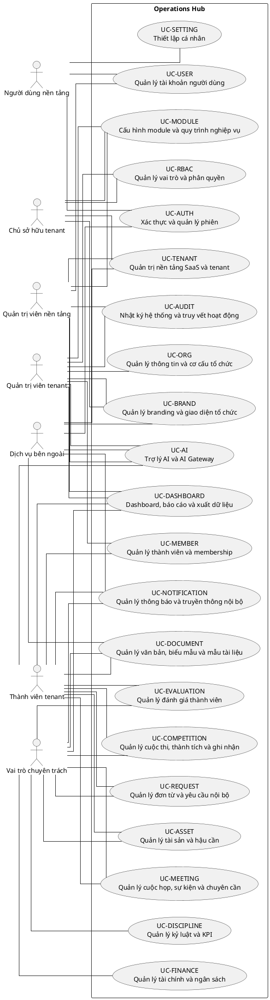

---

<!-- SOURCE: 00_Use_Case_Catalog_v4.md -->

# DANH MỤC USE CASE CHÍNH — OPERATIONS HUB V4

V4 gồm các Use Case nghiệp vụ đã được tinh gọn theo mục tiêu actor. Các chức năng chi tiết vẫn nằm trong phạm vi dưới dạng luồng, biến thể và quy tắc.

| Nhóm | Mã Use Case | Tên Use Case | Actor |
|---|---|---|---|
| `UC-TENANT` | `UC-TENANT-01` | Đăng ký tổ chức | Người đăng ký tổ chức |
| `UC-TENANT` | `UC-TENANT-02` | Xử lý hồ sơ đăng ký tổ chức | Quản trị viên nền tảng |
| `UC-TENANT` | `UC-TENANT-03` | Khởi tạo tenant | Quản trị viên nền tảng |
| `UC-TENANT` | `UC-TENANT-04` | Quản trị danh mục tenant | Quản trị viên nền tảng |
| `UC-TENANT` | `UC-TENANT-05` | Quản lý vòng đời tenant | Quản trị viên nền tảng |
| `UC-TENANT` | `UC-TENANT-06` | Quản lý quyền sở hữu tenant | Chủ sở hữu tenant |
| `UC-TENANT` | `UC-TENANT-07` | Quản lý dịch vụ và hạn mức tenant | Chủ sở hữu tenant; Quản trị viên nền tảng |
| `UC-TENANT` | `UC-TENANT-08` | Quản lý tên miền tenant | Chủ sở hữu tenant; Dịch vụ DNS hoặc tên miền |
| `UC-TENANT` | `UC-TENANT-09` | Đóng và xử lý dữ liệu tenant | Chủ sở hữu tenant; Quản trị viên nền tảng |
| `UC-TENANT` | `UC-TENANT-10` | Hỗ trợ quản trị tenant có kiểm soát | Quản trị viên nền tảng; Chủ sở hữu tenant |
| `UC-AUTH` | `UC-AUTH-01` | Đăng ký và xác minh tài khoản | Khách truy cập; Dịch vụ xác thực |
| `UC-AUTH` | `UC-AUTH-02` | Đăng nhập | Người dùng nền tảng; Dịch vụ xác thực |
| `UC-AUTH` | `UC-AUTH-03` | Quản lý xác thực đa yếu tố | Người dùng nền tảng; Dịch vụ xác thực |
| `UC-AUTH` | `UC-AUTH-04` | Quản lý phiên và thiết bị | Người dùng nền tảng |
| `UC-AUTH` | `UC-AUTH-05` | Khôi phục và thay đổi thông tin xác thực | Người dùng nền tảng; Dịch vụ xác thực |
| `UC-AUTH` | `UC-AUTH-06` | Xử lý lời mời tham gia tenant | Người dùng nền tảng |
| `UC-AUTH` | `UC-AUTH-07` | Chọn và chuyển tenant context | Người dùng nền tảng |
| `UC-USER` | `UC-USER-01` | Quản lý hồ sơ cá nhân | Người dùng nền tảng |
| `UC-USER` | `UC-USER-02` | Quản lý email và danh tính liên kết | Người dùng nền tảng; Dịch vụ xác thực |
| `UC-USER` | `UC-USER-03` | Xem hoạt động và quan hệ tổ chức cá nhân | Người dùng nền tảng |
| `UC-USER` | `UC-USER-04` | Quản lý dữ liệu và vòng đời tài khoản cá nhân | Người dùng nền tảng |
| `UC-USER` | `UC-USER-05` | Quản trị tài khoản người dùng | Quản trị viên nền tảng |
| `UC-USER` | `UC-USER-06` | Quản trị an toàn tài khoản | Quản trị viên nền tảng |
| `UC-USER` | `UC-USER-07` | Xử lý tài khoản đặc biệt | Quản trị viên nền tảng |
| `UC-RBAC` | `UC-RBAC-01` | Quản lý role tenant | Quản trị viên tenant; Chủ sở hữu tenant |
| `UC-RBAC` | `UC-RBAC-02` | Cấu hình permission cho role | Quản trị viên tenant |
| `UC-RBAC` | `UC-RBAC-03` | Gán role cho membership | Quản trị viên tenant; Quản trị viên đơn vị |
| `UC-RBAC` | `UC-RBAC-04` | Cấu hình phạm vi và ủy quyền | Quản trị viên tenant; Chủ sở hữu tenant |
| `UC-RBAC` | `UC-RBAC-05` | Phân tích quyền hiệu lực | Quản trị viên tenant; Người kiểm tra hoặc giám sát |
| `UC-RBAC` | `UC-RBAC-06` | Rà soát và xác nhận quyền | Quản trị viên tenant; Người kiểm tra hoặc giám sát |
| `UC-RBAC` | `UC-RBAC-07` | Quản lý quyền khẩn cấp và role nền tảng | Quản trị viên nền tảng; Chủ sở hữu tenant |
| `UC-ORG` | `UC-ORG-01` | Quản lý hồ sơ tổ chức | Quản trị viên tenant; Chủ sở hữu tenant |
| `UC-ORG` | `UC-ORG-02` | Quản lý cơ cấu đơn vị | Quản trị viên tenant |
| `UC-ORG` | `UC-ORG-03` | Tái cấu trúc và đóng đơn vị | Quản trị viên tenant |
| `UC-ORG` | `UC-ORG-04` | Quản lý loại đơn vị và chức vụ | Quản trị viên tenant |
| `UC-ORG` | `UC-ORG-05` | Quản lý lãnh đạo đơn vị | Quản trị viên tenant; Quản trị viên đơn vị |
| `UC-ORG` | `UC-ORG-06` | Quản lý kỳ hoạt động tổ chức | Quản trị viên tenant |
| `UC-ORG` | `UC-ORG-07` | Nhập, xuất và áp dụng mẫu cơ cấu | Quản trị viên tenant |
| `UC-BRAND` | `UC-BRAND-01` | Quản lý nhận diện thương hiệu | Quản trị viên tenant; Chủ sở hữu tenant; Dịch vụ lưu trữ |
| `UC-BRAND` | `UC-BRAND-02` | Quản lý bề mặt giao diện mang thương hiệu | Quản trị viên tenant |
| `UC-BRAND` | `UC-BRAND-03` | Quản lý thuật ngữ và nhãn hiển thị | Quản trị viên tenant |
| `UC-BRAND` | `UC-BRAND-04` | Quản lý thư viện tài sản thương hiệu | Quản trị viên tenant; Dịch vụ lưu trữ |
| `UC-BRAND` | `UC-BRAND-05` | Xem trước và xuất bản branding | Quản trị viên tenant; Chủ sở hữu tenant |
| `UC-BRAND` | `UC-BRAND-06` | Kiểm soát chất lượng branding | Quản trị viên tenant |
| `UC-MODULE` | `UC-MODULE-01` | Xem danh mục module | Quản trị viên tenant; Quản trị viên nền tảng |
| `UC-MODULE` | `UC-MODULE-02` | Kích hoạt hoặc vô hiệu hóa module | Quản trị viên tenant; Chủ sở hữu tenant |
| `UC-MODULE` | `UC-MODULE-03` | Quản lý phụ thuộc module | Quản trị viên tenant; Quản trị viên nền tảng |
| `UC-MODULE` | `UC-MODULE-04` | Cấu hình module theo tenant | Quản trị viên tenant |
| `UC-MODULE` | `UC-MODULE-05` | Quản lý mẫu quy trình module | Quản trị viên tenant; Vai trò chuyên trách mô-đun |
| `UC-MODULE` | `UC-MODULE-06` | Quản lý phát hành và chuyển đổi module | Quản trị viên nền tảng; Quản trị viên tenant |
| `UC-MODULE` | `UC-MODULE-07` | Theo dõi sử dụng và sức khỏe module | Quản trị viên tenant; Quản trị viên nền tảng |
| `UC-SETTING` | `UC-SETTING-01` | Quản lý tùy chọn giao diện | Người dùng nền tảng |
| `UC-SETTING` | `UC-SETTING-02` | Quản lý ngôn ngữ và định dạng | Người dùng nền tảng |
| `UC-SETTING` | `UC-SETTING-03` | Quản lý khả năng tiếp cận | Người dùng nền tảng |
| `UC-SETTING` | `UC-SETTING-04` | Quản lý tùy chọn thông báo | Người dùng nền tảng |
| `UC-SETTING` | `UC-SETTING-05` | Quản lý quyền riêng tư cá nhân | Người dùng nền tảng |
| `UC-SETTING` | `UC-SETTING-06` | Quản lý mặc định theo tenant | Người dùng nền tảng |
| `UC-MEMBER` | `UC-MEMBER-01` | Mời hoặc thêm thành viên | Phụ trách nhân sự; Quản trị viên tenant |
| `UC-MEMBER` | `UC-MEMBER-02` | Onboarding thành viên | Thành viên tenant; Phụ trách nhân sự |
| `UC-MEMBER` | `UC-MEMBER-03` | Quản lý hồ sơ thành viên | Thành viên tenant; Phụ trách nhân sự |
| `UC-MEMBER` | `UC-MEMBER-04` | Phân công thành viên vào đơn vị và chức vụ | Phụ trách nhân sự; Quản trị viên đơn vị |
| `UC-MEMBER` | `UC-MEMBER-05` | Quản lý trạng thái membership | Phụ trách nhân sự; Quản trị viên tenant |
| `UC-MEMBER` | `UC-MEMBER-06` | Chuyển giao hoặc kết thúc membership | Phụ trách nhân sự; Chủ sở hữu tenant |
| `UC-MEMBER` | `UC-MEMBER-07` | Tra cứu danh bạ và lịch sử thành viên | Thành viên tenant; Quản trị viên đơn vị; Phụ trách nhân sự |
| `UC-MEMBER` | `UC-MEMBER-08` | Nhập, xuất và cập nhật hàng loạt thành viên | Phụ trách nhân sự |
| `UC-REQUEST` | `UC-REQUEST-01` | Quản lý loại yêu cầu và biểu mẫu | Quản trị viên tenant; Vai trò chuyên trách mô-đun |
| `UC-REQUEST` | `UC-REQUEST-02` | Tạo và gửi yêu cầu | Thành viên tenant |
| `UC-REQUEST` | `UC-REQUEST-03` | Theo dõi và cập nhật yêu cầu | Thành viên tenant |
| `UC-REQUEST` | `UC-REQUEST-04` | Rút hoặc hủy yêu cầu | Thành viên tenant; Người phê duyệt |
| `UC-REQUEST` | `UC-REQUEST-05` | Tiếp nhận và phân công xử lý | Vai trò chuyên trách mô-đun; Người phê duyệt |
| `UC-REQUEST` | `UC-REQUEST-06` | Phê duyệt hoặc từ chối yêu cầu | Người phê duyệt |
| `UC-REQUEST` | `UC-REQUEST-07` | Thực hiện nghiệp vụ sau phê duyệt | Vai trò chuyên trách mô-đun |
| `UC-REQUEST` | `UC-REQUEST-08` | Báo cáo và xuất dữ liệu yêu cầu | Vai trò chuyên trách mô-đun; Người kiểm tra hoặc giám sát |
| `UC-DOCUMENT` | `UC-DOCUMENT-01` | Quản lý mẫu tài liệu | Phụ trách văn bản; Quản trị viên tenant |
| `UC-DOCUMENT` | `UC-DOCUMENT-02` | Soạn thảo tài liệu | Phụ trách văn bản; Thành viên tenant |
| `UC-DOCUMENT` | `UC-DOCUMENT-03` | Rà soát và phê duyệt tài liệu | Phụ trách văn bản; Người phê duyệt |
| `UC-DOCUMENT` | `UC-DOCUMENT-04` | Phát hành và phân phối tài liệu | Phụ trách văn bản; Người phê duyệt; Dịch vụ thông báo |
| `UC-DOCUMENT` | `UC-DOCUMENT-05` | Quản lý phiên bản và sửa đổi | Phụ trách văn bản |
| `UC-DOCUMENT` | `UC-DOCUMENT-06` | Quản lý truy cập và chia sẻ tài liệu | Phụ trách văn bản; Quản trị viên tenant |
| `UC-DOCUMENT` | `UC-DOCUMENT-07` | Tra cứu và xuất tài liệu | Thành viên tenant; Phụ trách văn bản; Người kiểm tra hoặc giám sát |
| `UC-DOCUMENT` | `UC-DOCUMENT-08` | Lưu trữ và xử lý hết hạn tài liệu | Phụ trách văn bản; Người kiểm tra hoặc giám sát |
| `UC-FINANCE` | `UC-FINANCE-01` | Quản lý danh mục và tài khoản tài chính | Phụ trách tài chính; Quản trị viên tenant |
| `UC-FINANCE` | `UC-FINANCE-02` | Lập và quản lý ngân sách | Phụ trách tài chính; Người phê duyệt |
| `UC-FINANCE` | `UC-FINANCE-03` | Tạo đề nghị thu, chi hoặc thanh toán | Thành viên tenant; Phụ trách tài chính |
| `UC-FINANCE` | `UC-FINANCE-04` | Phê duyệt nghiệp vụ tài chính | Người phê duyệt; Phụ trách tài chính |
| `UC-FINANCE` | `UC-FINANCE-05` | Ghi nhận giao dịch thu chi | Phụ trách tài chính |
| `UC-FINANCE` | `UC-FINANCE-06` | Quản lý tạm ứng, hoàn ứng và hoàn trả | Thành viên tenant; Phụ trách tài chính; Người phê duyệt |
| `UC-FINANCE` | `UC-FINANCE-07` | Quản lý chuyển quỹ và điều chỉnh | Phụ trách tài chính; Người phê duyệt |
| `UC-FINANCE` | `UC-FINANCE-08` | Đối soát và đóng kỳ | Phụ trách tài chính; Người kiểm tra hoặc giám sát |
| `UC-FINANCE` | `UC-FINANCE-09` | Theo dõi thực hiện ngân sách | Phụ trách tài chính; Phụ trách báo cáo và phân tích |
| `UC-FINANCE` | `UC-FINANCE-10` | Báo cáo và xuất dữ liệu tài chính | Phụ trách tài chính; Người kiểm tra hoặc giám sát |
| `UC-ASSET` | `UC-ASSET-01` | Quản lý danh mục tài sản và vật tư | Phụ trách tài sản và hậu cần |
| `UC-ASSET` | `UC-ASSET-02` | Tiếp nhận và ghi tăng tài sản | Phụ trách tài sản và hậu cần |
| `UC-ASSET` | `UC-ASSET-03` | Phân bổ và quản lý người giữ | Phụ trách tài sản và hậu cần; Quản trị viên đơn vị |
| `UC-ASSET` | `UC-ASSET-04` | Quản lý mượn và trả tài sản | Thành viên tenant; Phụ trách tài sản và hậu cần; Người phê duyệt |
| `UC-ASSET` | `UC-ASSET-05` | Quản lý bảo trì và sửa chữa | Phụ trách tài sản và hậu cần |
| `UC-ASSET` | `UC-ASSET-06` | Kiểm kê tài sản | Phụ trách tài sản và hậu cần; Người kiểm tra hoặc giám sát |
| `UC-ASSET` | `UC-ASSET-07` | Điều chuyển, thanh lý hoặc mất tài sản | Phụ trách tài sản và hậu cần; Người phê duyệt |
| `UC-ASSET` | `UC-ASSET-08` | Quản lý vật tư tiêu hao | Phụ trách tài sản và hậu cần; Quản trị viên đơn vị |
| `UC-ASSET` | `UC-ASSET-09` | Báo cáo và xuất dữ liệu tài sản | Phụ trách tài sản và hậu cần; Người kiểm tra hoặc giám sát |
| `UC-MEETING` | `UC-MEETING-01` | Lập lịch cuộc họp hoặc sự kiện | Phụ trách cuộc họp và sự kiện; Quản trị viên đơn vị |
| `UC-MEETING` | `UC-MEETING-02` | Mời và quản lý người tham gia | Phụ trách cuộc họp và sự kiện; Thành viên tenant |
| `UC-MEETING` | `UC-MEETING-03` | Quản lý chương trình và tài liệu | Phụ trách cuộc họp và sự kiện; Thành viên tenant |
| `UC-MEETING` | `UC-MEETING-04` | Điều hành cuộc họp hoặc sự kiện | Phụ trách cuộc họp và sự kiện |
| `UC-MEETING` | `UC-MEETING-05` | Ghi nhận chuyên cần | Phụ trách cuộc họp và sự kiện; Thành viên tenant |
| `UC-MEETING` | `UC-MEETING-06` | Lập và phê duyệt biên bản | Phụ trách cuộc họp và sự kiện; Người phê duyệt |
| `UC-MEETING` | `UC-MEETING-07` | Theo dõi quyết định và công việc sau họp | Phụ trách cuộc họp và sự kiện; Thành viên tenant |
| `UC-MEETING` | `UC-MEETING-08` | Tra cứu, báo cáo và lưu trữ hoạt động | Phụ trách cuộc họp và sự kiện; Quản trị viên đơn vị; Người kiểm tra hoặc giám sát |
| `UC-DISCIPLINE` | `UC-DISCIPLINE-01` | Cấu hình quy tắc kỷ luật và KPI | Phụ trách kỷ luật và KPI; Quản trị viên tenant |
| `UC-DISCIPLINE` | `UC-DISCIPLINE-02` | Ghi nhận vụ việc hoặc vi phạm | Phụ trách kỷ luật và KPI; Quản trị viên đơn vị |
| `UC-DISCIPLINE` | `UC-DISCIPLINE-03` | Thu thập và xác minh minh chứng | Phụ trách kỷ luật và KPI; Thành viên tenant |
| `UC-DISCIPLINE` | `UC-DISCIPLINE-04` | Xem xét và ra quyết định kỷ luật | Phụ trách kỷ luật và KPI; Người phê duyệt |
| `UC-DISCIPLINE` | `UC-DISCIPLINE-05` | Quản lý khiếu nại hoặc xem xét lại | Thành viên tenant; Người phê duyệt |
| `UC-DISCIPLINE` | `UC-DISCIPLINE-06` | Theo dõi biện pháp khắc phục | Phụ trách kỷ luật và KPI; Quản trị viên đơn vị |
| `UC-DISCIPLINE` | `UC-DISCIPLINE-07` | Theo dõi KPI và cảnh báo | Phụ trách kỷ luật và KPI; Quản trị viên đơn vị |
| `UC-DISCIPLINE` | `UC-DISCIPLINE-08` | Báo cáo và lịch sử kỷ luật | Phụ trách kỷ luật và KPI; Người kiểm tra hoặc giám sát |
| `UC-EVALUATION` | `UC-EVALUATION-01` | Quản lý chu kỳ đánh giá | Người đánh giá; Quản trị viên tenant |
| `UC-EVALUATION` | `UC-EVALUATION-02` | Quản lý bộ tiêu chí và biểu mẫu | Người đánh giá; Quản trị viên tenant |
| `UC-EVALUATION` | `UC-EVALUATION-03` | Phân công đối tượng và người đánh giá | Người đánh giá; Quản trị viên đơn vị |
| `UC-EVALUATION` | `UC-EVALUATION-04` | Thực hiện đánh giá | Thành viên tenant; Người đánh giá |
| `UC-EVALUATION` | `UC-EVALUATION-05` | Xác minh và hiệu chỉnh kết quả | Người đánh giá; Người phê duyệt |
| `UC-EVALUATION` | `UC-EVALUATION-06` | Công bố và phản hồi kết quả | Người đánh giá; Thành viên tenant |
| `UC-EVALUATION` | `UC-EVALUATION-07` | Khiếu nại kết quả đánh giá | Thành viên tenant; Người phê duyệt |
| `UC-EVALUATION` | `UC-EVALUATION-08` | Báo cáo và phân tích đánh giá | Người đánh giá; Quản trị viên đơn vị; Người kiểm tra hoặc giám sát |
| `UC-COMPETITION` | `UC-COMPETITION-01` | Cấu hình cuộc thi | Phụ trách cuộc thi và thành tích |
| `UC-COMPETITION` | `UC-COMPETITION-02` | Đăng ký cá nhân hoặc đội thi | Thành viên tenant; Phụ trách cuộc thi và thành tích |
| `UC-COMPETITION` | `UC-COMPETITION-03` | Quản lý bài dự thi | Thành viên tenant |
| `UC-COMPETITION` | `UC-COMPETITION-04` | Phân công và thực hiện chấm thi | Phụ trách cuộc thi và thành tích; Người đánh giá |
| `UC-COMPETITION` | `UC-COMPETITION-05` | Hiệu chỉnh, xếp hạng và chọn vòng | Phụ trách cuộc thi và thành tích; Người phê duyệt |
| `UC-COMPETITION` | `UC-COMPETITION-06` | Công bố kết quả và xử lý khiếu nại | Phụ trách cuộc thi và thành tích; Thành viên tenant; Người phê duyệt |
| `UC-COMPETITION` | `UC-COMPETITION-07` | Ghi nhận giải thưởng và thành tích | Phụ trách cuộc thi và thành tích; Phụ trách văn bản |
| `UC-COMPETITION` | `UC-COMPETITION-08` | Quản lý cuộc thi bên ngoài | Phụ trách cuộc thi và thành tích; Thành viên tenant |
| `UC-COMPETITION` | `UC-COMPETITION-09` | Báo cáo và lưu trữ cuộc thi | Phụ trách cuộc thi và thành tích; Người kiểm tra hoặc giám sát |
| `UC-NOTIFICATION` | `UC-NOTIFICATION-01` | Quản lý mẫu thông báo | Phụ trách truyền thông nội bộ; Quản trị viên tenant |
| `UC-NOTIFICATION` | `UC-NOTIFICATION-02` | Soạn và chọn đối tượng nhận | Phụ trách truyền thông nội bộ; Vai trò chuyên trách mô-đun |
| `UC-NOTIFICATION` | `UC-NOTIFICATION-03` | Phê duyệt và lên lịch thông báo | Phụ trách truyền thông nội bộ; Người phê duyệt |
| `UC-NOTIFICATION` | `UC-NOTIFICATION-04` | Phân phối thông báo đa kênh | Dịch vụ thông báo |
| `UC-NOTIFICATION` | `UC-NOTIFICATION-05` | Tạo thông báo tự động | Vai trò chuyên trách mô-đun; Dịch vụ thông báo |
| `UC-NOTIFICATION` | `UC-NOTIFICATION-06` | Quản lý hộp thông báo cá nhân | Thành viên tenant |
| `UC-NOTIFICATION` | `UC-NOTIFICATION-07` | Theo dõi hiệu quả gửi | Phụ trách truyền thông nội bộ; Phụ trách báo cáo và phân tích |
| `UC-DASHBOARD` | `UC-DASHBOARD-01` | Xem dashboard theo vai trò | Thành viên tenant; Quản trị viên đơn vị; Quản trị viên tenant; Quản trị viên nền tảng |
| `UC-DASHBOARD` | `UC-DASHBOARD-02` | Lọc và đi sâu dữ liệu | Thành viên tenant; Phụ trách báo cáo và phân tích |
| `UC-DASHBOARD` | `UC-DASHBOARD-03` | Tùy chỉnh dashboard | Thành viên tenant; Phụ trách báo cáo và phân tích |
| `UC-DASHBOARD` | `UC-DASHBOARD-04` | Quản lý metric, KPI và cảnh báo | Phụ trách báo cáo và phân tích; Quản trị viên tenant |
| `UC-DASHBOARD` | `UC-DASHBOARD-05` | Tạo báo cáo liên mô-đun | Phụ trách báo cáo và phân tích; Người kiểm tra hoặc giám sát |
| `UC-DASHBOARD` | `UC-DASHBOARD-06` | Xuất, chia sẻ và lên lịch báo cáo | Phụ trách báo cáo và phân tích; Quản trị viên tenant |
| `UC-DASHBOARD` | `UC-DASHBOARD-07` | Xem insight và chất lượng dữ liệu | Phụ trách báo cáo và phân tích; Quản trị viên tenant |
| `UC-AI` | `UC-AI-01` | Cấu hình nhà cung cấp và mô hình AI | Quản trị viên nền tảng; Quản trị viên tenant; Nhà cung cấp AI |
| `UC-AI` | `UC-AI-02` | Quản lý prompt và use case AI | Quản trị viên tenant; Vai trò chuyên trách mô-đun |
| `UC-AI` | `UC-AI-03` | Sử dụng trợ lý AI trong nghiệp vụ | Thành viên tenant; Vai trò chuyên trách mô-đun; Nhà cung cấp AI |
| `UC-AI` | `UC-AI-04` | Rà soát và áp dụng kết quả AI | Thành viên tenant; Vai trò chuyên trách mô-đun |
| `UC-AI` | `UC-AI-05` | Quản lý chính sách dữ liệu AI | Quản trị viên tenant; Người kiểm tra hoặc giám sát |
| `UC-AI` | `UC-AI-06` | Theo dõi sử dụng, chi phí và chất lượng AI | Quản trị viên tenant; Quản trị viên nền tảng; Người kiểm tra hoặc giám sát |
| `UC-AI` | `UC-AI-07` | Xử lý lỗi và chuyển nhà cung cấp | Nhà cung cấp AI; Quản trị viên nền tảng |
| `UC-AUDIT` | `UC-AUDIT-01` | Tra cứu audit log | Người kiểm tra hoặc giám sát; Quản trị viên tenant; Quản trị viên nền tảng |
| `UC-AUDIT` | `UC-AUDIT-02` | Truy vết thực thể, người dùng hoặc quy trình | Người kiểm tra hoặc giám sát |
| `UC-AUDIT` | `UC-AUDIT-03` | Điều tra sự cố từ audit trail | Người kiểm tra hoặc giám sát; Quản trị viên nền tảng |
| `UC-AUDIT` | `UC-AUDIT-04` | Quản lý cảnh báo và tích hợp audit | Người kiểm tra hoặc giám sát; Quản trị viên nền tảng |
| `UC-AUDIT` | `UC-AUDIT-05` | Xuất và báo cáo audit | Người kiểm tra hoặc giám sát; Quản trị viên nền tảng |
| `UC-AUDIT` | `UC-AUDIT-06` | Quản lý lưu giữ và tính toàn vẹn audit | Quản trị viên nền tảng; Người kiểm tra hoặc giám sát |
| `UC-AUDIT` | `UC-AUDIT-07` | Đánh giá độ đầy đủ của audit | Người kiểm tra hoặc giám sát; Quản trị viên nền tảng |

---

<!-- SOURCE: 00_Actor_UseCase_Matrix_v4.md -->

# MA TRẬN ACTOR–USE CASE — V4

Actor được liên kết trực tiếp với Use Case có mục tiêu nghiệp vụ. Không sử dụng package trung gian.

| Actor | Nhóm | Use Case trực tiếp |
|---|---|---|
| `ACT-GUEST` — Khách truy cập | `UC-AUTH` | `UC-AUTH-01` — Đăng ký và xác minh tài khoản |
| `ACT-PLATFORM-USER` — Người dùng nền tảng | `UC-AUTH`<br>`UC-AUTH`<br>`UC-AUTH`<br>`UC-AUTH`<br>`UC-AUTH`<br>`UC-AUTH`<br>`UC-USER`<br>`UC-USER`<br>`UC-USER`<br>`UC-USER`<br>`UC-SETTING`<br>`UC-SETTING`<br>`UC-SETTING`<br>`UC-SETTING`<br>`UC-SETTING`<br>`UC-SETTING` | `UC-AUTH-02` — Đăng nhập<br>`UC-AUTH-03` — Quản lý xác thực đa yếu tố<br>`UC-AUTH-04` — Quản lý phiên và thiết bị<br>`UC-AUTH-05` — Khôi phục và thay đổi thông tin xác thực<br>`UC-AUTH-06` — Xử lý lời mời tham gia tenant<br>`UC-AUTH-07` — Chọn và chuyển tenant context<br>`UC-USER-01` — Quản lý hồ sơ cá nhân<br>`UC-USER-02` — Quản lý email và danh tính liên kết<br>`UC-USER-03` — Xem hoạt động và quan hệ tổ chức cá nhân<br>`UC-USER-04` — Quản lý dữ liệu và vòng đời tài khoản cá nhân<br>`UC-SETTING-01` — Quản lý tùy chọn giao diện<br>`UC-SETTING-02` — Quản lý ngôn ngữ và định dạng<br>`UC-SETTING-03` — Quản lý khả năng tiếp cận<br>`UC-SETTING-04` — Quản lý tùy chọn thông báo<br>`UC-SETTING-05` — Quản lý quyền riêng tư cá nhân<br>`UC-SETTING-06` — Quản lý mặc định theo tenant |
| `ACT-ORG-REGISTRANT` — Người đăng ký tổ chức | `UC-TENANT` | `UC-TENANT-01` — Đăng ký tổ chức |
| `ACT-PLATFORM-ADMIN` — Quản trị viên nền tảng | `UC-TENANT`<br>`UC-TENANT`<br>`UC-TENANT`<br>`UC-TENANT`<br>`UC-TENANT`<br>`UC-TENANT`<br>`UC-TENANT`<br>`UC-USER`<br>`UC-USER`<br>`UC-USER`<br>`UC-RBAC`<br>`UC-MODULE`<br>`UC-MODULE`<br>`UC-MODULE`<br>`UC-MODULE`<br>`UC-DASHBOARD`<br>`UC-AI`<br>`UC-AI`<br>`UC-AI`<br>`UC-AUDIT`<br>`UC-AUDIT`<br>`UC-AUDIT`<br>`UC-AUDIT`<br>`UC-AUDIT`<br>`UC-AUDIT` | `UC-TENANT-02` — Xử lý hồ sơ đăng ký tổ chức<br>`UC-TENANT-03` — Khởi tạo tenant<br>`UC-TENANT-04` — Quản trị danh mục tenant<br>`UC-TENANT-05` — Quản lý vòng đời tenant<br>`UC-TENANT-07` — Quản lý dịch vụ và hạn mức tenant<br>`UC-TENANT-09` — Đóng và xử lý dữ liệu tenant<br>`UC-TENANT-10` — Hỗ trợ quản trị tenant có kiểm soát<br>`UC-USER-05` — Quản trị tài khoản người dùng<br>`UC-USER-06` — Quản trị an toàn tài khoản<br>`UC-USER-07` — Xử lý tài khoản đặc biệt<br>`UC-RBAC-07` — Quản lý quyền khẩn cấp và role nền tảng<br>`UC-MODULE-01` — Xem danh mục module<br>`UC-MODULE-03` — Quản lý phụ thuộc module<br>`UC-MODULE-06` — Quản lý phát hành và chuyển đổi module<br>`UC-MODULE-07` — Theo dõi sử dụng và sức khỏe module<br>`UC-DASHBOARD-01` — Xem dashboard theo vai trò<br>`UC-AI-01` — Cấu hình nhà cung cấp và mô hình AI<br>`UC-AI-06` — Theo dõi sử dụng, chi phí và chất lượng AI<br>`UC-AI-07` — Xử lý lỗi và chuyển nhà cung cấp<br>`UC-AUDIT-01` — Tra cứu audit log<br>`UC-AUDIT-03` — Điều tra sự cố từ audit trail<br>`UC-AUDIT-04` — Quản lý cảnh báo và tích hợp audit<br>`UC-AUDIT-05` — Xuất và báo cáo audit<br>`UC-AUDIT-06` — Quản lý lưu giữ và tính toàn vẹn audit<br>`UC-AUDIT-07` — Đánh giá độ đầy đủ của audit |
| `ACT-TENANT-MEMBER` — Thành viên tenant | `UC-MEMBER`<br>`UC-MEMBER`<br>`UC-MEMBER`<br>`UC-REQUEST`<br>`UC-REQUEST`<br>`UC-REQUEST`<br>`UC-DOCUMENT`<br>`UC-DOCUMENT`<br>`UC-FINANCE`<br>`UC-FINANCE`<br>`UC-ASSET`<br>`UC-MEETING`<br>`UC-MEETING`<br>`UC-MEETING`<br>`UC-MEETING`<br>`UC-DISCIPLINE`<br>`UC-DISCIPLINE`<br>`UC-EVALUATION`<br>`UC-EVALUATION`<br>`UC-EVALUATION`<br>`UC-COMPETITION`<br>`UC-COMPETITION`<br>`UC-COMPETITION`<br>`UC-COMPETITION`<br>`UC-NOTIFICATION`<br>`UC-DASHBOARD`<br>`UC-DASHBOARD`<br>`UC-DASHBOARD`<br>`UC-AI`<br>`UC-AI` | `UC-MEMBER-02` — Onboarding thành viên<br>`UC-MEMBER-03` — Quản lý hồ sơ thành viên<br>`UC-MEMBER-07` — Tra cứu danh bạ và lịch sử thành viên<br>`UC-REQUEST-02` — Tạo và gửi yêu cầu<br>`UC-REQUEST-03` — Theo dõi và cập nhật yêu cầu<br>`UC-REQUEST-04` — Rút hoặc hủy yêu cầu<br>`UC-DOCUMENT-02` — Soạn thảo tài liệu<br>`UC-DOCUMENT-07` — Tra cứu và xuất tài liệu<br>`UC-FINANCE-03` — Tạo đề nghị thu, chi hoặc thanh toán<br>`UC-FINANCE-06` — Quản lý tạm ứng, hoàn ứng và hoàn trả<br>`UC-ASSET-04` — Quản lý mượn và trả tài sản<br>`UC-MEETING-02` — Mời và quản lý người tham gia<br>`UC-MEETING-03` — Quản lý chương trình và tài liệu<br>`UC-MEETING-05` — Ghi nhận chuyên cần<br>`UC-MEETING-07` — Theo dõi quyết định và công việc sau họp<br>`UC-DISCIPLINE-03` — Thu thập và xác minh minh chứng<br>`UC-DISCIPLINE-05` — Quản lý khiếu nại hoặc xem xét lại<br>`UC-EVALUATION-04` — Thực hiện đánh giá<br>`UC-EVALUATION-06` — Công bố và phản hồi kết quả<br>`UC-EVALUATION-07` — Khiếu nại kết quả đánh giá<br>`UC-COMPETITION-02` — Đăng ký cá nhân hoặc đội thi<br>`UC-COMPETITION-03` — Quản lý bài dự thi<br>`UC-COMPETITION-06` — Công bố kết quả và xử lý khiếu nại<br>`UC-COMPETITION-08` — Quản lý cuộc thi bên ngoài<br>`UC-NOTIFICATION-06` — Quản lý hộp thông báo cá nhân<br>`UC-DASHBOARD-01` — Xem dashboard theo vai trò<br>`UC-DASHBOARD-02` — Lọc và đi sâu dữ liệu<br>`UC-DASHBOARD-03` — Tùy chỉnh dashboard<br>`UC-AI-03` — Sử dụng trợ lý AI trong nghiệp vụ<br>`UC-AI-04` — Rà soát và áp dụng kết quả AI |
| `ACT-UNIT-ADMIN` — Quản trị viên đơn vị | `UC-RBAC`<br>`UC-ORG`<br>`UC-MEMBER`<br>`UC-MEMBER`<br>`UC-ASSET`<br>`UC-ASSET`<br>`UC-MEETING`<br>`UC-MEETING`<br>`UC-DISCIPLINE`<br>`UC-DISCIPLINE`<br>`UC-DISCIPLINE`<br>`UC-EVALUATION`<br>`UC-EVALUATION`<br>`UC-DASHBOARD` | `UC-RBAC-03` — Gán role cho membership<br>`UC-ORG-05` — Quản lý lãnh đạo đơn vị<br>`UC-MEMBER-04` — Phân công thành viên vào đơn vị và chức vụ<br>`UC-MEMBER-07` — Tra cứu danh bạ và lịch sử thành viên<br>`UC-ASSET-03` — Phân bổ và quản lý người giữ<br>`UC-ASSET-08` — Quản lý vật tư tiêu hao<br>`UC-MEETING-01` — Lập lịch cuộc họp hoặc sự kiện<br>`UC-MEETING-08` — Tra cứu, báo cáo và lưu trữ hoạt động<br>`UC-DISCIPLINE-02` — Ghi nhận vụ việc hoặc vi phạm<br>`UC-DISCIPLINE-06` — Theo dõi biện pháp khắc phục<br>`UC-DISCIPLINE-07` — Theo dõi KPI và cảnh báo<br>`UC-EVALUATION-03` — Phân công đối tượng và người đánh giá<br>`UC-EVALUATION-08` — Báo cáo và phân tích đánh giá<br>`UC-DASHBOARD-01` — Xem dashboard theo vai trò |
| `ACT-MODULE-SPECIALIST` — Vai trò chuyên trách mô-đun | `UC-MODULE`<br>`UC-REQUEST`<br>`UC-REQUEST`<br>`UC-REQUEST`<br>`UC-REQUEST`<br>`UC-NOTIFICATION`<br>`UC-NOTIFICATION`<br>`UC-AI`<br>`UC-AI`<br>`UC-AI` | `UC-MODULE-05` — Quản lý mẫu quy trình module<br>`UC-REQUEST-01` — Quản lý loại yêu cầu và biểu mẫu<br>`UC-REQUEST-05` — Tiếp nhận và phân công xử lý<br>`UC-REQUEST-07` — Thực hiện nghiệp vụ sau phê duyệt<br>`UC-REQUEST-08` — Báo cáo và xuất dữ liệu yêu cầu<br>`UC-NOTIFICATION-02` — Soạn và chọn đối tượng nhận<br>`UC-NOTIFICATION-05` — Tạo thông báo tự động<br>`UC-AI-02` — Quản lý prompt và use case AI<br>`UC-AI-03` — Sử dụng trợ lý AI trong nghiệp vụ<br>`UC-AI-04` — Rà soát và áp dụng kết quả AI |
| `ACT-HR-SPECIALIST` — Phụ trách nhân sự | `UC-MEMBER`<br>`UC-MEMBER`<br>`UC-MEMBER`<br>`UC-MEMBER`<br>`UC-MEMBER`<br>`UC-MEMBER`<br>`UC-MEMBER`<br>`UC-MEMBER` | `UC-MEMBER-01` — Mời hoặc thêm thành viên<br>`UC-MEMBER-02` — Onboarding thành viên<br>`UC-MEMBER-03` — Quản lý hồ sơ thành viên<br>`UC-MEMBER-04` — Phân công thành viên vào đơn vị và chức vụ<br>`UC-MEMBER-05` — Quản lý trạng thái membership<br>`UC-MEMBER-06` — Chuyển giao hoặc kết thúc membership<br>`UC-MEMBER-07` — Tra cứu danh bạ và lịch sử thành viên<br>`UC-MEMBER-08` — Nhập, xuất và cập nhật hàng loạt thành viên |
| `ACT-DOCUMENT-OFFICER` — Phụ trách văn bản | `UC-DOCUMENT`<br>`UC-DOCUMENT`<br>`UC-DOCUMENT`<br>`UC-DOCUMENT`<br>`UC-DOCUMENT`<br>`UC-DOCUMENT`<br>`UC-DOCUMENT`<br>`UC-DOCUMENT`<br>`UC-COMPETITION` | `UC-DOCUMENT-01` — Quản lý mẫu tài liệu<br>`UC-DOCUMENT-02` — Soạn thảo tài liệu<br>`UC-DOCUMENT-03` — Rà soát và phê duyệt tài liệu<br>`UC-DOCUMENT-04` — Phát hành và phân phối tài liệu<br>`UC-DOCUMENT-05` — Quản lý phiên bản và sửa đổi<br>`UC-DOCUMENT-06` — Quản lý truy cập và chia sẻ tài liệu<br>`UC-DOCUMENT-07` — Tra cứu và xuất tài liệu<br>`UC-DOCUMENT-08` — Lưu trữ và xử lý hết hạn tài liệu<br>`UC-COMPETITION-07` — Ghi nhận giải thưởng và thành tích |
| `ACT-FINANCE-OFFICER` — Phụ trách tài chính | `UC-FINANCE`<br>`UC-FINANCE`<br>`UC-FINANCE`<br>`UC-FINANCE`<br>`UC-FINANCE`<br>`UC-FINANCE`<br>`UC-FINANCE`<br>`UC-FINANCE`<br>`UC-FINANCE`<br>`UC-FINANCE` | `UC-FINANCE-01` — Quản lý danh mục và tài khoản tài chính<br>`UC-FINANCE-02` — Lập và quản lý ngân sách<br>`UC-FINANCE-03` — Tạo đề nghị thu, chi hoặc thanh toán<br>`UC-FINANCE-04` — Phê duyệt nghiệp vụ tài chính<br>`UC-FINANCE-05` — Ghi nhận giao dịch thu chi<br>`UC-FINANCE-06` — Quản lý tạm ứng, hoàn ứng và hoàn trả<br>`UC-FINANCE-07` — Quản lý chuyển quỹ và điều chỉnh<br>`UC-FINANCE-08` — Đối soát và đóng kỳ<br>`UC-FINANCE-09` — Theo dõi thực hiện ngân sách<br>`UC-FINANCE-10` — Báo cáo và xuất dữ liệu tài chính |
| `ACT-LOGISTICS-OFFICER` — Phụ trách tài sản và hậu cần | `UC-ASSET`<br>`UC-ASSET`<br>`UC-ASSET`<br>`UC-ASSET`<br>`UC-ASSET`<br>`UC-ASSET`<br>`UC-ASSET`<br>`UC-ASSET`<br>`UC-ASSET` | `UC-ASSET-01` — Quản lý danh mục tài sản và vật tư<br>`UC-ASSET-02` — Tiếp nhận và ghi tăng tài sản<br>`UC-ASSET-03` — Phân bổ và quản lý người giữ<br>`UC-ASSET-04` — Quản lý mượn và trả tài sản<br>`UC-ASSET-05` — Quản lý bảo trì và sửa chữa<br>`UC-ASSET-06` — Kiểm kê tài sản<br>`UC-ASSET-07` — Điều chuyển, thanh lý hoặc mất tài sản<br>`UC-ASSET-08` — Quản lý vật tư tiêu hao<br>`UC-ASSET-09` — Báo cáo và xuất dữ liệu tài sản |
| `ACT-MEETING-COORDINATOR` — Phụ trách cuộc họp và sự kiện | `UC-MEETING`<br>`UC-MEETING`<br>`UC-MEETING`<br>`UC-MEETING`<br>`UC-MEETING`<br>`UC-MEETING`<br>`UC-MEETING`<br>`UC-MEETING` | `UC-MEETING-01` — Lập lịch cuộc họp hoặc sự kiện<br>`UC-MEETING-02` — Mời và quản lý người tham gia<br>`UC-MEETING-03` — Quản lý chương trình và tài liệu<br>`UC-MEETING-04` — Điều hành cuộc họp hoặc sự kiện<br>`UC-MEETING-05` — Ghi nhận chuyên cần<br>`UC-MEETING-06` — Lập và phê duyệt biên bản<br>`UC-MEETING-07` — Theo dõi quyết định và công việc sau họp<br>`UC-MEETING-08` — Tra cứu, báo cáo và lưu trữ hoạt động |
| `ACT-DISCIPLINE-OFFICER` — Phụ trách kỷ luật và KPI | `UC-DISCIPLINE`<br>`UC-DISCIPLINE`<br>`UC-DISCIPLINE`<br>`UC-DISCIPLINE`<br>`UC-DISCIPLINE`<br>`UC-DISCIPLINE`<br>`UC-DISCIPLINE` | `UC-DISCIPLINE-01` — Cấu hình quy tắc kỷ luật và KPI<br>`UC-DISCIPLINE-02` — Ghi nhận vụ việc hoặc vi phạm<br>`UC-DISCIPLINE-03` — Thu thập và xác minh minh chứng<br>`UC-DISCIPLINE-04` — Xem xét và ra quyết định kỷ luật<br>`UC-DISCIPLINE-06` — Theo dõi biện pháp khắc phục<br>`UC-DISCIPLINE-07` — Theo dõi KPI và cảnh báo<br>`UC-DISCIPLINE-08` — Báo cáo và lịch sử kỷ luật |
| `ACT-EVALUATOR` — Người đánh giá | `UC-EVALUATION`<br>`UC-EVALUATION`<br>`UC-EVALUATION`<br>`UC-EVALUATION`<br>`UC-EVALUATION`<br>`UC-EVALUATION`<br>`UC-EVALUATION`<br>`UC-COMPETITION` | `UC-EVALUATION-01` — Quản lý chu kỳ đánh giá<br>`UC-EVALUATION-02` — Quản lý bộ tiêu chí và biểu mẫu<br>`UC-EVALUATION-03` — Phân công đối tượng và người đánh giá<br>`UC-EVALUATION-04` — Thực hiện đánh giá<br>`UC-EVALUATION-05` — Xác minh và hiệu chỉnh kết quả<br>`UC-EVALUATION-06` — Công bố và phản hồi kết quả<br>`UC-EVALUATION-08` — Báo cáo và phân tích đánh giá<br>`UC-COMPETITION-04` — Phân công và thực hiện chấm thi |
| `ACT-COMPETITION-MANAGER` — Phụ trách cuộc thi và thành tích | `UC-COMPETITION`<br>`UC-COMPETITION`<br>`UC-COMPETITION`<br>`UC-COMPETITION`<br>`UC-COMPETITION`<br>`UC-COMPETITION`<br>`UC-COMPETITION`<br>`UC-COMPETITION` | `UC-COMPETITION-01` — Cấu hình cuộc thi<br>`UC-COMPETITION-02` — Đăng ký cá nhân hoặc đội thi<br>`UC-COMPETITION-04` — Phân công và thực hiện chấm thi<br>`UC-COMPETITION-05` — Hiệu chỉnh, xếp hạng và chọn vòng<br>`UC-COMPETITION-06` — Công bố kết quả và xử lý khiếu nại<br>`UC-COMPETITION-07` — Ghi nhận giải thưởng và thành tích<br>`UC-COMPETITION-08` — Quản lý cuộc thi bên ngoài<br>`UC-COMPETITION-09` — Báo cáo và lưu trữ cuộc thi |
| `ACT-COMMUNICATION-OFFICER` — Phụ trách truyền thông nội bộ | `UC-NOTIFICATION`<br>`UC-NOTIFICATION`<br>`UC-NOTIFICATION`<br>`UC-NOTIFICATION` | `UC-NOTIFICATION-01` — Quản lý mẫu thông báo<br>`UC-NOTIFICATION-02` — Soạn và chọn đối tượng nhận<br>`UC-NOTIFICATION-03` — Phê duyệt và lên lịch thông báo<br>`UC-NOTIFICATION-07` — Theo dõi hiệu quả gửi |
| `ACT-REPORT-ANALYST` — Phụ trách báo cáo và phân tích | `UC-FINANCE`<br>`UC-NOTIFICATION`<br>`UC-DASHBOARD`<br>`UC-DASHBOARD`<br>`UC-DASHBOARD`<br>`UC-DASHBOARD`<br>`UC-DASHBOARD`<br>`UC-DASHBOARD` | `UC-FINANCE-09` — Theo dõi thực hiện ngân sách<br>`UC-NOTIFICATION-07` — Theo dõi hiệu quả gửi<br>`UC-DASHBOARD-02` — Lọc và đi sâu dữ liệu<br>`UC-DASHBOARD-03` — Tùy chỉnh dashboard<br>`UC-DASHBOARD-04` — Quản lý metric, KPI và cảnh báo<br>`UC-DASHBOARD-05` — Tạo báo cáo liên mô-đun<br>`UC-DASHBOARD-06` — Xuất, chia sẻ và lên lịch báo cáo<br>`UC-DASHBOARD-07` — Xem insight và chất lượng dữ liệu |
| `ACT-APPROVER` — Người phê duyệt | `UC-REQUEST`<br>`UC-REQUEST`<br>`UC-REQUEST`<br>`UC-DOCUMENT`<br>`UC-DOCUMENT`<br>`UC-FINANCE`<br>`UC-FINANCE`<br>`UC-FINANCE`<br>`UC-FINANCE`<br>`UC-ASSET`<br>`UC-ASSET`<br>`UC-MEETING`<br>`UC-DISCIPLINE`<br>`UC-DISCIPLINE`<br>`UC-EVALUATION`<br>`UC-EVALUATION`<br>`UC-COMPETITION`<br>`UC-COMPETITION`<br>`UC-NOTIFICATION` | `UC-REQUEST-04` — Rút hoặc hủy yêu cầu<br>`UC-REQUEST-05` — Tiếp nhận và phân công xử lý<br>`UC-REQUEST-06` — Phê duyệt hoặc từ chối yêu cầu<br>`UC-DOCUMENT-03` — Rà soát và phê duyệt tài liệu<br>`UC-DOCUMENT-04` — Phát hành và phân phối tài liệu<br>`UC-FINANCE-02` — Lập và quản lý ngân sách<br>`UC-FINANCE-04` — Phê duyệt nghiệp vụ tài chính<br>`UC-FINANCE-06` — Quản lý tạm ứng, hoàn ứng và hoàn trả<br>`UC-FINANCE-07` — Quản lý chuyển quỹ và điều chỉnh<br>`UC-ASSET-04` — Quản lý mượn và trả tài sản<br>`UC-ASSET-07` — Điều chuyển, thanh lý hoặc mất tài sản<br>`UC-MEETING-06` — Lập và phê duyệt biên bản<br>`UC-DISCIPLINE-04` — Xem xét và ra quyết định kỷ luật<br>`UC-DISCIPLINE-05` — Quản lý khiếu nại hoặc xem xét lại<br>`UC-EVALUATION-05` — Xác minh và hiệu chỉnh kết quả<br>`UC-EVALUATION-07` — Khiếu nại kết quả đánh giá<br>`UC-COMPETITION-05` — Hiệu chỉnh, xếp hạng và chọn vòng<br>`UC-COMPETITION-06` — Công bố kết quả và xử lý khiếu nại<br>`UC-NOTIFICATION-03` — Phê duyệt và lên lịch thông báo |
| `ACT-TENANT-ADMIN` — Quản trị viên tenant | `UC-RBAC`<br>`UC-RBAC`<br>`UC-RBAC`<br>`UC-RBAC`<br>`UC-RBAC`<br>`UC-RBAC`<br>`UC-ORG`<br>`UC-ORG`<br>`UC-ORG`<br>`UC-ORG`<br>`UC-ORG`<br>`UC-ORG`<br>`UC-ORG`<br>`UC-BRAND`<br>`UC-BRAND`<br>`UC-BRAND`<br>`UC-BRAND`<br>`UC-BRAND`<br>`UC-BRAND`<br>`UC-MODULE`<br>`UC-MODULE`<br>`UC-MODULE`<br>`UC-MODULE`<br>`UC-MODULE`<br>`UC-MODULE`<br>`UC-MODULE`<br>`UC-MEMBER`<br>`UC-MEMBER`<br>`UC-REQUEST`<br>`UC-DOCUMENT`<br>`UC-DOCUMENT`<br>`UC-FINANCE`<br>`UC-DISCIPLINE`<br>`UC-EVALUATION`<br>`UC-EVALUATION`<br>`UC-NOTIFICATION`<br>`UC-DASHBOARD`<br>`UC-DASHBOARD`<br>`UC-DASHBOARD`<br>`UC-DASHBOARD`<br>`UC-AI`<br>`UC-AI`<br>`UC-AI`<br>`UC-AI`<br>`UC-AUDIT` | `UC-RBAC-01` — Quản lý role tenant<br>`UC-RBAC-02` — Cấu hình permission cho role<br>`UC-RBAC-03` — Gán role cho membership<br>`UC-RBAC-04` — Cấu hình phạm vi và ủy quyền<br>`UC-RBAC-05` — Phân tích quyền hiệu lực<br>`UC-RBAC-06` — Rà soát và xác nhận quyền<br>`UC-ORG-01` — Quản lý hồ sơ tổ chức<br>`UC-ORG-02` — Quản lý cơ cấu đơn vị<br>`UC-ORG-03` — Tái cấu trúc và đóng đơn vị<br>`UC-ORG-04` — Quản lý loại đơn vị và chức vụ<br>`UC-ORG-05` — Quản lý lãnh đạo đơn vị<br>`UC-ORG-06` — Quản lý kỳ hoạt động tổ chức<br>`UC-ORG-07` — Nhập, xuất và áp dụng mẫu cơ cấu<br>`UC-BRAND-01` — Quản lý nhận diện thương hiệu<br>`UC-BRAND-02` — Quản lý bề mặt giao diện mang thương hiệu<br>`UC-BRAND-03` — Quản lý thuật ngữ và nhãn hiển thị<br>`UC-BRAND-04` — Quản lý thư viện tài sản thương hiệu<br>`UC-BRAND-05` — Xem trước và xuất bản branding<br>`UC-BRAND-06` — Kiểm soát chất lượng branding<br>`UC-MODULE-01` — Xem danh mục module<br>`UC-MODULE-02` — Kích hoạt hoặc vô hiệu hóa module<br>`UC-MODULE-03` — Quản lý phụ thuộc module<br>`UC-MODULE-04` — Cấu hình module theo tenant<br>`UC-MODULE-05` — Quản lý mẫu quy trình module<br>`UC-MODULE-06` — Quản lý phát hành và chuyển đổi module<br>`UC-MODULE-07` — Theo dõi sử dụng và sức khỏe module<br>`UC-MEMBER-01` — Mời hoặc thêm thành viên<br>`UC-MEMBER-05` — Quản lý trạng thái membership<br>`UC-REQUEST-01` — Quản lý loại yêu cầu và biểu mẫu<br>`UC-DOCUMENT-01` — Quản lý mẫu tài liệu<br>`UC-DOCUMENT-06` — Quản lý truy cập và chia sẻ tài liệu<br>`UC-FINANCE-01` — Quản lý danh mục và tài khoản tài chính<br>`UC-DISCIPLINE-01` — Cấu hình quy tắc kỷ luật và KPI<br>`UC-EVALUATION-01` — Quản lý chu kỳ đánh giá<br>`UC-EVALUATION-02` — Quản lý bộ tiêu chí và biểu mẫu<br>`UC-NOTIFICATION-01` — Quản lý mẫu thông báo<br>`UC-DASHBOARD-01` — Xem dashboard theo vai trò<br>`UC-DASHBOARD-04` — Quản lý metric, KPI và cảnh báo<br>`UC-DASHBOARD-06` — Xuất, chia sẻ và lên lịch báo cáo<br>`UC-DASHBOARD-07` — Xem insight và chất lượng dữ liệu<br>`UC-AI-01` — Cấu hình nhà cung cấp và mô hình AI<br>`UC-AI-02` — Quản lý prompt và use case AI<br>`UC-AI-05` — Quản lý chính sách dữ liệu AI<br>`UC-AI-06` — Theo dõi sử dụng, chi phí và chất lượng AI<br>`UC-AUDIT-01` — Tra cứu audit log |
| `ACT-TENANT-OWNER` — Chủ sở hữu tenant | `UC-TENANT`<br>`UC-TENANT`<br>`UC-TENANT`<br>`UC-TENANT`<br>`UC-TENANT`<br>`UC-RBAC`<br>`UC-RBAC`<br>`UC-RBAC`<br>`UC-ORG`<br>`UC-BRAND`<br>`UC-BRAND`<br>`UC-MODULE`<br>`UC-MEMBER` | `UC-TENANT-06` — Quản lý quyền sở hữu tenant<br>`UC-TENANT-07` — Quản lý dịch vụ và hạn mức tenant<br>`UC-TENANT-08` — Quản lý tên miền tenant<br>`UC-TENANT-09` — Đóng và xử lý dữ liệu tenant<br>`UC-TENANT-10` — Hỗ trợ quản trị tenant có kiểm soát<br>`UC-RBAC-01` — Quản lý role tenant<br>`UC-RBAC-04` — Cấu hình phạm vi và ủy quyền<br>`UC-RBAC-07` — Quản lý quyền khẩn cấp và role nền tảng<br>`UC-ORG-01` — Quản lý hồ sơ tổ chức<br>`UC-BRAND-01` — Quản lý nhận diện thương hiệu<br>`UC-BRAND-05` — Xem trước và xuất bản branding<br>`UC-MODULE-02` — Kích hoạt hoặc vô hiệu hóa module<br>`UC-MEMBER-06` — Chuyển giao hoặc kết thúc membership |
| `ACT-AUDITOR` — Người kiểm tra hoặc giám sát | `UC-RBAC`<br>`UC-RBAC`<br>`UC-REQUEST`<br>`UC-DOCUMENT`<br>`UC-DOCUMENT`<br>`UC-FINANCE`<br>`UC-FINANCE`<br>`UC-ASSET`<br>`UC-ASSET`<br>`UC-MEETING`<br>`UC-DISCIPLINE`<br>`UC-EVALUATION`<br>`UC-COMPETITION`<br>`UC-DASHBOARD`<br>`UC-AI`<br>`UC-AI`<br>`UC-AUDIT`<br>`UC-AUDIT`<br>`UC-AUDIT`<br>`UC-AUDIT`<br>`UC-AUDIT`<br>`UC-AUDIT`<br>`UC-AUDIT` | `UC-RBAC-05` — Phân tích quyền hiệu lực<br>`UC-RBAC-06` — Rà soát và xác nhận quyền<br>`UC-REQUEST-08` — Báo cáo và xuất dữ liệu yêu cầu<br>`UC-DOCUMENT-07` — Tra cứu và xuất tài liệu<br>`UC-DOCUMENT-08` — Lưu trữ và xử lý hết hạn tài liệu<br>`UC-FINANCE-08` — Đối soát và đóng kỳ<br>`UC-FINANCE-10` — Báo cáo và xuất dữ liệu tài chính<br>`UC-ASSET-06` — Kiểm kê tài sản<br>`UC-ASSET-09` — Báo cáo và xuất dữ liệu tài sản<br>`UC-MEETING-08` — Tra cứu, báo cáo và lưu trữ hoạt động<br>`UC-DISCIPLINE-08` — Báo cáo và lịch sử kỷ luật<br>`UC-EVALUATION-08` — Báo cáo và phân tích đánh giá<br>`UC-COMPETITION-09` — Báo cáo và lưu trữ cuộc thi<br>`UC-DASHBOARD-05` — Tạo báo cáo liên mô-đun<br>`UC-AI-05` — Quản lý chính sách dữ liệu AI<br>`UC-AI-06` — Theo dõi sử dụng, chi phí và chất lượng AI<br>`UC-AUDIT-01` — Tra cứu audit log<br>`UC-AUDIT-02` — Truy vết thực thể, người dùng hoặc quy trình<br>`UC-AUDIT-03` — Điều tra sự cố từ audit trail<br>`UC-AUDIT-04` — Quản lý cảnh báo và tích hợp audit<br>`UC-AUDIT-05` — Xuất và báo cáo audit<br>`UC-AUDIT-06` — Quản lý lưu giữ và tính toàn vẹn audit<br>`UC-AUDIT-07` — Đánh giá độ đầy đủ của audit |
| `ACT-IDENTITY-SERVICE` — Dịch vụ xác thực | `UC-AUTH`<br>`UC-AUTH`<br>`UC-AUTH`<br>`UC-AUTH`<br>`UC-USER` | `UC-AUTH-01` — Đăng ký và xác minh tài khoản<br>`UC-AUTH-02` — Đăng nhập<br>`UC-AUTH-03` — Quản lý xác thực đa yếu tố<br>`UC-AUTH-05` — Khôi phục và thay đổi thông tin xác thực<br>`UC-USER-02` — Quản lý email và danh tính liên kết |
| `ACT-STORAGE-SERVICE` — Dịch vụ lưu trữ | `UC-BRAND`<br>`UC-BRAND` | `UC-BRAND-01` — Quản lý nhận diện thương hiệu<br>`UC-BRAND-04` — Quản lý thư viện tài sản thương hiệu |
| `ACT-NOTIFICATION-SERVICE` — Dịch vụ thông báo | `UC-DOCUMENT`<br>`UC-NOTIFICATION`<br>`UC-NOTIFICATION` | `UC-DOCUMENT-04` — Phát hành và phân phối tài liệu<br>`UC-NOTIFICATION-04` — Phân phối thông báo đa kênh<br>`UC-NOTIFICATION-05` — Tạo thông báo tự động |
| `ACT-AI-PROVIDER` — Nhà cung cấp AI | `UC-AI`<br>`UC-AI`<br>`UC-AI` | `UC-AI-01` — Cấu hình nhà cung cấp và mô hình AI<br>`UC-AI-03` — Sử dụng trợ lý AI trong nghiệp vụ<br>`UC-AI-07` — Xử lý lỗi và chuyển nhà cung cấp |
| `ACT-DNS-SERVICE` — Dịch vụ DNS hoặc tên miền | `UC-TENANT` | `UC-TENANT-08` — Quản lý tên miền tenant |

---

<!-- SOURCE: 00_Traceability_Matrix.md -->

# MA TRẬN TRUY VẾT 21 NHÓM USE CASE — V4

| STT | Nhóm | Số UC chính V4 | Actor chính | Phụ thuộc | Tệp |
|---:|---|---:|---|---|---|
| 1 | `UC-TENANT` — Quản trị nền tảng SaaS và tenant | 10 | Người đăng ký tổ chức; Quản trị viên nền tảng; Chủ sở hữu tenant; Dịch vụ DNS hoặc tên miền | UC-AUTH, UC-USER, UC-RBAC, UC-ORG, UC-MODULE, UC-AUDIT | [01_UC-TENANT.md](./01_UC-TENANT.md) |
| 2 | `UC-AUTH` — Xác thực và quản lý phiên | 7 | Khách truy cập; Dịch vụ xác thực; Người dùng nền tảng | UC-TENANT, UC-USER, UC-RBAC, UC-AUDIT | [02_UC-AUTH.md](./02_UC-AUTH.md) |
| 3 | `UC-USER` — Quản lý tài khoản người dùng | 7 | Người dùng nền tảng; Dịch vụ xác thực; Quản trị viên nền tảng | UC-AUTH, UC-TENANT, UC-MEMBER, UC-AUDIT | [03_UC-USER.md](./03_UC-USER.md) |
| 4 | `UC-RBAC` — Quản lý vai trò và phân quyền | 7 | Quản trị viên tenant; Chủ sở hữu tenant; Quản trị viên đơn vị; Người kiểm tra hoặc giám sát; Quản trị viên nền tảng | UC-USER, UC-MEMBER, UC-ORG, UC-MODULE, UC-AUDIT | [04_UC-RBAC.md](./04_UC-RBAC.md) |
| 5 | `UC-ORG` — Quản lý thông tin và cơ cấu tổ chức | 7 | Quản trị viên tenant; Chủ sở hữu tenant; Quản trị viên đơn vị | UC-TENANT, UC-MEMBER, UC-RBAC, UC-AUDIT | [05_UC-ORG.md](./05_UC-ORG.md) |
| 6 | `UC-BRAND` — Quản lý branding và giao diện tổ chức | 6 | Quản trị viên tenant; Chủ sở hữu tenant; Dịch vụ lưu trữ | UC-TENANT, UC-MODULE, UC-DOCUMENT, UC-NOTIFICATION, UC-AUDIT | [06_UC-BRAND.md](./06_UC-BRAND.md) |
| 7 | `UC-MODULE` — Cấu hình module và quy trình nghiệp vụ | 7 | Quản trị viên tenant; Quản trị viên nền tảng; Chủ sở hữu tenant; Vai trò chuyên trách mô-đun | UC-TENANT, UC-RBAC, UC-BRAND, UC-AUDIT | [07_UC-MODULE.md](./07_UC-MODULE.md) |
| 8 | `UC-SETTING` — Thiết lập cá nhân | 6 | Người dùng nền tảng | UC-AUTH, UC-USER, UC-NOTIFICATION, UC-DASHBOARD | [08_UC-SETTING.md](./08_UC-SETTING.md) |
| 9 | `UC-MEMBER` — Quản lý thành viên và membership | 8 | Phụ trách nhân sự; Quản trị viên tenant; Thành viên tenant; Quản trị viên đơn vị; Chủ sở hữu tenant | UC-USER, UC-ORG, UC-RBAC, UC-AUTH, UC-AUDIT | [09_UC-MEMBER.md](./09_UC-MEMBER.md) |
| 10 | `UC-REQUEST` — Quản lý đơn từ và yêu cầu nội bộ | 8 | Quản trị viên tenant; Vai trò chuyên trách mô-đun; Thành viên tenant; Người phê duyệt; Người kiểm tra hoặc giám sát | UC-MEMBER, UC-RBAC, UC-DOCUMENT, UC-FINANCE, UC-NOTIFICATION, UC-AUDIT | [10_UC-REQUEST.md](./10_UC-REQUEST.md) |
| 11 | `UC-DOCUMENT` — Quản lý văn bản, biểu mẫu và mẫu tài liệu | 8 | Phụ trách văn bản; Quản trị viên tenant; Thành viên tenant; Người phê duyệt; Dịch vụ thông báo; Người kiểm tra hoặc giám sát | UC-REQUEST, UC-BRAND, UC-RBAC, UC-NOTIFICATION, UC-AUDIT | [11_UC-DOCUMENT.md](./11_UC-DOCUMENT.md) |
| 12 | `UC-FINANCE` — Quản lý tài chính và ngân sách | 10 | Phụ trách tài chính; Quản trị viên tenant; Người phê duyệt; Thành viên tenant; Người kiểm tra hoặc giám sát; Phụ trách báo cáo và phân tích | UC-REQUEST, UC-DOCUMENT, UC-RBAC, UC-DASHBOARD, UC-AUDIT | [12_UC-FINANCE.md](./12_UC-FINANCE.md) |
| 13 | `UC-ASSET` — Quản lý tài sản và hậu cần | 9 | Phụ trách tài sản và hậu cần; Quản trị viên đơn vị; Thành viên tenant; Người phê duyệt; Người kiểm tra hoặc giám sát | UC-MEMBER, UC-ORG, UC-REQUEST, UC-FINANCE, UC-AUDIT | [13_UC-ASSET.md](./13_UC-ASSET.md) |
| 14 | `UC-MEETING` — Quản lý cuộc họp, sự kiện và chuyên cần | 8 | Phụ trách cuộc họp và sự kiện; Quản trị viên đơn vị; Thành viên tenant; Người phê duyệt; Người kiểm tra hoặc giám sát | UC-MEMBER, UC-ORG, UC-DOCUMENT, UC-NOTIFICATION, UC-DISCIPLINE, UC-AUDIT | [14_UC-MEETING.md](./14_UC-MEETING.md) |
| 15 | `UC-DISCIPLINE` — Quản lý kỷ luật và KPI | 8 | Phụ trách kỷ luật và KPI; Quản trị viên tenant; Quản trị viên đơn vị; Thành viên tenant; Người phê duyệt; Người kiểm tra hoặc giám sát | UC-MEMBER, UC-MEETING, UC-EVALUATION, UC-DOCUMENT, UC-AUDIT | [15_UC-DISCIPLINE.md](./15_UC-DISCIPLINE.md) |
| 16 | `UC-EVALUATION` — Quản lý đánh giá thành viên | 8 | Người đánh giá; Quản trị viên tenant; Quản trị viên đơn vị; Thành viên tenant; Người phê duyệt; Người kiểm tra hoặc giám sát | UC-MEMBER, UC-ORG, UC-RBAC, UC-DISCIPLINE, UC-AUDIT | [16_UC-EVALUATION.md](./16_UC-EVALUATION.md) |
| 17 | `UC-COMPETITION` — Quản lý cuộc thi, thành tích và ghi nhận | 9 | Phụ trách cuộc thi và thành tích; Thành viên tenant; Người đánh giá; Người phê duyệt; Phụ trách văn bản; Người kiểm tra hoặc giám sát | UC-MEMBER, UC-EVALUATION, UC-DOCUMENT, UC-FINANCE, UC-AUDIT | [17_UC-COMPETITION.md](./17_UC-COMPETITION.md) |
| 18 | `UC-NOTIFICATION` — Quản lý thông báo và truyền thông nội bộ | 7 | Phụ trách truyền thông nội bộ; Quản trị viên tenant; Vai trò chuyên trách mô-đun; Người phê duyệt; Dịch vụ thông báo; Thành viên tenant; Phụ trách báo cáo và phân tích | UC-SETTING, UC-MEMBER, UC-BRAND, UC-AUDIT | [18_UC-NOTIFICATION.md](./18_UC-NOTIFICATION.md) |
| 19 | `UC-DASHBOARD` — Dashboard, báo cáo và xuất dữ liệu | 7 | Thành viên tenant; Quản trị viên đơn vị; Quản trị viên tenant; Quản trị viên nền tảng; Phụ trách báo cáo và phân tích; Người kiểm tra hoặc giám sát | UC-RBAC, UC-NOTIFICATION, UC-AI, UC-AUDIT | [19_UC-DASHBOARD.md](./19_UC-DASHBOARD.md) |
| 20 | `UC-AI` — Trợ lý AI và AI Gateway | 7 | Quản trị viên nền tảng; Quản trị viên tenant; Nhà cung cấp AI; Vai trò chuyên trách mô-đun; Thành viên tenant; Người kiểm tra hoặc giám sát | UC-MODULE, UC-RBAC, UC-DOCUMENT, UC-DASHBOARD, UC-AUDIT | [20_UC-AI.md](./20_UC-AI.md) |
| 21 | `UC-AUDIT` — Nhật ký hệ thống và truy vết hoạt động | 7 | Người kiểm tra hoặc giám sát; Quản trị viên tenant; Quản trị viên nền tảng | UC-AUTH, UC-TENANT, UC-RBAC, UC-NOTIFICATION, UC-DASHBOARD | [21_UC-AUDIT.md](./21_UC-AUDIT.md) |

---

<!-- SOURCE: 00_V3_to_V4_Consolidation.md -->

# NGUYÊN TẮC HỢP NHẤT V3 → V4

V3 có 841 phần tử chức năng, trong đó nhiều phần tử là thao tác CRUD, bước validate, kênh thực hiện hoặc xử lý kỹ thuật. V4 không xóa các năng lực này mà chuyển chúng về đúng cấp mô hình.

| Loại phần tử V3 | Cách xử lý trong V4 |
|---|---|
| Mục tiêu actor hoàn chỉnh | Giữ hoặc hợp nhất thành Use Case chính |
| CRUD của cùng đối tượng | Gộp vào một Use Case “Quản lý ...” |
| Lưu nháp, bổ sung, rút, đính kèm | Đưa vào nội dung bao hàm/luồng thay thế của Use Case cha |
| Validate, chuẩn hóa, kiểm tra trùng | Quy tắc hoặc bước hệ thống |
| Audit, authorization, tenant isolation | Yêu cầu xuyên suốt |
| Retry, timeout, token refresh, cache | Yêu cầu kỹ thuật/luồng ngoại lệ |
| Kênh hoặc phương thức khác nhau cùng mục tiêu | Biến thể của một Use Case |

## Kết quả

- Số nhóm nghiệp vụ: **21**.
- Số Use Case chính V4: **161**.
- Trung bình: **7.7 Use Case/nhóm**.
- Chi tiết V3 được giữ làm nguồn phân tích, không dùng làm số lượng Use Case chính.

---

<!-- SOURCE: 00_CHANGELOG_v4.md -->

# CHANGELOG — OPERATIONS HUB 21UC V4

## Thay đổi so với V3

- Giảm từ **841 phần tử chức năng** xuống **161 Use Case chính**.
- Gộp CRUD, validate, kênh thực hiện và xử lý kỹ thuật vào luồng hoặc quy tắc.
- Mỗi nhóm còn khoảng 6–10 Use Case có mục tiêu actor rõ ràng.
- Actor tiếp tục nối trực tiếp với Use Case; không sử dụng `PKG*` hoặc pseudo-use-case.
- Sơ đồ của mỗi nhóm chỉ còn các mục tiêu nghiệp vụ cấp cao, dễ đọc trong báo cáo.
- Bổ sung cột **Nội dung bao hàm** để bảo toàn phạm vi chức năng sau khi gộp.


---

<!-- SOURCE: 01_UC-TENANT.md -->

# UC-TENANT — Quản trị nền tảng SaaS và tenant

## 1. Thông tin tài liệu

| Thuộc tính | Nội dung |
|---|---|
| Mã nhóm Use Case | `UC-TENANT` |
| Miền nghiệp vụ | Nền tảng SaaS |
| Mức ưu tiên | Nền tảng bắt buộc |
| Phiên bản mô hình | V4 — tinh gọn theo mục tiêu actor |

## 2. Mục tiêu

Cho phép đăng ký, khởi tạo, quản trị vòng đời và bảo đảm ranh giới sở hữu của từng tổ chức sử dụng Operations Hub.

## 3. Nguyên tắc phân rã

> Mỗi Use Case dưới đây đại diện cho một mục tiêu nghiệp vụ có kết quả quan sát được. Các thao tác chi tiết được hợp nhất vào cột **Nội dung bao hàm**, luồng nghiệp vụ và quy tắc; không tiếp tục tách thành các Use Case nhỏ.

## 4. Danh mục Use Case chính

| Mã | Use Case | Actor chính/hỗ trợ | Kết quả nghiệp vụ | Nội dung bao hàm |
|---|---|---|---|---|
| `UC-TENANT-01` | **Đăng ký tổ chức** | `ACT-ORG-REGISTRANT` — Người đăng ký tổ chức | Hồ sơ đăng ký hợp lệ được gửi và có trạng thái theo dõi. | Bắt đầu đăng ký, lưu nháp, nhập thông tin tổ chức/người đại diện, tải minh chứng, xác minh liên hệ, chấp nhận điều khoản, bổ sung hoặc rút hồ sơ. |
| `UC-TENANT-02` | **Xử lý hồ sơ đăng ký tổ chức** | `ACT-PLATFORM-ADMIN` — Quản trị viên nền tảng | Hồ sơ được phê duyệt, từ chối hoặc yêu cầu bổ sung có lý do. | Tiếp nhận, phân công, thẩm định, yêu cầu bổ sung, phê duyệt hoặc từ chối. |
| `UC-TENANT-03` | **Khởi tạo tenant** | `ACT-PLATFORM-ADMIN` — Quản trị viên nền tảng | Tenant, membership Owner, role mặc định và cấu hình nền tảng được tạo nhất quán. | Tạo tenant, cấu hình mặc định, role/permission mặc định, Owner ban đầu, kích hoạt tenant và ghi audit. |
| `UC-TENANT-04` | **Quản trị danh mục tenant** | `ACT-PLATFORM-ADMIN` — Quản trị viên nền tảng | Quản trị viên nền tảng tra cứu và cập nhật thông tin quản trị tenant theo quyền. | Xem danh sách, tìm kiếm, lọc, xem chi tiết, cập nhật hồ sơ quản trị, xem lịch sử trạng thái. |
| `UC-TENANT-05` | **Quản lý vòng đời tenant** | `ACT-PLATFORM-ADMIN` — Quản trị viên nền tảng | Tenant chuyển trạng thái hợp lệ mà không làm mất dữ liệu trái chính sách. | Tạm khóa, khôi phục, lưu trữ, kích hoạt lại và kiểm soát chuyển trạng thái. |
| `UC-TENANT-06` | **Quản lý quyền sở hữu tenant** | `ACT-TENANT-OWNER` — Chủ sở hữu tenant | Quyền Owner được chuyển giao hoặc thay đổi mà tenant luôn còn ít nhất một Owner hợp lệ. | Chuyển quyền sở hữu, bổ nhiệm thêm Owner, thu hồi Owner không phải Owner cuối cùng. |
| `UC-TENANT-07` | **Quản lý dịch vụ và hạn mức tenant** | `ACT-TENANT-OWNER` — Chủ sở hữu tenant<br>`ACT-PLATFORM-ADMIN` — Quản trị viên nền tảng | Gói dịch vụ, phạm vi sử dụng, liên hệ thanh toán và hạn mức được xác lập. | Chọn gói, cấu hình liên hệ dịch vụ/thanh toán, quản lý trạng thái dịch vụ và hạn mức. |
| `UC-TENANT-08` | **Quản lý tên miền tenant** | `ACT-TENANT-OWNER` — Chủ sở hữu tenant<br>`ACT-DNS-SERVICE` — Dịch vụ DNS hoặc tên miền | Subdomain hoặc tên miền tùy chỉnh được cấu hình và xác minh. | Cấu hình subdomain, tên miền tùy chỉnh, xác minh quyền sở hữu và xử lý trạng thái DNS. |
| `UC-TENANT-09` | **Đóng và xử lý dữ liệu tenant** | `ACT-TENANT-OWNER` — Chủ sở hữu tenant<br>`ACT-PLATFORM-ADMIN` — Quản trị viên nền tảng | Yêu cầu đóng tenant được xử lý theo thời gian chờ, lưu giữ, xuất và xóa/ẩn danh dữ liệu. | Xuất dữ liệu, yêu cầu/hủy đóng tenant, thời gian chờ xóa, khôi phục, lưu giữ, xóa hoặc ẩn danh. |
| `UC-TENANT-10` | **Hỗ trợ quản trị tenant có kiểm soát** | `ACT-PLATFORM-ADMIN` — Quản trị viên nền tảng<br>`ACT-TENANT-OWNER` — Chủ sở hữu tenant | Hoạt động hỗ trợ đặc biệt có lý do, phạm vi, thời hạn và audit. | Yêu cầu hỗ trợ, cấp quyền hỗ trợ tạm thời, thao tác trong phạm vi được duyệt và kết thúc quyền hỗ trợ. |

## 5. Luồng nghiệp vụ cấp nhóm

1. Actor khởi phát một Use Case theo quyền và tenant context hiện hành.
2. Hệ thống kiểm tra xác thực, membership, permission, trạng thái tenant và module.
3. Hệ thống thực hiện luồng nghiệp vụ chính và các kiểm tra dữ liệu cần thiết.
4. Kết quả nghiệp vụ được lưu, thông báo cho bên liên quan và ghi audit khi thuộc danh mục bắt buộc.

## 6. Quy tắc nghiệp vụ cốt lõi

- Slug hoặc mã công khai tenant phải duy nhất sau chuẩn hóa.
- Tạo tenant, Owner và cấu hình mặc định phải là một giao dịch nghiệp vụ thống nhất.
- Tenant đang hoạt động phải có ít nhất một Owner đang hoạt động.
- Tạm khóa hoặc lưu trữ tenant không đồng nghĩa với xóa dữ liệu.
- Platform Admin không mặc nhiên có quyền nghiệp vụ nội bộ của tenant.

## 7. Quan hệ với nhóm Use Case khác

[`UC-AUTH`](./02_UC-AUTH.md), [`UC-USER`](./03_UC-USER.md), [`UC-RBAC`](./04_UC-RBAC.md), [`UC-ORG`](./05_UC-ORG.md), [`UC-MODULE`](./07_UC-MODULE.md), [`UC-AUDIT`](./21_UC-AUDIT.md)

## 8. Use Case Diagram

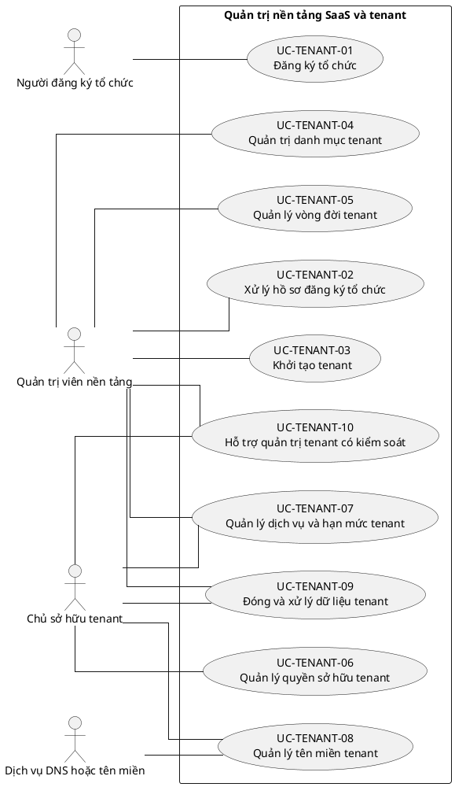

## 9. Ghi chú truy vết từ V3

Các phần tử chi tiết của V3 thuộc nhóm này được giữ làm nguồn phân tích nhưng đã được hợp nhất vào Use Case chính, luồng, quy tắc hoặc yêu cầu hệ thống. Không xem số lượng phần tử V3 là số lượng Use Case nghiệp vụ của V4.

---

<!-- SOURCE: 02_UC-AUTH.md -->

# UC-AUTH — Xác thực và quản lý phiên

## 1. Thông tin tài liệu

| Thuộc tính | Nội dung |
|---|---|
| Mã nhóm Use Case | `UC-AUTH` |
| Miền nghiệp vụ | Danh tính và truy cập |
| Mức ưu tiên | Nền tảng bắt buộc |
| Phiên bản mô hình | V4 — tinh gọn theo mục tiêu actor |

## 2. Mục tiêu

Xác thực người dùng, bảo vệ phiên và thiết lập tenant context trước khi truy cập nghiệp vụ.

## 3. Nguyên tắc phân rã

> Mỗi Use Case dưới đây đại diện cho một mục tiêu nghiệp vụ có kết quả quan sát được. Các thao tác chi tiết được hợp nhất vào cột **Nội dung bao hàm**, luồng nghiệp vụ và quy tắc; không tiếp tục tách thành các Use Case nhỏ.

## 4. Danh mục Use Case chính

| Mã | Use Case | Actor chính/hỗ trợ | Kết quả nghiệp vụ | Nội dung bao hàm |
|---|---|---|---|---|
| `UC-AUTH-01` | **Đăng ký và xác minh tài khoản** | `ACT-GUEST` — Khách truy cập<br>`ACT-IDENTITY-SERVICE` — Dịch vụ xác thực | Tài khoản được tạo và xác minh theo chính sách. | Đăng ký bằng email/định danh, xác minh liên hệ, gửi lại xác minh và chống tự động hóa. |
| `UC-AUTH-02` | **Đăng nhập** | `ACT-PLATFORM-USER` — Người dùng nền tảng<br>`ACT-IDENTITY-SERVICE` — Dịch vụ xác thực | Người dùng nhận phiên hợp lệ hoặc lỗi chuẩn hóa. | Đăng nhập bằng mật khẩu, SSO/OAuth hoặc liên kết dùng một lần; xử lý tài khoản chưa xác minh và giới hạn thất bại. |
| `UC-AUTH-03` | **Quản lý xác thực đa yếu tố** | `ACT-PLATFORM-USER` — Người dùng nền tảng<br>`ACT-IDENTITY-SERVICE` — Dịch vụ xác thực | MFA được đăng ký, sử dụng, thay đổi hoặc khôi phục an toàn. | Đăng ký phương thức, xác minh mã, mã khôi phục, thay đổi/tắt MFA và xác thực tăng cường. |
| `UC-AUTH-04` | **Quản lý phiên và thiết bị** | `ACT-PLATFORM-USER` — Người dùng nền tảng | Người dùng xem và thu hồi phiên hoặc thiết bị tin cậy. | Làm mới phiên, xem phiên, đăng xuất hiện tại/tất cả thiết bị, thu hồi phiên, quản lý thiết bị tin cậy. |
| `UC-AUTH-05` | **Khôi phục và thay đổi thông tin xác thực** | `ACT-PLATFORM-USER` — Người dùng nền tảng<br>`ACT-IDENTITY-SERVICE` — Dịch vụ xác thực | Mật khẩu được đổi hoặc đặt lại sau xác minh hợp lệ. | Quên mật khẩu, đặt lại, đổi mật khẩu, buộc đổi mật khẩu và mở khóa theo chính sách. |
| `UC-AUTH-06` | **Xử lý lời mời tham gia tenant** | `ACT-PLATFORM-USER` — Người dùng nền tảng | Lời mời được chấp nhận hoặc từ chối và membership cập nhật phù hợp. | Mở liên kết mời, xác minh danh tính, chấp nhận hoặc từ chối lời mời. |
| `UC-AUTH-07` | **Chọn và chuyển tenant context** | `ACT-PLATFORM-USER` — Người dùng nền tảng | Tenant context, quyền, menu và branding được chuyển đồng bộ. | Chọn tenant sau đăng nhập, chuyển tenant đang hoạt động và xử lý tenant/membership không còn hợp lệ. |

## 5. Luồng nghiệp vụ cấp nhóm

1. Actor khởi phát một Use Case theo quyền và tenant context hiện hành.
2. Hệ thống kiểm tra xác thực, membership, permission, trạng thái tenant và module.
3. Hệ thống thực hiện luồng nghiệp vụ chính và các kiểm tra dữ liệu cần thiết.
4. Kết quả nghiệp vụ được lưu, thông báo cho bên liên quan và ghi audit khi thuộc danh mục bắt buộc.

## 6. Quy tắc nghiệp vụ cốt lõi

- Backend phải kiểm tra xác thực cho mọi endpoint không công khai.
- Phiên phải bị vô hiệu hóa khi tài khoản, tenant hoặc membership không còn hợp lệ.
- Mật khẩu và secret không được lưu hoặc trả về dạng rõ.
- Tenant context phải được đối chiếu với membership, không tin cậy chỉ từ client.

## 7. Quan hệ với nhóm Use Case khác

[`UC-TENANT`](./01_UC-TENANT.md), [`UC-USER`](./03_UC-USER.md), [`UC-RBAC`](./04_UC-RBAC.md), [`UC-AUDIT`](./21_UC-AUDIT.md)

## 8. Use Case Diagram

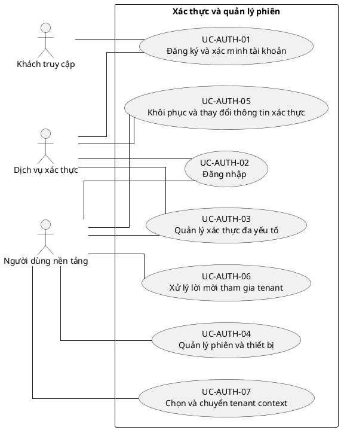

## 9. Ghi chú truy vết từ V3

Các phần tử chi tiết của V3 thuộc nhóm này được giữ làm nguồn phân tích nhưng đã được hợp nhất vào Use Case chính, luồng, quy tắc hoặc yêu cầu hệ thống. Không xem số lượng phần tử V3 là số lượng Use Case nghiệp vụ của V4.

---

<!-- SOURCE: 03_UC-USER.md -->

# UC-USER — Quản lý tài khoản người dùng

## 1. Thông tin tài liệu

| Thuộc tính | Nội dung |
|---|---|
| Mã nhóm Use Case | `UC-USER` |
| Miền nghiệp vụ | Danh tính người dùng |
| Mức ưu tiên | Nền tảng bắt buộc |
| Phiên bản mô hình | V4 — tinh gọn theo mục tiêu actor |

## 2. Mục tiêu

Quản lý hồ sơ và vòng đời tài khoản toàn nền tảng, tách biệt với membership trong từng tenant.

## 3. Nguyên tắc phân rã

> Mỗi Use Case dưới đây đại diện cho một mục tiêu nghiệp vụ có kết quả quan sát được. Các thao tác chi tiết được hợp nhất vào cột **Nội dung bao hàm**, luồng nghiệp vụ và quy tắc; không tiếp tục tách thành các Use Case nhỏ.

## 4. Danh mục Use Case chính

| Mã | Use Case | Actor chính/hỗ trợ | Kết quả nghiệp vụ | Nội dung bao hàm |
|---|---|---|---|---|
| `UC-USER-01` | **Quản lý hồ sơ cá nhân** | `ACT-PLATFORM-USER` — Người dùng nền tảng | Thông tin hồ sơ và ảnh đại diện được cập nhật trong phạm vi cho phép. | Xem hồ sơ, cập nhật họ tên/liên hệ/ảnh đại diện và xem trạng thái tài khoản. |
| `UC-USER-02` | **Quản lý email và danh tính liên kết** | `ACT-PLATFORM-USER` — Người dùng nền tảng<br>`ACT-IDENTITY-SERVICE` — Dịch vụ xác thực | Email đăng nhập hoặc danh tính ngoài được thay đổi sau xác minh. | Thay đổi/xác minh email, đổi username theo chính sách, liên kết/gỡ liên kết danh tính bên ngoài. |
| `UC-USER-03` | **Xem hoạt động và quan hệ tổ chức cá nhân** | `ACT-PLATFORM-USER` — Người dùng nền tảng | Người dùng xem tenant đang tham gia và lịch sử hoạt động tài khoản. | Danh sách tenant, trạng thái membership tóm tắt và hoạt động cá nhân. |
| `UC-USER-04` | **Quản lý dữ liệu và vòng đời tài khoản cá nhân** | `ACT-PLATFORM-USER` — Người dùng nền tảng | Yêu cầu xuất, đóng, hủy đóng hoặc khôi phục tài khoản được xử lý theo chính sách. | Xuất dữ liệu, yêu cầu đóng, hủy/khôi phục trong thời gian chờ, quản lý đồng ý và điều khoản. |
| `UC-USER-05` | **Quản trị tài khoản người dùng** | `ACT-PLATFORM-ADMIN` — Quản trị viên nền tảng | Tài khoản được tra cứu, tạo và cập nhật trạng thái quản trị. | Danh sách/tìm kiếm/chi tiết, tạo tài khoản, kích hoạt, vô hiệu hóa, khôi phục. |
| `UC-USER-06` | **Quản trị an toàn tài khoản** | `ACT-PLATFORM-ADMIN` — Quản trị viên nền tảng | Tài khoản bị khóa/mở khóa hoặc reset thông tin xác thực có audit. | Khóa bảo mật, mở khóa, reset mật khẩu, buộc đổi mật khẩu. |
| `UC-USER-07` | **Xử lý tài khoản đặc biệt** | `ACT-PLATFORM-ADMIN` — Quản trị viên nền tảng | Tài khoản trùng, liên kết sai, ẩn danh hoặc platform role được xử lý có kiểm soát. | Hợp nhất/tách tài khoản, ẩn danh dữ liệu, quản lý platform role và trường hợp không còn membership. |

## 5. Luồng nghiệp vụ cấp nhóm

1. Actor khởi phát một Use Case theo quyền và tenant context hiện hành.
2. Hệ thống kiểm tra xác thực, membership, permission, trạng thái tenant và module.
3. Hệ thống thực hiện luồng nghiệp vụ chính và các kiểm tra dữ liệu cần thiết.
4. Kết quả nghiệp vụ được lưu, thông báo cho bên liên quan và ghi audit khi thuộc danh mục bắt buộc.

## 6. Quy tắc nghiệp vụ cốt lõi

- User là danh tính toàn cục; role tenant không được gán trực tiếp cho User.
- Vô hiệu hóa User toàn cục làm mất hiệu lực phiên ở mọi tenant.
- Đóng tài khoản không được phá vỡ lịch sử nghiệp vụ và audit.

## 7. Quan hệ với nhóm Use Case khác

[`UC-AUTH`](./02_UC-AUTH.md), [`UC-TENANT`](./01_UC-TENANT.md), [`UC-MEMBER`](./09_UC-MEMBER.md), [`UC-AUDIT`](./21_UC-AUDIT.md)

## 8. Use Case Diagram

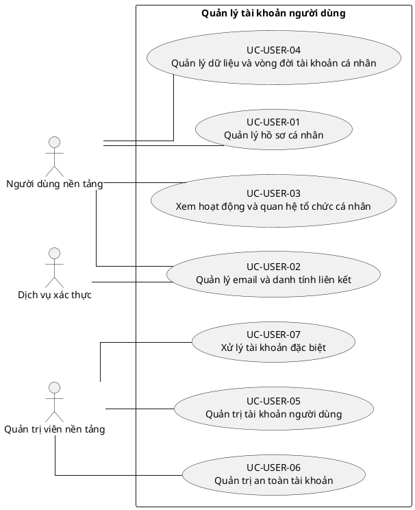

## 9. Ghi chú truy vết từ V3

Các phần tử chi tiết của V3 thuộc nhóm này được giữ làm nguồn phân tích nhưng đã được hợp nhất vào Use Case chính, luồng, quy tắc hoặc yêu cầu hệ thống. Không xem số lượng phần tử V3 là số lượng Use Case nghiệp vụ của V4.

---

<!-- SOURCE: 04_UC-RBAC.md -->

# UC-RBAC — Quản lý vai trò và phân quyền

## 1. Thông tin tài liệu

| Thuộc tính | Nội dung |
|---|---|
| Mã nhóm Use Case | `UC-RBAC` |
| Miền nghiệp vụ | Kiểm soát truy cập |
| Mức ưu tiên | Nền tảng bắt buộc |
| Phiên bản mô hình | V4 — tinh gọn theo mục tiêu actor |

## 2. Mục tiêu

Cấu hình role, permission và phạm vi quyền theo tenant, membership và đơn vị.

## 3. Nguyên tắc phân rã

> Mỗi Use Case dưới đây đại diện cho một mục tiêu nghiệp vụ có kết quả quan sát được. Các thao tác chi tiết được hợp nhất vào cột **Nội dung bao hàm**, luồng nghiệp vụ và quy tắc; không tiếp tục tách thành các Use Case nhỏ.

## 4. Danh mục Use Case chính

| Mã | Use Case | Actor chính/hỗ trợ | Kết quả nghiệp vụ | Nội dung bao hàm |
|---|---|---|---|---|
| `UC-RBAC-01` | **Quản lý role tenant** | `ACT-TENANT-ADMIN` — Quản trị viên tenant<br>`ACT-TENANT-OWNER` — Chủ sở hữu tenant | Role mặc định và tùy chỉnh được tạo, cập nhật, sao chép, kích hoạt hoặc lưu trữ. | Xem role, tạo/sao chép, đổi tên/mô tả, kích hoạt/vô hiệu hóa/lưu trữ và xóa role chưa dùng. |
| `UC-RBAC-02` | **Cấu hình permission cho role** | `ACT-TENANT-ADMIN` — Quản trị viên tenant | Permission được gán hoặc thu hồi theo nhóm và có thể xuất/nhập ma trận. | Gán/thu hồi permission, nhóm permission, so sánh role, xuất/nhập ma trận. |
| `UC-RBAC-03` | **Gán role cho membership** | `ACT-TENANT-ADMIN` — Quản trị viên tenant<br>`ACT-UNIT-ADMIN` — Quản trị viên đơn vị | Membership nhận role hợp lệ theo tenant và phạm vi được phép. | Gán/thu hồi role, gán hàng loạt, role có thời hạn và gia hạn. |
| `UC-RBAC-04` | **Cấu hình phạm vi và ủy quyền** | `ACT-TENANT-ADMIN` — Quản trị viên tenant<br>`ACT-TENANT-OWNER` — Chủ sở hữu tenant | Quyền được giới hạn theo đơn vị, tài nguyên và phạm vi ủy quyền. | Role theo đơn vị, scope tài nguyên, kế thừa nếu cho phép, ngoại lệ từ chối và ủy quyền quản trị role. |
| `UC-RBAC-05` | **Phân tích quyền hiệu lực** | `ACT-TENANT-ADMIN` — Quản trị viên tenant<br>`ACT-AUDITOR` — Người kiểm tra hoặc giám sát | Quyền của membership được mô phỏng và giải thích. | Mô phỏng quyền, giải thích nguồn quyền, kiểm tra xung đột và phân tách trách nhiệm. |
| `UC-RBAC-06` | **Rà soát và xác nhận quyền** | `ACT-TENANT-ADMIN` — Quản trị viên tenant<br>`ACT-AUDITOR` — Người kiểm tra hoặc giám sát | Quyền được rà soát định kỳ, xác nhận lại hoặc thu hồi. | Chiến dịch rà soát, xác nhận quyền, thu hồi quyền không còn cần thiết và xem lịch sử. |
| `UC-RBAC-07` | **Quản lý quyền khẩn cấp và role nền tảng** | `ACT-PLATFORM-ADMIN` — Quản trị viên nền tảng<br>`ACT-TENANT-OWNER` — Chủ sở hữu tenant | Quyền khẩn cấp có thời hạn và role nền tảng được tách biệt với role tenant. | Cấp/kết thúc quyền khẩn cấp, quản lý platform role và audit đầy đủ. |

## 5. Luồng nghiệp vụ cấp nhóm

1. Actor khởi phát một Use Case theo quyền và tenant context hiện hành.
2. Hệ thống kiểm tra xác thực, membership, permission, trạng thái tenant và module.
3. Hệ thống thực hiện luồng nghiệp vụ chính và các kiểm tra dữ liệu cần thiết.
4. Kết quả nghiệp vụ được lưu, thông báo cho bên liên quan và ghi audit khi thuộc danh mục bắt buộc.

## 6. Quy tắc nghiệp vụ cốt lõi

- Role tenant chỉ được gán cho membership cùng tenant.
- Người dùng không được tự nâng quyền hoặc ủy quyền vượt phạm vi.
- Ẩn nút trên frontend không thay thế kiểm tra permission tại backend.
- Quyền xem, tạo, cập nhật, phê duyệt, xuất và quản trị là các quyền độc lập.

## 7. Quan hệ với nhóm Use Case khác

[`UC-USER`](./03_UC-USER.md), [`UC-MEMBER`](./09_UC-MEMBER.md), [`UC-ORG`](./05_UC-ORG.md), [`UC-MODULE`](./07_UC-MODULE.md), [`UC-AUDIT`](./21_UC-AUDIT.md)

## 8. Use Case Diagram

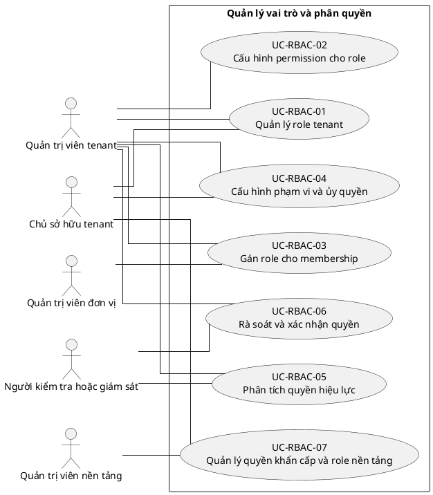

## 9. Ghi chú truy vết từ V3

Các phần tử chi tiết của V3 thuộc nhóm này được giữ làm nguồn phân tích nhưng đã được hợp nhất vào Use Case chính, luồng, quy tắc hoặc yêu cầu hệ thống. Không xem số lượng phần tử V3 là số lượng Use Case nghiệp vụ của V4.

---

<!-- SOURCE: 05_UC-ORG.md -->

# UC-ORG — Quản lý thông tin và cơ cấu tổ chức

## 1. Thông tin tài liệu

| Thuộc tính | Nội dung |
|---|---|
| Mã nhóm Use Case | `UC-ORG` |
| Miền nghiệp vụ | Cơ cấu tổ chức |
| Mức ưu tiên | Nền tảng bắt buộc |
| Phiên bản mô hình | V4 — tinh gọn theo mục tiêu actor |

## 2. Mục tiêu

Quản lý hồ sơ, đơn vị, chức vụ, nhiệm kỳ và lịch sử cơ cấu theo tenant.

## 3. Nguyên tắc phân rã

> Mỗi Use Case dưới đây đại diện cho một mục tiêu nghiệp vụ có kết quả quan sát được. Các thao tác chi tiết được hợp nhất vào cột **Nội dung bao hàm**, luồng nghiệp vụ và quy tắc; không tiếp tục tách thành các Use Case nhỏ.

## 4. Danh mục Use Case chính

| Mã | Use Case | Actor chính/hỗ trợ | Kết quả nghiệp vụ | Nội dung bao hàm |
|---|---|---|---|---|
| `UC-ORG-01` | **Quản lý hồ sơ tổ chức** | `ACT-TENANT-ADMIN` — Quản trị viên tenant<br>`ACT-TENANT-OWNER` — Chủ sở hữu tenant | Hồ sơ tổ chức và trường mở rộng được cập nhật trong tenant. | Tên, mô tả, liên hệ, định danh nội bộ/pháp lý và trường dữ liệu mở rộng. |
| `UC-ORG-02` | **Quản lý cơ cấu đơn vị** | `ACT-TENANT-ADMIN` — Quản trị viên tenant | Đơn vị trực thuộc được tạo, cập nhật, sắp xếp và gắn quan hệ cha-con hợp lệ. | Xem cơ cấu, tạo/sửa đơn vị, sắp xếp, di chuyển và kiểm tra vòng lặp. |
| `UC-ORG-03` | **Tái cấu trúc và đóng đơn vị** | `ACT-TENANT-ADMIN` — Quản trị viên tenant | Đơn vị được vô hiệu hóa, lưu trữ, hợp nhất hoặc tách mà vẫn giữ lịch sử. | Vô hiệu hóa/kích hoạt lại, lưu trữ, chuyển dữ liệu, hợp nhất và tách đơn vị. |
| `UC-ORG-04` | **Quản lý loại đơn vị và chức vụ** | `ACT-TENANT-ADMIN` — Quản trị viên tenant | Danh mục loại đơn vị, chức vụ và quy tắc mã được cấu hình. | Tạo/cập nhật/vô hiệu hóa chức vụ, loại đơn vị và quy tắc đặt mã. |
| `UC-ORG-05` | **Quản lý lãnh đạo đơn vị** | `ACT-TENANT-ADMIN` — Quản trị viên tenant<br>`ACT-UNIT-ADMIN` — Quản trị viên đơn vị | Người quản lý đơn vị và nhiệm kỳ được ghi nhận. | Gán người quản lý, kết thúc nhiệm kỳ và lưu lịch sử. |
| `UC-ORG-06` | **Quản lý kỳ hoạt động tổ chức** | `ACT-TENANT-ADMIN` — Quản trị viên tenant | Nhiệm kỳ, năm học và kỳ hoạt động được cấu hình. | Tạo, cập nhật, kích hoạt, đóng và tra cứu kỳ hoạt động. |
| `UC-ORG-07` | **Nhập, xuất và áp dụng mẫu cơ cấu** | `ACT-TENANT-ADMIN` — Quản trị viên tenant | Cơ cấu được nhập/xuất hoặc tạo từ mẫu có kiểm tra toàn vẹn. | Nhập, xuất, sao chép mẫu nền tảng và xem lịch sử thay đổi cơ cấu. |

## 5. Luồng nghiệp vụ cấp nhóm

1. Actor khởi phát một Use Case theo quyền và tenant context hiện hành.
2. Hệ thống kiểm tra xác thực, membership, permission, trạng thái tenant và module.
3. Hệ thống thực hiện luồng nghiệp vụ chính và các kiểm tra dữ liệu cần thiết.
4. Kết quả nghiệp vụ được lưu, thông báo cho bên liên quan và ghi audit khi thuộc danh mục bắt buộc.

## 6. Quy tắc nghiệp vụ cốt lõi

- Mỗi đơn vị thuộc duy nhất một tenant.
- Đơn vị cha và con phải cùng tenant; không được tạo chu trình.
- Đơn vị có dữ liệu liên quan không được xóa vật lý trực tiếp.
- Tên ban và chức vụ riêng của MTEC không được mã hóa thành mặc định bắt buộc.

## 7. Quan hệ với nhóm Use Case khác

[`UC-TENANT`](./01_UC-TENANT.md), [`UC-MEMBER`](./09_UC-MEMBER.md), [`UC-RBAC`](./04_UC-RBAC.md), [`UC-AUDIT`](./21_UC-AUDIT.md)

## 8. Use Case Diagram

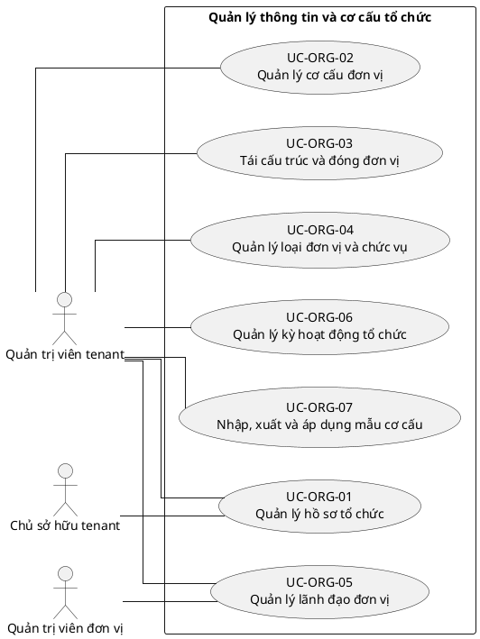

## 9. Ghi chú truy vết từ V3

Các phần tử chi tiết của V3 thuộc nhóm này được giữ làm nguồn phân tích nhưng đã được hợp nhất vào Use Case chính, luồng, quy tắc hoặc yêu cầu hệ thống. Không xem số lượng phần tử V3 là số lượng Use Case nghiệp vụ của V4.

---

<!-- SOURCE: 06_UC-BRAND.md -->

# UC-BRAND — Quản lý branding và giao diện tổ chức

## 1. Thông tin tài liệu

| Thuộc tính | Nội dung |
|---|---|
| Mã nhóm Use Case | `UC-BRAND` |
| Miền nghiệp vụ | Cấu hình tenant |
| Mức ưu tiên | Nền tảng bắt buộc |
| Phiên bản mô hình | V4 — tinh gọn theo mục tiêu actor |

## 2. Mục tiêu

Cho phép tenant tùy chỉnh nhận diện trong giới hạn bảo đảm nhất quán và khả năng sử dụng.

## 3. Nguyên tắc phân rã

> Mỗi Use Case dưới đây đại diện cho một mục tiêu nghiệp vụ có kết quả quan sát được. Các thao tác chi tiết được hợp nhất vào cột **Nội dung bao hàm**, luồng nghiệp vụ và quy tắc; không tiếp tục tách thành các Use Case nhỏ.

## 4. Danh mục Use Case chính

| Mã | Use Case | Actor chính/hỗ trợ | Kết quả nghiệp vụ | Nội dung bao hàm |
|---|---|---|---|---|
| `UC-BRAND-01` | **Quản lý nhận diện thương hiệu** | `ACT-TENANT-ADMIN` — Quản trị viên tenant<br>`ACT-TENANT-OWNER` — Chủ sở hữu tenant<br>`ACT-STORAGE-SERVICE` — Dịch vụ lưu trữ | Tên hiển thị, logo, favicon, màu sắc và kiểu chữ được cấu hình. | Logo chính/rút gọn, favicon, màu chủ/phụ, kiểu chữ, chế độ sáng/tối và ảnh nền. |
| `UC-BRAND-02` | **Quản lý bề mặt giao diện mang thương hiệu** | `ACT-TENANT-ADMIN` — Quản trị viên tenant | Branding được áp dụng cho đăng nhập, email, thông báo, tài liệu và bản xuất. | Trang đăng nhập, chân trang, email, thông báo, tài liệu và bản xuất. |
| `UC-BRAND-03` | **Quản lý thuật ngữ và nhãn hiển thị** | `ACT-TENANT-ADMIN` — Quản trị viên tenant | Thuật ngữ, nhãn menu và tên mô-đun phản ánh cách gọi của tổ chức. | Thuật ngữ tổ chức, nhãn menu, tên module và nội dung liên hệ. |
| `UC-BRAND-04` | **Quản lý thư viện tài sản thương hiệu** | `ACT-TENANT-ADMIN` — Quản trị viên tenant<br>`ACT-STORAGE-SERVICE` — Dịch vụ lưu trữ | Tài sản thương hiệu được tải lên, thay thế, phân loại và lưu trữ. | Upload, thay thế, lưu trữ và tra cứu tài sản. |
| `UC-BRAND-05` | **Xem trước và xuất bản branding** | `ACT-TENANT-ADMIN` — Quản trị viên tenant<br>`ACT-TENANT-OWNER` — Chủ sở hữu tenant | Branding được xem trước, xuất bản, lên lịch hoặc khôi phục phiên bản. | Bản nháp, preview, publish, schedule, version history và rollback. |
| `UC-BRAND-06` | **Kiểm soát chất lượng branding** | `ACT-TENANT-ADMIN` — Quản trị viên tenant | Tệp, độ tương phản và cấu hình fallback đáp ứng yêu cầu sử dụng. | Kiểm tra tệp, khả năng đọc, giới hạn tùy chỉnh và branding mặc định nền tảng. |

## 5. Luồng nghiệp vụ cấp nhóm

1. Actor khởi phát một Use Case theo quyền và tenant context hiện hành.
2. Hệ thống kiểm tra xác thực, membership, permission, trạng thái tenant và module.
3. Hệ thống thực hiện luồng nghiệp vụ chính và các kiểm tra dữ liệu cần thiết.
4. Kết quả nghiệp vụ được lưu, thông báo cho bên liên quan và ghi audit khi thuộc danh mục bắt buộc.

## 6. Quy tắc nghiệp vụ cốt lõi

- Branding chỉ có hiệu lực trong tenant sở hữu cấu hình.
- Branding không được thay đổi quyền hoặc logic nghiệp vụ.
- Màu sắc và nội dung tùy chỉnh không được che khuất cảnh báo bắt buộc.

## 7. Quan hệ với nhóm Use Case khác

[`UC-TENANT`](./01_UC-TENANT.md), [`UC-MODULE`](./07_UC-MODULE.md), [`UC-DOCUMENT`](./11_UC-DOCUMENT.md), [`UC-NOTIFICATION`](./18_UC-NOTIFICATION.md), [`UC-AUDIT`](./21_UC-AUDIT.md)

## 8. Use Case Diagram

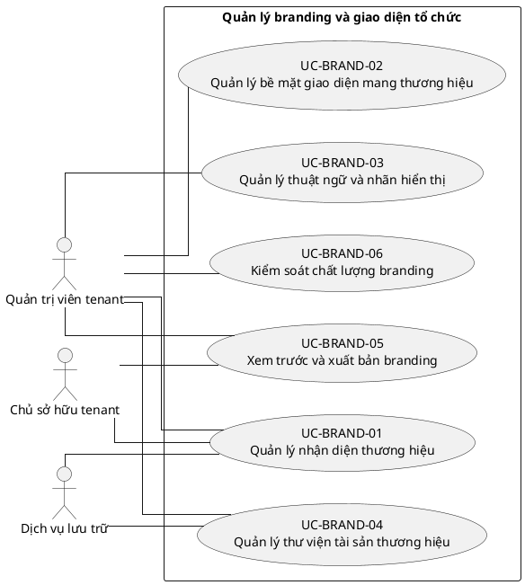

## 9. Ghi chú truy vết từ V3

Các phần tử chi tiết của V3 thuộc nhóm này được giữ làm nguồn phân tích nhưng đã được hợp nhất vào Use Case chính, luồng, quy tắc hoặc yêu cầu hệ thống. Không xem số lượng phần tử V3 là số lượng Use Case nghiệp vụ của V4.

---

<!-- SOURCE: 07_UC-MODULE.md -->

# UC-MODULE — Cấu hình module và quy trình nghiệp vụ

## 1. Thông tin tài liệu

| Thuộc tính | Nội dung |
|---|---|
| Mã nhóm Use Case | `UC-MODULE` |
| Miền nghiệp vụ | Nền tảng mô-đun |
| Mức ưu tiên | Nền tảng bắt buộc |
| Phiên bản mô hình | V4 — tinh gọn theo mục tiêu actor |

## 2. Mục tiêu

Quản lý module được hỗ trợ, trạng thái kích hoạt, phụ thuộc và cấu hình theo tenant.

## 3. Nguyên tắc phân rã

> Mỗi Use Case dưới đây đại diện cho một mục tiêu nghiệp vụ có kết quả quan sát được. Các thao tác chi tiết được hợp nhất vào cột **Nội dung bao hàm**, luồng nghiệp vụ và quy tắc; không tiếp tục tách thành các Use Case nhỏ.

## 4. Danh mục Use Case chính

| Mã | Use Case | Actor chính/hỗ trợ | Kết quả nghiệp vụ | Nội dung bao hàm |
|---|---|---|---|---|
| `UC-MODULE-01` | **Xem danh mục module** | `ACT-TENANT-ADMIN` — Quản trị viên tenant<br>`ACT-PLATFORM-ADMIN` — Quản trị viên nền tảng | Người quản trị xem module, phiên bản, mô tả và phụ thuộc. | Danh mục module, trạng thái hỗ trợ và tài liệu cấu hình. |
| `UC-MODULE-02` | **Kích hoạt hoặc vô hiệu hóa module** | `ACT-TENANT-ADMIN` — Quản trị viên tenant<br>`ACT-TENANT-OWNER` — Chủ sở hữu tenant | Module được bật/tắt riêng theo tenant sau kiểm tra điều kiện. | Bật/tắt module, xác nhận tác động và ghi audit. |
| `UC-MODULE-03` | **Quản lý phụ thuộc module** | `ACT-TENANT-ADMIN` — Quản trị viên tenant<br>`ACT-PLATFORM-ADMIN` — Quản trị viên nền tảng | Phụ thuộc bắt buộc và xung đột module được kiểm soát. | Kiểm tra dependency, chặn cấu hình không hợp lệ và đề xuất thứ tự xử lý. |
| `UC-MODULE-04` | **Cấu hình module theo tenant** | `ACT-TENANT-ADMIN` — Quản trị viên tenant | Tham số, thuật ngữ và thiết lập module được lưu theo tenant. | Cấu hình chung, cấu hình đơn vị, chính sách module và giá trị mặc định. |
| `UC-MODULE-05` | **Quản lý mẫu quy trình module** | `ACT-TENANT-ADMIN` — Quản trị viên tenant<br>`ACT-MODULE-SPECIALIST` — Vai trò chuyên trách mô-đun | Mẫu workflow được chọn, sao chép và tùy chỉnh trong giới hạn. | Áp dụng mẫu nền tảng, tùy chỉnh trạng thái/bước/phê duyệt và phiên bản hóa. |
| `UC-MODULE-06` | **Quản lý phát hành và chuyển đổi module** | `ACT-PLATFORM-ADMIN` — Quản trị viên nền tảng<br>`ACT-TENANT-ADMIN` — Quản trị viên tenant | Thay đổi phiên bản hoặc rollout module được kiểm soát. | Lên lịch bật, thử nghiệm giới hạn, nâng cấp, migration và rollback. |
| `UC-MODULE-07` | **Theo dõi sử dụng và sức khỏe module** | `ACT-TENANT-ADMIN` — Quản trị viên tenant<br>`ACT-PLATFORM-ADMIN` — Quản trị viên nền tảng | Trạng thái, lỗi, mức sử dụng và hạn mức module được giám sát. | Theo dõi sức khỏe, lỗi cấu hình, sử dụng và cảnh báo. |

## 5. Luồng nghiệp vụ cấp nhóm

1. Actor khởi phát một Use Case theo quyền và tenant context hiện hành.
2. Hệ thống kiểm tra xác thực, membership, permission, trạng thái tenant và module.
3. Hệ thống thực hiện luồng nghiệp vụ chính và các kiểm tra dữ liệu cần thiết.
4. Kết quả nghiệp vụ được lưu, thông báo cho bên liên quan và ghi audit khi thuộc danh mục bắt buộc.

## 6. Quy tắc nghiệp vụ cốt lõi

- Vô hiệu hóa module không được tự động xóa dữ liệu đã phát sinh.
- API module bị tắt phải bị backend từ chối, không chỉ ẩn menu.
- Không được tắt module nền khi module phụ thuộc còn hoạt động.

## 7. Quan hệ với nhóm Use Case khác

[`UC-TENANT`](./01_UC-TENANT.md), [`UC-RBAC`](./04_UC-RBAC.md), [`UC-BRAND`](./06_UC-BRAND.md), [`UC-AUDIT`](./21_UC-AUDIT.md)

## 8. Use Case Diagram

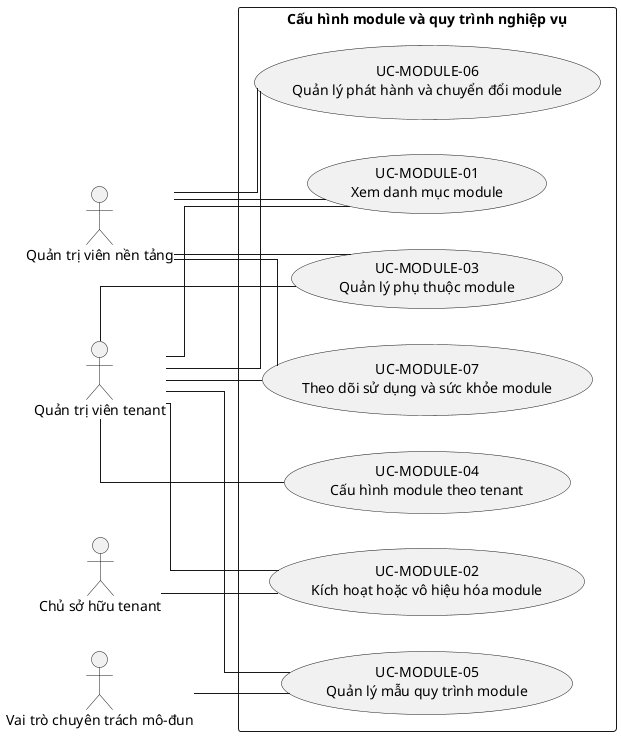

## 9. Ghi chú truy vết từ V3

Các phần tử chi tiết của V3 thuộc nhóm này được giữ làm nguồn phân tích nhưng đã được hợp nhất vào Use Case chính, luồng, quy tắc hoặc yêu cầu hệ thống. Không xem số lượng phần tử V3 là số lượng Use Case nghiệp vụ của V4.

---

<!-- SOURCE: 08_UC-SETTING.md -->

# UC-SETTING — Thiết lập cá nhân

## 1. Thông tin tài liệu

| Thuộc tính | Nội dung |
|---|---|
| Mã nhóm Use Case | `UC-SETTING` |
| Miền nghiệp vụ | Trải nghiệm người dùng |
| Mức ưu tiên | Nền tảng |
| Phiên bản mô hình | V4 — tinh gọn theo mục tiêu actor |

## 2. Mục tiêu

Cho phép người dùng quản lý tùy chọn cá nhân mà không thay đổi chính sách tenant.

## 3. Nguyên tắc phân rã

> Mỗi Use Case dưới đây đại diện cho một mục tiêu nghiệp vụ có kết quả quan sát được. Các thao tác chi tiết được hợp nhất vào cột **Nội dung bao hàm**, luồng nghiệp vụ và quy tắc; không tiếp tục tách thành các Use Case nhỏ.

## 4. Danh mục Use Case chính

| Mã | Use Case | Actor chính/hỗ trợ | Kết quả nghiệp vụ | Nội dung bao hàm |
|---|---|---|---|---|
| `UC-SETTING-01` | **Quản lý tùy chọn giao diện** | `ACT-PLATFORM-USER` — Người dùng nền tảng | Giao diện cá nhân được lưu theo người dùng. | Chủ đề sáng/tối, mật độ hiển thị, sidebar, trang mặc định và bố cục cá nhân. |
| `UC-SETTING-02` | **Quản lý ngôn ngữ và định dạng** | `ACT-PLATFORM-USER` — Người dùng nền tảng | Ngôn ngữ, múi giờ, ngày giờ và số được hiển thị theo tùy chọn. | Ngôn ngữ, locale, múi giờ, định dạng ngày/giờ/số. |
| `UC-SETTING-03` | **Quản lý khả năng tiếp cận** | `ACT-PLATFORM-USER` — Người dùng nền tảng | Tùy chọn accessibility được áp dụng. | Cỡ chữ, tương phản, giảm chuyển động, điều hướng bàn phím và hỗ trợ đọc. |
| `UC-SETTING-04` | **Quản lý tùy chọn thông báo** | `ACT-PLATFORM-USER` — Người dùng nền tảng | Kênh, tần suất và giờ yên lặng được lưu. | Email/push/in-app, digest, giờ yên lặng và loại thông báo. |
| `UC-SETTING-05` | **Quản lý quyền riêng tư cá nhân** | `ACT-PLATFORM-USER` — Người dùng nền tảng | Tùy chọn chia sẻ và hiển thị thông tin cá nhân được áp dụng trong phạm vi chính sách. | Mức hiển thị hồ sơ, dữ liệu phân tích, AI opt-in và lịch sử đồng ý. |
| `UC-SETTING-06` | **Quản lý mặc định theo tenant** | `ACT-PLATFORM-USER` — Người dùng nền tảng | Tenant mặc định và tùy chọn cá nhân theo từng tenant được lưu. | Tenant mặc định, đơn vị quan tâm, dashboard mặc định và lựa chọn module gần đây. |

## 5. Luồng nghiệp vụ cấp nhóm

1. Actor khởi phát một Use Case theo quyền và tenant context hiện hành.
2. Hệ thống kiểm tra xác thực, membership, permission, trạng thái tenant và module.
3. Hệ thống thực hiện luồng nghiệp vụ chính và các kiểm tra dữ liệu cần thiết.
4. Kết quả nghiệp vụ được lưu, thông báo cho bên liên quan và ghi audit khi thuộc danh mục bắt buộc.

## 6. Quy tắc nghiệp vụ cốt lõi

- Thiết lập cá nhân không được vượt qua chính sách bảo mật hoặc quyền tenant.
- Tùy chọn theo tenant phải tách biệt giữa các tenant.

## 7. Quan hệ với nhóm Use Case khác

[`UC-AUTH`](./02_UC-AUTH.md), [`UC-USER`](./03_UC-USER.md), [`UC-NOTIFICATION`](./18_UC-NOTIFICATION.md), [`UC-DASHBOARD`](./19_UC-DASHBOARD.md)

## 8. Use Case Diagram

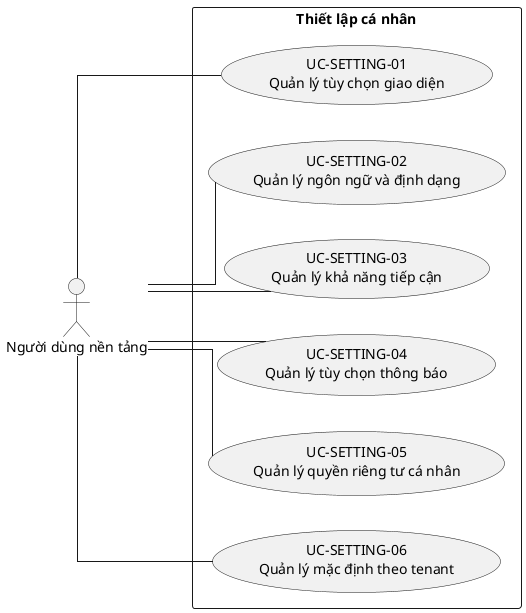

## 9. Ghi chú truy vết từ V3

Các phần tử chi tiết của V3 thuộc nhóm này được giữ làm nguồn phân tích nhưng đã được hợp nhất vào Use Case chính, luồng, quy tắc hoặc yêu cầu hệ thống. Không xem số lượng phần tử V3 là số lượng Use Case nghiệp vụ của V4.

---

<!-- SOURCE: 09_UC-MEMBER.md -->

# UC-MEMBER — Quản lý thành viên và membership

## 1. Thông tin tài liệu

| Thuộc tính | Nội dung |
|---|---|
| Mã nhóm Use Case | `UC-MEMBER` |
| Miền nghiệp vụ | Nhân sự tổ chức |
| Mức ưu tiên | Nghiệp vụ lõi |
| Phiên bản mô hình | V4 — tinh gọn theo mục tiêu actor |

## 2. Mục tiêu

Quản lý quan hệ User–Tenant, hồ sơ thành viên, đơn vị, chức vụ và vòng đời tham gia.

## 3. Nguyên tắc phân rã

> Mỗi Use Case dưới đây đại diện cho một mục tiêu nghiệp vụ có kết quả quan sát được. Các thao tác chi tiết được hợp nhất vào cột **Nội dung bao hàm**, luồng nghiệp vụ và quy tắc; không tiếp tục tách thành các Use Case nhỏ.

## 4. Danh mục Use Case chính

| Mã | Use Case | Actor chính/hỗ trợ | Kết quả nghiệp vụ | Nội dung bao hàm |
|---|---|---|---|---|
| `UC-MEMBER-01` | **Mời hoặc thêm thành viên** | `ACT-HR-SPECIALIST` — Phụ trách nhân sự<br>`ACT-TENANT-ADMIN` — Quản trị viên tenant | User được mời hoặc thêm vào tenant mà không tạo membership trùng. | Mời bằng email/liên kết, thêm user hiện có, tạo tài khoản theo quyền và gửi thông báo. |
| `UC-MEMBER-02` | **Onboarding thành viên** | `ACT-TENANT-MEMBER` — Thành viên tenant<br>`ACT-HR-SPECIALIST` — Phụ trách nhân sự | Thành viên hoàn tất xác nhận, hồ sơ và điều kiện gia nhập. | Chấp nhận lời mời, bổ sung hồ sơ, xác nhận quy định và kích hoạt membership. |
| `UC-MEMBER-03` | **Quản lý hồ sơ thành viên** | `ACT-TENANT-MEMBER` — Thành viên tenant<br>`ACT-HR-SPECIALIST` — Phụ trách nhân sự | Hồ sơ thành viên, kỹ năng và minh chứng được cập nhật theo quyền. | Thông tin cá nhân trong tổ chức, kỹ năng, kinh nghiệm, tài liệu và lịch sử. |
| `UC-MEMBER-04` | **Phân công thành viên vào đơn vị và chức vụ** | `ACT-HR-SPECIALIST` — Phụ trách nhân sự<br>`ACT-UNIT-ADMIN` — Quản trị viên đơn vị | Thành viên được gán đơn vị, chức vụ và thời gian hiệu lực hợp lệ. | Gán/chuyển đơn vị, chức vụ, nhiều đơn vị, nhiệm kỳ và người quản lý. |
| `UC-MEMBER-05` | **Quản lý trạng thái membership** | `ACT-HR-SPECIALIST` — Phụ trách nhân sự<br>`ACT-TENANT-ADMIN` — Quản trị viên tenant | Membership chuyển trạng thái hợp lệ và không làm mất lịch sử. | Pending/Active/Suspended/Ended, tái kích hoạt và ghi lý do. |
| `UC-MEMBER-06` | **Chuyển giao hoặc kết thúc membership** | `ACT-HR-SPECIALIST` — Phụ trách nhân sự<br>`ACT-TENANT-OWNER` — Chủ sở hữu tenant | Việc rời tổ chức, chuyển giao trách nhiệm và kết thúc tư cách được kiểm soát. | Yêu cầu rời, phê duyệt kết thúc, chuyển tài sản/công việc/quyền và kiểm tra Owner cuối cùng. |
| `UC-MEMBER-07` | **Tra cứu danh bạ và lịch sử thành viên** | `ACT-TENANT-MEMBER` — Thành viên tenant<br>`ACT-UNIT-ADMIN` — Quản trị viên đơn vị<br>`ACT-HR-SPECIALIST` — Phụ trách nhân sự | Danh sách và chi tiết thành viên hiển thị theo phạm vi quyền. | Tìm kiếm, lọc, xem hồ sơ, lịch sử đơn vị/chức vụ và trạng thái. |
| `UC-MEMBER-08` | **Nhập, xuất và cập nhật hàng loạt thành viên** | `ACT-HR-SPECIALIST` — Phụ trách nhân sự | Dữ liệu thành viên được nhập/xuất hoặc cập nhật hàng loạt có kiểm tra lỗi. | Import CSV, mapping, preview, xử lý lỗi, export và bulk update. |

## 5. Luồng nghiệp vụ cấp nhóm

1. Actor khởi phát một Use Case theo quyền và tenant context hiện hành.
2. Hệ thống kiểm tra xác thực, membership, permission, trạng thái tenant và module.
3. Hệ thống thực hiện luồng nghiệp vụ chính và các kiểm tra dữ liệu cần thiết.
4. Kết quả nghiệp vụ được lưu, thông báo cho bên liên quan và ghi audit khi thuộc danh mục bắt buộc.

## 6. Quy tắc nghiệp vụ cốt lõi

- Mỗi cặp User–Tenant chỉ có một membership hiện hành.
- Chỉ membership Active được thực hiện nghiệp vụ tenant.
- Membership và đơn vị được gán phải cùng tenant.
- Không được kết thúc hoặc đình chỉ Owner cuối cùng trước khi có người thay thế.

## 7. Quan hệ với nhóm Use Case khác

[`UC-USER`](./03_UC-USER.md), [`UC-ORG`](./05_UC-ORG.md), [`UC-RBAC`](./04_UC-RBAC.md), [`UC-AUTH`](./02_UC-AUTH.md), [`UC-AUDIT`](./21_UC-AUDIT.md)

## 8. Use Case Diagram

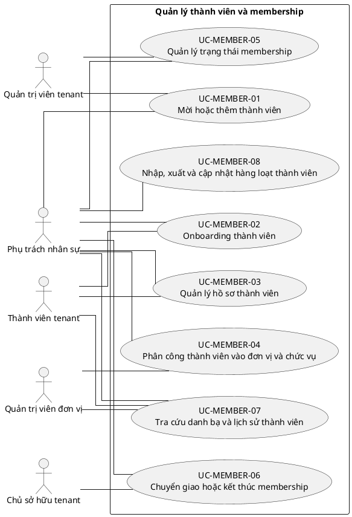

## 9. Ghi chú truy vết từ V3

Các phần tử chi tiết của V3 thuộc nhóm này được giữ làm nguồn phân tích nhưng đã được hợp nhất vào Use Case chính, luồng, quy tắc hoặc yêu cầu hệ thống. Không xem số lượng phần tử V3 là số lượng Use Case nghiệp vụ của V4.

---

<!-- SOURCE: 10_UC-REQUEST.md -->

# UC-REQUEST — Quản lý đơn từ và yêu cầu nội bộ

## 1. Thông tin tài liệu

| Thuộc tính | Nội dung |
|---|---|
| Mã nhóm Use Case | `UC-REQUEST` |
| Miền nghiệp vụ | Workflow yêu cầu |
| Mức ưu tiên | Nghiệp vụ lõi |
| Phiên bản mô hình | V4 — tinh gọn theo mục tiêu actor |

## 2. Mục tiêu

Số hóa việc tạo, theo dõi, phê duyệt và liên kết yêu cầu nội bộ với nghiệp vụ phát sinh.

## 3. Nguyên tắc phân rã

> Mỗi Use Case dưới đây đại diện cho một mục tiêu nghiệp vụ có kết quả quan sát được. Các thao tác chi tiết được hợp nhất vào cột **Nội dung bao hàm**, luồng nghiệp vụ và quy tắc; không tiếp tục tách thành các Use Case nhỏ.

## 4. Danh mục Use Case chính

| Mã | Use Case | Actor chính/hỗ trợ | Kết quả nghiệp vụ | Nội dung bao hàm |
|---|---|---|---|---|
| `UC-REQUEST-01` | **Quản lý loại yêu cầu và biểu mẫu** | `ACT-TENANT-ADMIN` — Quản trị viên tenant<br>`ACT-MODULE-SPECIALIST` — Vai trò chuyên trách mô-đun | Loại yêu cầu, trường dữ liệu, điều kiện và luồng phê duyệt được cấu hình. | Tạo/sửa loại, form, trạng thái, SLA, quy tắc phê duyệt và quyền. |
| `UC-REQUEST-02` | **Tạo và gửi yêu cầu** | `ACT-TENANT-MEMBER` — Thành viên tenant | Yêu cầu hợp lệ được gửi với dữ liệu và tệp đính kèm. | Lưu nháp, điền form, tải tệp, chọn người/đơn vị liên quan và gửi. |
| `UC-REQUEST-03` | **Theo dõi và cập nhật yêu cầu** | `ACT-TENANT-MEMBER` — Thành viên tenant | Người gửi xem trạng thái, trao đổi và bổ sung dữ liệu khi được phép. | Xem chi tiết/lịch sử, bình luận, bổ sung, sửa trước xử lý và nhận thông báo. |
| `UC-REQUEST-04` | **Rút hoặc hủy yêu cầu** | `ACT-TENANT-MEMBER` — Thành viên tenant<br>`ACT-APPROVER` — Người phê duyệt | Yêu cầu được rút/hủy theo trạng thái và chính sách. | Rút trước duyệt, yêu cầu hủy sau duyệt và ghi lý do. |
| `UC-REQUEST-05` | **Tiếp nhận và phân công xử lý** | `ACT-MODULE-SPECIALIST` — Vai trò chuyên trách mô-đun<br>`ACT-APPROVER` — Người phê duyệt | Yêu cầu được phân công đúng người, đơn vị và thời hạn. | Queue xử lý, phân công/chuyển giao, ưu tiên và SLA. |
| `UC-REQUEST-06` | **Phê duyệt hoặc từ chối yêu cầu** | `ACT-APPROVER` — Người phê duyệt | Yêu cầu được duyệt, từ chối hoặc yêu cầu bổ sung có lý do và audit. | Xem hồ sơ, xin bổ sung, duyệt/từ chối, phê duyệt nhiều cấp và phân tách trách nhiệm. |
| `UC-REQUEST-07` | **Thực hiện nghiệp vụ sau phê duyệt** | `ACT-MODULE-SPECIALIST` — Vai trò chuyên trách mô-đun | Yêu cầu được chuyển thành giao dịch, văn bản, nhiệm vụ hoặc thay đổi dữ liệu liên quan. | Sinh đối tượng nghiệp vụ, liên kết tài chính/tài liệu/thành viên và cập nhật kết quả. |
| `UC-REQUEST-08` | **Báo cáo và xuất dữ liệu yêu cầu** | `ACT-MODULE-SPECIALIST` — Vai trò chuyên trách mô-đun<br>`ACT-AUDITOR` — Người kiểm tra hoặc giám sát | Yêu cầu được thống kê, lọc và xuất theo quyền. | Dashboard, SLA, tồn đọng, lịch sử phê duyệt và export. |

## 5. Luồng nghiệp vụ cấp nhóm

1. Actor khởi phát một Use Case theo quyền và tenant context hiện hành.
2. Hệ thống kiểm tra xác thực, membership, permission, trạng thái tenant và module.
3. Hệ thống thực hiện luồng nghiệp vụ chính và các kiểm tra dữ liệu cần thiết.
4. Kết quả nghiệp vụ được lưu, thông báo cho bên liên quan và ghi audit khi thuộc danh mục bắt buộc.

## 6. Quy tắc nghiệp vụ cốt lõi

- Không được duyệt lại yêu cầu đã kết thúc nếu không có quy trình mở lại.
- Người tạo không được tự phê duyệt khi chính sách phân tách trách nhiệm được bật.
- Yêu cầu và đối tượng phát sinh phải cùng tenant.

## 7. Quan hệ với nhóm Use Case khác

[`UC-MEMBER`](./09_UC-MEMBER.md), [`UC-RBAC`](./04_UC-RBAC.md), [`UC-DOCUMENT`](./11_UC-DOCUMENT.md), [`UC-FINANCE`](./12_UC-FINANCE.md), [`UC-NOTIFICATION`](./18_UC-NOTIFICATION.md), [`UC-AUDIT`](./21_UC-AUDIT.md)

## 8. Use Case Diagram

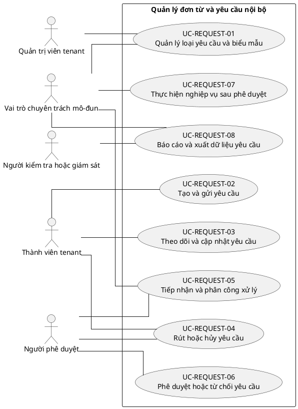

## 9. Ghi chú truy vết từ V3

Các phần tử chi tiết của V3 thuộc nhóm này được giữ làm nguồn phân tích nhưng đã được hợp nhất vào Use Case chính, luồng, quy tắc hoặc yêu cầu hệ thống. Không xem số lượng phần tử V3 là số lượng Use Case nghiệp vụ của V4.

---

<!-- SOURCE: 11_UC-DOCUMENT.md -->

# UC-DOCUMENT — Quản lý văn bản, biểu mẫu và mẫu tài liệu

## 1. Thông tin tài liệu

| Thuộc tính | Nội dung |
|---|---|
| Mã nhóm Use Case | `UC-DOCUMENT` |
| Miền nghiệp vụ | Quản trị tài liệu |
| Mức ưu tiên | Nghiệp vụ lõi |
| Phiên bản mô hình | V4 — tinh gọn theo mục tiêu actor |

## 2. Mục tiêu

Quản lý vòng đời tài liệu từ mẫu, soạn thảo, phê duyệt, phát hành đến lưu trữ.

## 3. Nguyên tắc phân rã

> Mỗi Use Case dưới đây đại diện cho một mục tiêu nghiệp vụ có kết quả quan sát được. Các thao tác chi tiết được hợp nhất vào cột **Nội dung bao hàm**, luồng nghiệp vụ và quy tắc; không tiếp tục tách thành các Use Case nhỏ.

## 4. Danh mục Use Case chính

| Mã | Use Case | Actor chính/hỗ trợ | Kết quả nghiệp vụ | Nội dung bao hàm |
|---|---|---|---|---|
| `UC-DOCUMENT-01` | **Quản lý mẫu tài liệu** | `ACT-DOCUMENT-OFFICER` — Phụ trách văn bản<br>`ACT-TENANT-ADMIN` — Quản trị viên tenant | Mẫu tài liệu được tạo, phiên bản hóa và áp dụng theo tenant. | Tạo/sửa mẫu, trường trộn dữ liệu, numbering, quyền dùng và mẫu nền tảng. |
| `UC-DOCUMENT-02` | **Soạn thảo tài liệu** | `ACT-DOCUMENT-OFFICER` — Phụ trách văn bản<br>`ACT-TENANT-MEMBER` — Thành viên tenant | Tài liệu nháp được tạo thủ công hoặc từ mẫu với tệp liên quan. | Tạo nháp, điền dữ liệu, upload, liên kết nghiệp vụ và đồng tác giả. |
| `UC-DOCUMENT-03` | **Rà soát và phê duyệt tài liệu** | `ACT-DOCUMENT-OFFICER` — Phụ trách văn bản<br>`ACT-APPROVER` — Người phê duyệt | Tài liệu được góp ý, chỉnh sửa và phê duyệt theo workflow. | Gửi duyệt, bình luận, yêu cầu sửa, phê duyệt/từ chối và nhiều cấp. |
| `UC-DOCUMENT-04` | **Phát hành và phân phối tài liệu** | `ACT-DOCUMENT-OFFICER` — Phụ trách văn bản<br>`ACT-APPROVER` — Người phê duyệt<br>`ACT-NOTIFICATION-SERVICE` — Dịch vụ thông báo | Tài liệu có số, ngày hiệu lực, đối tượng nhận và trạng thái phát hành. | Cấp số, ký/xác nhận, phát hành, công bố, gửi người nhận và thu hồi phát hành. |
| `UC-DOCUMENT-05` | **Quản lý phiên bản và sửa đổi** | `ACT-DOCUMENT-OFFICER` — Phụ trách văn bản | Lịch sử phiên bản, sửa đổi và văn bản thay thế được truy vết. | Tạo phiên bản mới, so sánh, thay thế, đính chính và khôi phục. |
| `UC-DOCUMENT-06` | **Quản lý truy cập và chia sẻ tài liệu** | `ACT-DOCUMENT-OFFICER` — Phụ trách văn bản<br>`ACT-TENANT-ADMIN` — Quản trị viên tenant | Quyền xem, sửa, tải và chia sẻ tài liệu được kiểm soát. | Phân quyền, chia sẻ nội bộ, liên kết có thời hạn và hạn chế tải. |
| `UC-DOCUMENT-07` | **Tra cứu và xuất tài liệu** | `ACT-TENANT-MEMBER` — Thành viên tenant<br>`ACT-DOCUMENT-OFFICER` — Phụ trách văn bản<br>`ACT-AUDITOR` — Người kiểm tra hoặc giám sát | Tài liệu được tìm kiếm, xem, tải và xuất theo quyền. | Tìm kiếm metadata/full-text, bộ lọc, xem trước, tải và xuất danh mục. |
| `UC-DOCUMENT-08` | **Lưu trữ và xử lý hết hạn tài liệu** | `ACT-DOCUMENT-OFFICER` — Phụ trách văn bản<br>`ACT-AUDITOR` — Người kiểm tra hoặc giám sát | Tài liệu được lưu trữ, giữ pháp lý hoặc tiêu hủy theo chính sách. | Archive, retention, legal hold, tiêu hủy và biên bản xử lý. |

## 5. Luồng nghiệp vụ cấp nhóm

1. Actor khởi phát một Use Case theo quyền và tenant context hiện hành.
2. Hệ thống kiểm tra xác thực, membership, permission, trạng thái tenant và module.
3. Hệ thống thực hiện luồng nghiệp vụ chính và các kiểm tra dữ liệu cần thiết.
4. Kết quả nghiệp vụ được lưu, thông báo cho bên liên quan và ghi audit khi thuộc danh mục bắt buộc.

## 6. Quy tắc nghiệp vụ cốt lõi

- Tài liệu phải thuộc một tenant và có version history khi sửa đổi sau phát hành.
- Tài liệu đã phát hành không được sửa trực tiếp; phải tạo phiên bản hoặc đính chính.
- Tệp phải được kiểm tra loại, kích thước và quyền truy cập.

## 7. Quan hệ với nhóm Use Case khác

[`UC-REQUEST`](./10_UC-REQUEST.md), [`UC-BRAND`](./06_UC-BRAND.md), [`UC-RBAC`](./04_UC-RBAC.md), [`UC-NOTIFICATION`](./18_UC-NOTIFICATION.md), [`UC-AUDIT`](./21_UC-AUDIT.md)

## 8. Use Case Diagram

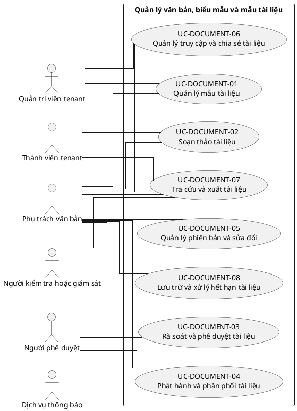

## 9. Ghi chú truy vết từ V3

Các phần tử chi tiết của V3 thuộc nhóm này được giữ làm nguồn phân tích nhưng đã được hợp nhất vào Use Case chính, luồng, quy tắc hoặc yêu cầu hệ thống. Không xem số lượng phần tử V3 là số lượng Use Case nghiệp vụ của V4.

---

<!-- SOURCE: 12_UC-FINANCE.md -->

# UC-FINANCE — Quản lý tài chính và ngân sách

## 1. Thông tin tài liệu

| Thuộc tính | Nội dung |
|---|---|
| Mã nhóm Use Case | `UC-FINANCE` |
| Miền nghiệp vụ | Tài chính nội bộ |
| Mức ưu tiên | Nghiệp vụ lõi |
| Phiên bản mô hình | V4 — tinh gọn theo mục tiêu actor |

## 2. Mục tiêu

Quản lý ngân sách, giao dịch, phê duyệt, chứng từ và đối soát tài chính theo tenant.

## 3. Nguyên tắc phân rã

> Mỗi Use Case dưới đây đại diện cho một mục tiêu nghiệp vụ có kết quả quan sát được. Các thao tác chi tiết được hợp nhất vào cột **Nội dung bao hàm**, luồng nghiệp vụ và quy tắc; không tiếp tục tách thành các Use Case nhỏ.

## 4. Danh mục Use Case chính

| Mã | Use Case | Actor chính/hỗ trợ | Kết quả nghiệp vụ | Nội dung bao hàm |
|---|---|---|---|---|
| `UC-FINANCE-01` | **Quản lý danh mục và tài khoản tài chính** | `ACT-FINANCE-OFFICER` — Phụ trách tài chính<br>`ACT-TENANT-ADMIN` — Quản trị viên tenant | Quỹ, tài khoản, danh mục, nguồn tiền và quy tắc được cấu hình. | Quỹ/tài khoản, danh mục thu chi, phương thức thanh toán và người phụ trách. |
| `UC-FINANCE-02` | **Lập và quản lý ngân sách** | `ACT-FINANCE-OFFICER` — Phụ trách tài chính<br>`ACT-APPROVER` — Người phê duyệt | Ngân sách theo kỳ, đơn vị hoặc hoạt động được lập và phê duyệt. | Dự toán, phân bổ, điều chỉnh, phê duyệt và khóa ngân sách. |
| `UC-FINANCE-03` | **Tạo đề nghị thu, chi hoặc thanh toán** | `ACT-TENANT-MEMBER` — Thành viên tenant<br>`ACT-FINANCE-OFFICER` — Phụ trách tài chính | Đề nghị tài chính hợp lệ được gửi kèm chứng từ. | Lưu nháp, nhập số tiền/danh mục, đính kèm, liên kết yêu cầu/sự kiện và gửi. |
| `UC-FINANCE-04` | **Phê duyệt nghiệp vụ tài chính** | `ACT-APPROVER` — Người phê duyệt<br>`ACT-FINANCE-OFFICER` — Phụ trách tài chính | Đề nghị hoặc giao dịch được duyệt/từ chối theo thẩm quyền và hạn mức. | Phê duyệt nhiều cấp, yêu cầu bổ sung, kiểm tra ngân sách và phân tách trách nhiệm. |
| `UC-FINANCE-05` | **Ghi nhận giao dịch thu chi** | `ACT-FINANCE-OFFICER` — Phụ trách tài chính | Giao dịch được ghi nhận, cập nhật trạng thái và liên kết chứng từ. | Khoản thu/chi, ngày hạch toán, người phụ trách, trạng thái, soft delete và khôi phục. |
| `UC-FINANCE-06` | **Quản lý tạm ứng, hoàn ứng và hoàn trả** | `ACT-TENANT-MEMBER` — Thành viên tenant<br>`ACT-FINANCE-OFFICER` — Phụ trách tài chính<br>`ACT-APPROVER` — Người phê duyệt | Khoản tạm ứng được cấp, quyết toán hoặc hoàn trả có đối chiếu. | Tạo tạm ứng, giải ngân, nộp chứng từ, hoàn ứng, thu hồi dư và đóng hồ sơ. |
| `UC-FINANCE-07` | **Quản lý chuyển quỹ và điều chỉnh** | `ACT-FINANCE-OFFICER` — Phụ trách tài chính<br>`ACT-APPROVER` — Người phê duyệt | Chuyển quỹ hoặc điều chỉnh giao dịch được phê duyệt và truy vết. | Chuyển giữa quỹ, bút toán điều chỉnh, hoàn giao dịch và lý do. |
| `UC-FINANCE-08` | **Đối soát và đóng kỳ** | `ACT-FINANCE-OFFICER` — Phụ trách tài chính<br>`ACT-AUDITOR` — Người kiểm tra hoặc giám sát | Số dư, chứng từ và giao dịch được đối soát; kỳ được khóa có kiểm soát. | Đối soát, phát hiện chênh lệch, xử lý chênh lệch, khóa/mở kỳ theo quyền. |
| `UC-FINANCE-09` | **Theo dõi thực hiện ngân sách** | `ACT-FINANCE-OFFICER` — Phụ trách tài chính<br>`ACT-REPORT-ANALYST` — Phụ trách báo cáo và phân tích | Mức sử dụng, cam kết và cảnh báo vượt ngân sách được hiển thị. | Theo dõi budget vs actual, cảnh báo hạn mức và dự báo. |
| `UC-FINANCE-10` | **Báo cáo và xuất dữ liệu tài chính** | `ACT-FINANCE-OFFICER` — Phụ trách tài chính<br>`ACT-AUDITOR` — Người kiểm tra hoặc giám sát | Báo cáo thu chi, quỹ, ngân sách và chứng từ được xuất theo quyền. | Báo cáo kỳ, sổ quỹ, tổng hợp theo đơn vị/hoạt động và export. |

## 5. Luồng nghiệp vụ cấp nhóm

1. Actor khởi phát một Use Case theo quyền và tenant context hiện hành.
2. Hệ thống kiểm tra xác thực, membership, permission, trạng thái tenant và module.
3. Hệ thống thực hiện luồng nghiệp vụ chính và các kiểm tra dữ liệu cần thiết.
4. Kết quả nghiệp vụ được lưu, thông báo cho bên liên quan và ghi audit khi thuộc danh mục bắt buộc.

## 6. Quy tắc nghiệp vụ cốt lõi

- Số tiền giao dịch phải lớn hơn 0 và đúng đơn vị tiền tệ được hỗ trợ.
- Khoản chi phải tuân theo vai trò duyệt và hạn mức.
- Soft delete không được làm mất lịch sử đối soát và audit.
- Giao dịch, chứng từ, ngân sách và yêu cầu liên quan phải cùng tenant.

## 7. Quan hệ với nhóm Use Case khác

[`UC-REQUEST`](./10_UC-REQUEST.md), [`UC-DOCUMENT`](./11_UC-DOCUMENT.md), [`UC-RBAC`](./04_UC-RBAC.md), [`UC-DASHBOARD`](./19_UC-DASHBOARD.md), [`UC-AUDIT`](./21_UC-AUDIT.md)

## 8. Use Case Diagram

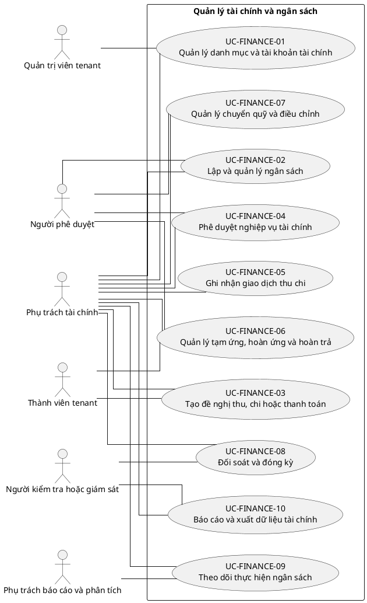

## 9. Ghi chú truy vết từ V3

Các phần tử chi tiết của V3 thuộc nhóm này được giữ làm nguồn phân tích nhưng đã được hợp nhất vào Use Case chính, luồng, quy tắc hoặc yêu cầu hệ thống. Không xem số lượng phần tử V3 là số lượng Use Case nghiệp vụ của V4.

---

<!-- SOURCE: 13_UC-ASSET.md -->

# UC-ASSET — Quản lý tài sản và hậu cần

## 1. Thông tin tài liệu

| Thuộc tính | Nội dung |
|---|---|
| Mã nhóm Use Case | `UC-ASSET` |
| Miền nghiệp vụ | Tài sản và vật tư |
| Mức ưu tiên | Nghiệp vụ |
| Phiên bản mô hình | V4 — tinh gọn theo mục tiêu actor |

## 2. Mục tiêu

Theo dõi tài sản, vật tư, người giữ, mượn trả, bảo trì và kiểm kê.

## 3. Nguyên tắc phân rã

> Mỗi Use Case dưới đây đại diện cho một mục tiêu nghiệp vụ có kết quả quan sát được. Các thao tác chi tiết được hợp nhất vào cột **Nội dung bao hàm**, luồng nghiệp vụ và quy tắc; không tiếp tục tách thành các Use Case nhỏ.

## 4. Danh mục Use Case chính

| Mã | Use Case | Actor chính/hỗ trợ | Kết quả nghiệp vụ | Nội dung bao hàm |
|---|---|---|---|---|
| `UC-ASSET-01` | **Quản lý danh mục tài sản và vật tư** | `ACT-LOGISTICS-OFFICER` — Phụ trách tài sản và hậu cần | Danh mục, loại, đơn vị tính, trạng thái và vị trí được cấu hình. | Loại tài sản, kho/vị trí, đơn vị tính, tình trạng và quy tắc mã. |
| `UC-ASSET-02` | **Tiếp nhận và ghi tăng tài sản** | `ACT-LOGISTICS-OFFICER` — Phụ trách tài sản và hậu cần | Tài sản mới được ghi nhận, gắn mã và chứng từ nguồn. | Nhập tài sản, số lượng/serial, QR/barcode, nguồn mua/tặng và hồ sơ. |
| `UC-ASSET-03` | **Phân bổ và quản lý người giữ** | `ACT-LOGISTICS-OFFICER` — Phụ trách tài sản và hậu cần<br>`ACT-UNIT-ADMIN` — Quản trị viên đơn vị | Tài sản được bàn giao cho đơn vị hoặc người giữ có biên bản. | Phân bổ, bàn giao, đổi người giữ và xác nhận trách nhiệm. |
| `UC-ASSET-04` | **Quản lý mượn và trả tài sản** | `ACT-TENANT-MEMBER` — Thành viên tenant<br>`ACT-LOGISTICS-OFFICER` — Phụ trách tài sản và hậu cần<br>`ACT-APPROVER` — Người phê duyệt | Yêu cầu mượn được duyệt, giao và trả đúng trạng thái. | Đăng ký mượn, duyệt, bàn giao, gia hạn, trả, xử lý quá hạn/hư hỏng. |
| `UC-ASSET-05` | **Quản lý bảo trì và sửa chữa** | `ACT-LOGISTICS-OFFICER` — Phụ trách tài sản và hậu cần | Nhu cầu bảo trì được lập lịch, thực hiện và ghi chi phí/kết quả. | Báo hỏng, lập lịch, giao sửa, nghiệm thu và cập nhật tình trạng. |
| `UC-ASSET-06` | **Kiểm kê tài sản** | `ACT-LOGISTICS-OFFICER` — Phụ trách tài sản và hậu cần<br>`ACT-AUDITOR` — Người kiểm tra hoặc giám sát | Đợt kiểm kê xác định chênh lệch và phương án xử lý. | Tạo đợt, quét/đếm, đối chiếu, xử lý thừa thiếu và khóa kết quả. |
| `UC-ASSET-07` | **Điều chuyển, thanh lý hoặc mất tài sản** | `ACT-LOGISTICS-OFFICER` — Phụ trách tài sản và hậu cần<br>`ACT-APPROVER` — Người phê duyệt | Tài sản được chuyển, thanh lý, tiêu hủy hoặc ghi mất theo phê duyệt. | Điều chuyển kho/đơn vị, đề nghị thanh lý, phê duyệt và biên bản. |
| `UC-ASSET-08` | **Quản lý vật tư tiêu hao** | `ACT-LOGISTICS-OFFICER` — Phụ trách tài sản và hậu cần<br>`ACT-UNIT-ADMIN` — Quản trị viên đơn vị | Nhập, xuất, tồn và định mức vật tư được theo dõi. | Nhập kho, cấp phát, hoàn trả, tồn tối thiểu và cảnh báo. |
| `UC-ASSET-09` | **Báo cáo và xuất dữ liệu tài sản** | `ACT-LOGISTICS-OFFICER` — Phụ trách tài sản và hậu cần<br>`ACT-AUDITOR` — Người kiểm tra hoặc giám sát | Báo cáo tồn, tình trạng, mượn trả, bảo trì và kiểm kê được xuất. | Tra cứu, lọc, báo cáo và export. |

## 5. Luồng nghiệp vụ cấp nhóm

1. Actor khởi phát một Use Case theo quyền và tenant context hiện hành.
2. Hệ thống kiểm tra xác thực, membership, permission, trạng thái tenant và module.
3. Hệ thống thực hiện luồng nghiệp vụ chính và các kiểm tra dữ liệu cần thiết.
4. Kết quả nghiệp vụ được lưu, thông báo cho bên liên quan và ghi audit khi thuộc danh mục bắt buộc.

## 6. Quy tắc nghiệp vụ cốt lõi

- Mỗi tài sản thuộc một tenant và có trạng thái nhất quán.
- Không thể đồng thời bàn giao cùng một tài sản đơn chiếc cho nhiều người.
- Thanh lý hoặc xóa không được làm mất lịch sử custody và kiểm kê.

## 7. Quan hệ với nhóm Use Case khác

[`UC-MEMBER`](./09_UC-MEMBER.md), [`UC-ORG`](./05_UC-ORG.md), [`UC-REQUEST`](./10_UC-REQUEST.md), [`UC-FINANCE`](./12_UC-FINANCE.md), [`UC-AUDIT`](./21_UC-AUDIT.md)

## 8. Use Case Diagram

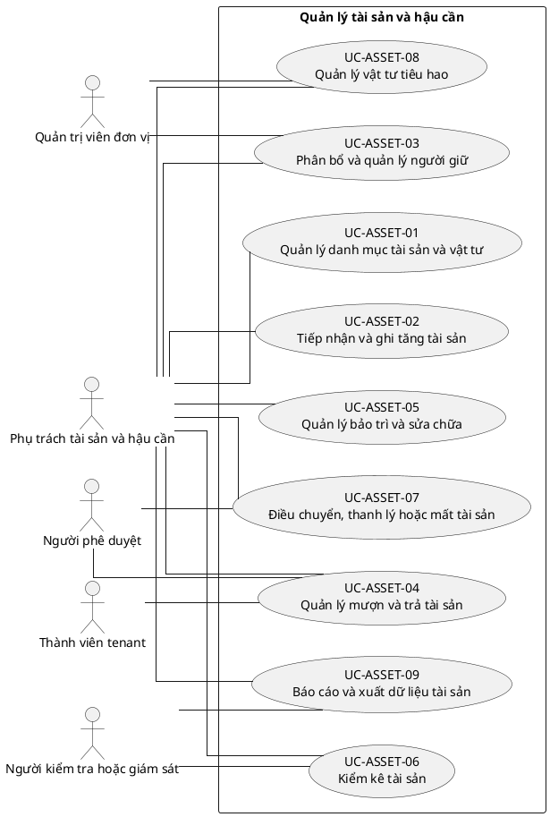

## 9. Ghi chú truy vết từ V3

Các phần tử chi tiết của V3 thuộc nhóm này được giữ làm nguồn phân tích nhưng đã được hợp nhất vào Use Case chính, luồng, quy tắc hoặc yêu cầu hệ thống. Không xem số lượng phần tử V3 là số lượng Use Case nghiệp vụ của V4.

---

<!-- SOURCE: 14_UC-MEETING.md -->

# UC-MEETING — Quản lý cuộc họp, sự kiện và chuyên cần

## 1. Thông tin tài liệu

| Thuộc tính | Nội dung |
|---|---|
| Mã nhóm Use Case | `UC-MEETING` |
| Miền nghiệp vụ | Hoạt động tổ chức |
| Mức ưu tiên | Nghiệp vụ |
| Phiên bản mô hình | V4 — tinh gọn theo mục tiêu actor |

## 2. Mục tiêu

Quản lý lịch, người tham gia, nội dung, chuyên cần, biên bản và công việc sau cuộc họp/sự kiện.

## 3. Nguyên tắc phân rã

> Mỗi Use Case dưới đây đại diện cho một mục tiêu nghiệp vụ có kết quả quan sát được. Các thao tác chi tiết được hợp nhất vào cột **Nội dung bao hàm**, luồng nghiệp vụ và quy tắc; không tiếp tục tách thành các Use Case nhỏ.

## 4. Danh mục Use Case chính

| Mã | Use Case | Actor chính/hỗ trợ | Kết quả nghiệp vụ | Nội dung bao hàm |
|---|---|---|---|---|
| `UC-MEETING-01` | **Lập lịch cuộc họp hoặc sự kiện** | `ACT-MEETING-COORDINATOR` — Phụ trách cuộc họp và sự kiện<br>`ACT-UNIT-ADMIN` — Quản trị viên đơn vị | Hoạt động được tạo với thời gian, địa điểm, phạm vi và người phụ trách. | Tạo/sửa/lặp lịch, loại hoạt động, địa điểm/online, đơn vị tham gia và xung đột lịch. |
| `UC-MEETING-02` | **Mời và quản lý người tham gia** | `ACT-MEETING-COORDINATOR` — Phụ trách cuộc họp và sự kiện<br>`ACT-TENANT-MEMBER` — Thành viên tenant | Danh sách mời và phản hồi tham dự được ghi nhận. | Mời theo đơn vị/role/người, RSVP, khách ngoài và nhắc lịch. |
| `UC-MEETING-03` | **Quản lý chương trình và tài liệu** | `ACT-MEETING-COORDINATOR` — Phụ trách cuộc họp và sự kiện<br>`ACT-TENANT-MEMBER` — Thành viên tenant | Agenda, tài liệu và đề xuất nội dung được chuẩn bị. | Agenda, tài liệu, đề xuất mục, phân công trình bày và phiên bản. |
| `UC-MEETING-04` | **Điều hành cuộc họp hoặc sự kiện** | `ACT-MEETING-COORDINATOR` — Phụ trách cuộc họp và sự kiện | Trạng thái hoạt động, nội dung thực tế và thay đổi tại chỗ được ghi nhận. | Bắt đầu/kết thúc, cập nhật agenda, ghi chú nhanh và xử lý hủy/hoãn. |
| `UC-MEETING-05` | **Ghi nhận chuyên cần** | `ACT-MEETING-COORDINATOR` — Phụ trách cuộc họp và sự kiện<br>`ACT-TENANT-MEMBER` — Thành viên tenant | Trạng thái tham dự được xác nhận theo thành viên. | Check-in QR/thủ công, đúng giờ/trễ/vắng/có phép, chỉnh sửa có lý do. |
| `UC-MEETING-06` | **Lập và phê duyệt biên bản** | `ACT-MEETING-COORDINATOR` — Phụ trách cuộc họp và sự kiện<br>`ACT-APPROVER` — Người phê duyệt | Biên bản, quyết định và kết luận được phê duyệt/phát hành. | Soạn biên bản, xác nhận người tham dự, duyệt, phát hành và phiên bản. |
| `UC-MEETING-07` | **Theo dõi quyết định và công việc sau họp** | `ACT-MEETING-COORDINATOR` — Phụ trách cuộc họp và sự kiện<br>`ACT-TENANT-MEMBER` — Thành viên tenant | Nhiệm vụ và quyết định được giao, theo dõi và đóng. | Tạo action item, người phụ trách, hạn, nhắc việc và cập nhật kết quả. |
| `UC-MEETING-08` | **Tra cứu, báo cáo và lưu trữ hoạt động** | `ACT-MEETING-COORDINATOR` — Phụ trách cuộc họp và sự kiện<br>`ACT-UNIT-ADMIN` — Quản trị viên đơn vị<br>`ACT-AUDITOR` — Người kiểm tra hoặc giám sát | Lịch sử họp, chuyên cần, biên bản và báo cáo được tra cứu. | Calendar/list, báo cáo chuyên cần, export và archive. |

## 5. Luồng nghiệp vụ cấp nhóm

1. Actor khởi phát một Use Case theo quyền và tenant context hiện hành.
2. Hệ thống kiểm tra xác thực, membership, permission, trạng thái tenant và module.
3. Hệ thống thực hiện luồng nghiệp vụ chính và các kiểm tra dữ liệu cần thiết.
4. Kết quả nghiệp vụ được lưu, thông báo cho bên liên quan và ghi audit khi thuộc danh mục bắt buộc.

## 6. Quy tắc nghiệp vụ cốt lõi

- Meeting, attendance và participant phải cùng tenant.
- Chỉnh sửa chuyên cần sau khi khóa phải có quyền và lý do.
- Biên bản phát hành phải có version history.

## 7. Quan hệ với nhóm Use Case khác

[`UC-MEMBER`](./09_UC-MEMBER.md), [`UC-ORG`](./05_UC-ORG.md), [`UC-DOCUMENT`](./11_UC-DOCUMENT.md), [`UC-NOTIFICATION`](./18_UC-NOTIFICATION.md), [`UC-DISCIPLINE`](./15_UC-DISCIPLINE.md), [`UC-AUDIT`](./21_UC-AUDIT.md)

## 8. Use Case Diagram

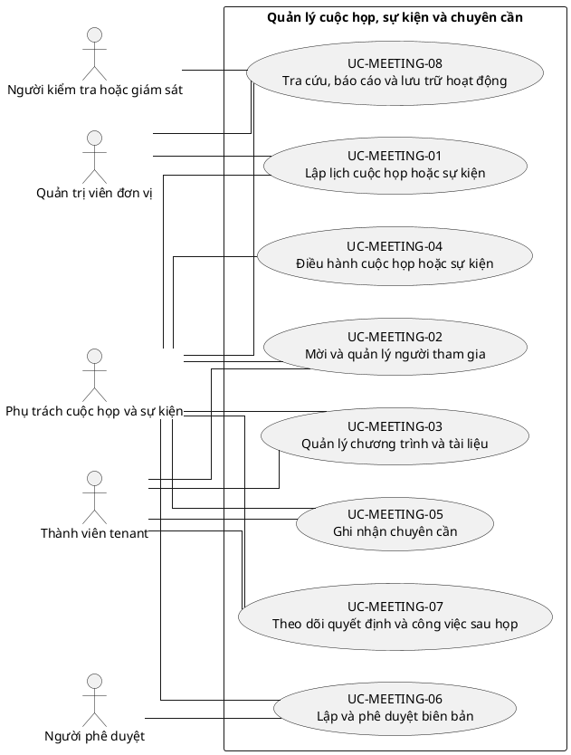

## 9. Ghi chú truy vết từ V3

Các phần tử chi tiết của V3 thuộc nhóm này được giữ làm nguồn phân tích nhưng đã được hợp nhất vào Use Case chính, luồng, quy tắc hoặc yêu cầu hệ thống. Không xem số lượng phần tử V3 là số lượng Use Case nghiệp vụ của V4.

---

<!-- SOURCE: 15_UC-DISCIPLINE.md -->

# UC-DISCIPLINE — Quản lý kỷ luật và KPI

## 1. Thông tin tài liệu

| Thuộc tính | Nội dung |
|---|---|
| Mã nhóm Use Case | `UC-DISCIPLINE` |
| Miền nghiệp vụ | Kỷ luật và tuân thủ |
| Mức ưu tiên | Nghiệp vụ |
| Phiên bản mô hình | V4 — tinh gọn theo mục tiêu actor |

## 2. Mục tiêu

Quản lý quy tắc, vụ việc, minh chứng, quyết định kỷ luật, khiếu nại và theo dõi khắc phục.

## 3. Nguyên tắc phân rã

> Mỗi Use Case dưới đây đại diện cho một mục tiêu nghiệp vụ có kết quả quan sát được. Các thao tác chi tiết được hợp nhất vào cột **Nội dung bao hàm**, luồng nghiệp vụ và quy tắc; không tiếp tục tách thành các Use Case nhỏ.

## 4. Danh mục Use Case chính

| Mã | Use Case | Actor chính/hỗ trợ | Kết quả nghiệp vụ | Nội dung bao hàm |
|---|---|---|---|---|
| `UC-DISCIPLINE-01` | **Cấu hình quy tắc kỷ luật và KPI** | `ACT-DISCIPLINE-OFFICER` — Phụ trách kỷ luật và KPI<br>`ACT-TENANT-ADMIN` — Quản trị viên tenant | Loại vi phạm, ngưỡng, mức xử lý và quy trình được cấu hình. | Danh mục vi phạm, KPI, ngưỡng cảnh báo, mức kỷ luật và workflow. |
| `UC-DISCIPLINE-02` | **Ghi nhận vụ việc hoặc vi phạm** | `ACT-DISCIPLINE-OFFICER` — Phụ trách kỷ luật và KPI<br>`ACT-UNIT-ADMIN` — Quản trị viên đơn vị | Vụ việc được tạo với đối tượng, thời gian, nguồn và mô tả. | Tạo hồ sơ, liên kết attendance/KPI/yêu cầu và thông báo tiếp nhận. |
| `UC-DISCIPLINE-03` | **Thu thập và xác minh minh chứng** | `ACT-DISCIPLINE-OFFICER` — Phụ trách kỷ luật và KPI<br>`ACT-TENANT-MEMBER` — Thành viên tenant | Minh chứng và ý kiến giải trình được tập hợp có kiểm soát. | Tài liệu, người liên quan, giải trình, xác minh và bảo mật hồ sơ. |
| `UC-DISCIPLINE-04` | **Xem xét và ra quyết định kỷ luật** | `ACT-DISCIPLINE-OFFICER` — Phụ trách kỷ luật và KPI<br>`ACT-APPROVER` — Người phê duyệt | Hồ sơ được kết luận, áp dụng hoặc bác bỏ biện pháp xử lý. | Đánh giá, họp xem xét, đề xuất, phê duyệt, quyết định và thông báo. |
| `UC-DISCIPLINE-05` | **Quản lý khiếu nại hoặc xem xét lại** | `ACT-TENANT-MEMBER` — Thành viên tenant<br>`ACT-APPROVER` — Người phê duyệt | Khiếu nại được tiếp nhận, đánh giá và kết luận độc lập theo chính sách. | Gửi khiếu nại, bổ sung, phân công, quyết định giữ/sửa/hủy. |
| `UC-DISCIPLINE-06` | **Theo dõi biện pháp khắc phục** | `ACT-DISCIPLINE-OFFICER` — Phụ trách kỷ luật và KPI<br>`ACT-UNIT-ADMIN` — Quản trị viên đơn vị | Nghĩa vụ khắc phục, thời hạn và kết quả được theo dõi. | Kế hoạch khắc phục, nhắc hạn, xác nhận hoàn thành và đóng vụ việc. |
| `UC-DISCIPLINE-07` | **Theo dõi KPI và cảnh báo** | `ACT-DISCIPLINE-OFFICER` — Phụ trách kỷ luật và KPI<br>`ACT-UNIT-ADMIN` — Quản trị viên đơn vị | KPI, vắng mặt và ngưỡng cảnh báo được tổng hợp. | Đồng bộ dữ liệu, tính chỉ số, cảnh báo và xác minh ngoại lệ. |
| `UC-DISCIPLINE-08` | **Báo cáo và lịch sử kỷ luật** | `ACT-DISCIPLINE-OFFICER` — Phụ trách kỷ luật và KPI<br>`ACT-AUDITOR` — Người kiểm tra hoặc giám sát | Báo cáo, lịch sử quyết định và số liệu tuân thủ được xuất theo quyền. | Tìm kiếm, thống kê, export, ẩn dữ liệu nhạy cảm và retention. |

## 5. Luồng nghiệp vụ cấp nhóm

1. Actor khởi phát một Use Case theo quyền và tenant context hiện hành.
2. Hệ thống kiểm tra xác thực, membership, permission, trạng thái tenant và module.
3. Hệ thống thực hiện luồng nghiệp vụ chính và các kiểm tra dữ liệu cần thiết.
4. Kết quả nghiệp vụ được lưu, thông báo cho bên liên quan và ghi audit khi thuộc danh mục bắt buộc.

## 6. Quy tắc nghiệp vụ cốt lõi

- Hồ sơ kỷ luật phải giới hạn quyền xem theo mức nhạy cảm.
- Người bị xem xét phải có quyền giải trình và khiếu nại theo chính sách.
- Quyết định đã ban hành không được sửa trực tiếp; phải có quyết định thay thế hoặc xem xét lại.

## 7. Quan hệ với nhóm Use Case khác

[`UC-MEMBER`](./09_UC-MEMBER.md), [`UC-MEETING`](./14_UC-MEETING.md), [`UC-EVALUATION`](./16_UC-EVALUATION.md), [`UC-DOCUMENT`](./11_UC-DOCUMENT.md), [`UC-AUDIT`](./21_UC-AUDIT.md)

## 8. Use Case Diagram

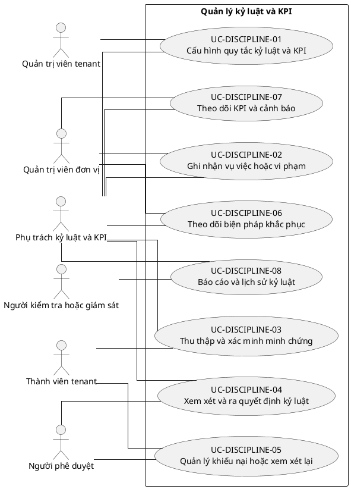

## 9. Ghi chú truy vết từ V3

Các phần tử chi tiết của V3 thuộc nhóm này được giữ làm nguồn phân tích nhưng đã được hợp nhất vào Use Case chính, luồng, quy tắc hoặc yêu cầu hệ thống. Không xem số lượng phần tử V3 là số lượng Use Case nghiệp vụ của V4.

---

<!-- SOURCE: 16_UC-EVALUATION.md -->

# UC-EVALUATION — Quản lý đánh giá thành viên

## 1. Thông tin tài liệu

| Thuộc tính | Nội dung |
|---|---|
| Mã nhóm Use Case | `UC-EVALUATION` |
| Miền nghiệp vụ | Đánh giá hiệu suất |
| Mức ưu tiên | Nghiệp vụ |
| Phiên bản mô hình | V4 — tinh gọn theo mục tiêu actor |

## 2. Mục tiêu

Quản lý chu kỳ, tiêu chí, phân công, chấm điểm, hiệu chỉnh, công bố và khiếu nại đánh giá.

## 3. Nguyên tắc phân rã

> Mỗi Use Case dưới đây đại diện cho một mục tiêu nghiệp vụ có kết quả quan sát được. Các thao tác chi tiết được hợp nhất vào cột **Nội dung bao hàm**, luồng nghiệp vụ và quy tắc; không tiếp tục tách thành các Use Case nhỏ.

## 4. Danh mục Use Case chính

| Mã | Use Case | Actor chính/hỗ trợ | Kết quả nghiệp vụ | Nội dung bao hàm |
|---|---|---|---|---|
| `UC-EVALUATION-01` | **Quản lý chu kỳ đánh giá** | `ACT-EVALUATOR` — Người đánh giá<br>`ACT-TENANT-ADMIN` — Quản trị viên tenant | Chu kỳ đánh giá được tạo, kích hoạt, khóa và lưu trữ. | Loại chu kỳ, phạm vi, mốc thời gian, trạng thái và sao chép chu kỳ. |
| `UC-EVALUATION-02` | **Quản lý bộ tiêu chí và biểu mẫu** | `ACT-EVALUATOR` — Người đánh giá<br>`ACT-TENANT-ADMIN` — Quản trị viên tenant | Tiêu chí, trọng số, thang điểm và yêu cầu minh chứng được cấu hình. | Tạo/sửa/version tiêu chí, nhóm cấu phần, công thức và form. |
| `UC-EVALUATION-03` | **Phân công đối tượng và người đánh giá** | `ACT-EVALUATOR` — Người đánh giá<br>`ACT-UNIT-ADMIN` — Quản trị viên đơn vị | Người được đánh giá, evaluator và phạm vi đơn vị được phân công. | Danh sách đối tượng, tự đánh giá, cấp trên/đồng cấp, thay người và xung đột lợi ích. |
| `UC-EVALUATION-04` | **Thực hiện đánh giá** | `ACT-TENANT-MEMBER` — Thành viên tenant<br>`ACT-EVALUATOR` — Người đánh giá | Phiếu đánh giá và minh chứng được lưu, gửi đúng hạn. | Tự đánh giá, đánh giá người khác, nhận xét, điểm, minh chứng, lưu nháp và gửi. |
| `UC-EVALUATION-05` | **Xác minh và hiệu chỉnh kết quả** | `ACT-EVALUATOR` — Người đánh giá<br>`ACT-APPROVER` — Người phê duyệt | Điểm được kiểm tra, calibration và phê duyệt trước công bố. | Kiểm tra thiếu dữ liệu, moderation, hội đồng, điều chỉnh có lý do và khóa điểm. |
| `UC-EVALUATION-06` | **Công bố và phản hồi kết quả** | `ACT-EVALUATOR` — Người đánh giá<br>`ACT-TENANT-MEMBER` — Thành viên tenant | Kết quả được công bố theo quyền và người được đánh giá phản hồi. | Công bố, xem chi tiết, xác nhận đã xem, kế hoạch phát triển và phản hồi. |
| `UC-EVALUATION-07` | **Khiếu nại kết quả đánh giá** | `ACT-TENANT-MEMBER` — Thành viên tenant<br>`ACT-APPROVER` — Người phê duyệt | Khiếu nại được xem xét và kết quả cuối cùng được ghi nhận. | Gửi khiếu nại, bổ sung minh chứng, phân công, quyết định và cập nhật kết quả. |
| `UC-EVALUATION-08` | **Báo cáo và phân tích đánh giá** | `ACT-EVALUATOR` — Người đánh giá<br>`ACT-UNIT-ADMIN` — Quản trị viên đơn vị<br>`ACT-AUDITOR` — Người kiểm tra hoặc giám sát | Kết quả được tổng hợp theo kỳ, đơn vị và tiêu chí. | Báo cáo cá nhân/đơn vị, phân phối điểm, xu hướng, export và ẩn danh. |

## 5. Luồng nghiệp vụ cấp nhóm

1. Actor khởi phát một Use Case theo quyền và tenant context hiện hành.
2. Hệ thống kiểm tra xác thực, membership, permission, trạng thái tenant và module.
3. Hệ thống thực hiện luồng nghiệp vụ chính và các kiểm tra dữ liệu cần thiết.
4. Kết quả nghiệp vụ được lưu, thông báo cho bên liên quan và ghi audit khi thuộc danh mục bắt buộc.

## 6. Quy tắc nghiệp vụ cốt lõi

- Điểm phải truy vết được nguồn, người chấm, thời điểm và minh chứng.
- Người không có unit permission không được đánh giá hoặc xem kết quả ngoài phạm vi.
- Kết quả đã khóa chỉ được thay đổi qua quy trình hiệu chỉnh hoặc khiếu nại.

## 7. Quan hệ với nhóm Use Case khác

[`UC-MEMBER`](./09_UC-MEMBER.md), [`UC-ORG`](./05_UC-ORG.md), [`UC-RBAC`](./04_UC-RBAC.md), [`UC-DISCIPLINE`](./15_UC-DISCIPLINE.md), [`UC-AUDIT`](./21_UC-AUDIT.md)

## 8. Use Case Diagram

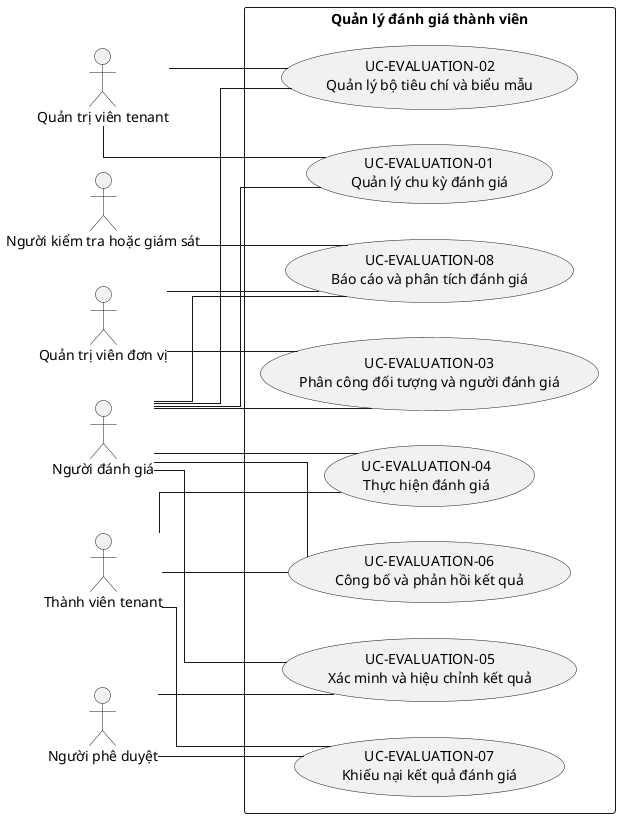

## 9. Ghi chú truy vết từ V3

Các phần tử chi tiết của V3 thuộc nhóm này được giữ làm nguồn phân tích nhưng đã được hợp nhất vào Use Case chính, luồng, quy tắc hoặc yêu cầu hệ thống. Không xem số lượng phần tử V3 là số lượng Use Case nghiệp vụ của V4.

---

<!-- SOURCE: 17_UC-COMPETITION.md -->

# UC-COMPETITION — Quản lý cuộc thi, thành tích và ghi nhận

## 1. Thông tin tài liệu

| Thuộc tính | Nội dung |
|---|---|
| Mã nhóm Use Case | `UC-COMPETITION` |
| Miền nghiệp vụ | Hoạt động và thành tích |
| Mức ưu tiên | Nghiệp vụ |
| Phiên bản mô hình | V4 — tinh gọn theo mục tiêu actor |

## 2. Mục tiêu

Quản lý cuộc thi nội bộ, tham gia, bài dự thi, chấm điểm, kết quả và thành tích.

## 3. Nguyên tắc phân rã

> Mỗi Use Case dưới đây đại diện cho một mục tiêu nghiệp vụ có kết quả quan sát được. Các thao tác chi tiết được hợp nhất vào cột **Nội dung bao hàm**, luồng nghiệp vụ và quy tắc; không tiếp tục tách thành các Use Case nhỏ.

## 4. Danh mục Use Case chính

| Mã | Use Case | Actor chính/hỗ trợ | Kết quả nghiệp vụ | Nội dung bao hàm |
|---|---|---|---|---|
| `UC-COMPETITION-01` | **Cấu hình cuộc thi** | `ACT-COMPETITION-MANAGER` — Phụ trách cuộc thi và thành tích | Cuộc thi, vòng thi, tiêu chí, điều kiện và thời gian được thiết lập. | Tạo/sửa, loại cuộc thi, vòng, tiêu chí, điều kiện, quyền và sao chép cấu hình. |
| `UC-COMPETITION-02` | **Đăng ký cá nhân hoặc đội thi** | `ACT-TENANT-MEMBER` — Thành viên tenant<br>`ACT-COMPETITION-MANAGER` — Phụ trách cuộc thi và thành tích | Cá nhân/đội hợp lệ được đăng ký và quản lý thành viên. | Mở/đóng đăng ký, tạo đội, mời/chấp nhận thành viên và kiểm tra điều kiện. |
| `UC-COMPETITION-03` | **Quản lý bài dự thi** | `ACT-TENANT-MEMBER` — Thành viên tenant | Bài dự thi và sản phẩm được nộp, cập nhật hoặc rút trong thời hạn. | Nộp, sửa trước hạn, upload minh chứng/sản phẩm, kiểm tra đầy đủ và rút bài. |
| `UC-COMPETITION-04` | **Phân công và thực hiện chấm thi** | `ACT-COMPETITION-MANAGER` — Phụ trách cuộc thi và thành tích<br>`ACT-EVALUATOR` — Người đánh giá | Giám khảo được phân công và ghi điểm/nhận xét theo tiêu chí. | Phân công, chấm, nhận xét, xung đột lợi ích và hoàn tất phiếu. |
| `UC-COMPETITION-05` | **Hiệu chỉnh, xếp hạng và chọn vòng** | `ACT-COMPETITION-MANAGER` — Phụ trách cuộc thi và thành tích<br>`ACT-APPROVER` — Người phê duyệt | Điểm được moderation, xếp hạng và xác định người vào vòng tiếp theo. | Hiệu chỉnh, tổng hợp, tie-break, xếp hạng và duyệt danh sách. |
| `UC-COMPETITION-06` | **Công bố kết quả và xử lý khiếu nại** | `ACT-COMPETITION-MANAGER` — Phụ trách cuộc thi và thành tích<br>`ACT-TENANT-MEMBER` — Thành viên tenant<br>`ACT-APPROVER` — Người phê duyệt | Kết quả vòng/chung cuộc được công bố và khiếu nại được xử lý. | Công bố, gửi khiếu nại, xem xét và cập nhật kết quả cuối cùng. |
| `UC-COMPETITION-07` | **Ghi nhận giải thưởng và thành tích** | `ACT-COMPETITION-MANAGER` — Phụ trách cuộc thi và thành tích<br>`ACT-DOCUMENT-OFFICER` — Phụ trách văn bản | Giải thưởng, chứng nhận và thành tích cá nhân/đơn vị được ghi nhận. | Giải thưởng, giấy chứng nhận, quyết định khen thưởng và hồ sơ thành tích. |
| `UC-COMPETITION-08` | **Quản lý cuộc thi bên ngoài** | `ACT-COMPETITION-MANAGER` — Phụ trách cuộc thi và thành tích<br>`ACT-TENANT-MEMBER` — Thành viên tenant | Việc đề cử, tham gia và kết quả cuộc thi ngoài được theo dõi. | Đề cử, hồ sơ tham gia, trạng thái, chi phí/tài trợ và kết quả. |
| `UC-COMPETITION-09` | **Báo cáo và lưu trữ cuộc thi** | `ACT-COMPETITION-MANAGER` — Phụ trách cuộc thi và thành tích<br>`ACT-AUDITOR` — Người kiểm tra hoặc giám sát | Danh sách, điểm, kết quả và minh chứng được xuất và lưu trữ. | Báo cáo, export, liên kết tài liệu/tài chính, quyền hình ảnh và archive. |

## 5. Luồng nghiệp vụ cấp nhóm

1. Actor khởi phát một Use Case theo quyền và tenant context hiện hành.
2. Hệ thống kiểm tra xác thực, membership, permission, trạng thái tenant và module.
3. Hệ thống thực hiện luồng nghiệp vụ chính và các kiểm tra dữ liệu cần thiết.
4. Kết quả nghiệp vụ được lưu, thông báo cho bên liên quan và ghi audit khi thuộc danh mục bắt buộc.

## 6. Quy tắc nghiệp vụ cốt lõi

- Bài dự thi sau hạn chỉ được thay đổi theo quyền ngoại lệ có audit.
- Giám khảo có xung đột lợi ích không được chấm đối tượng liên quan.
- Công bố kết quả phải sử dụng phiên bản điểm đã khóa/phê duyệt.

## 7. Quan hệ với nhóm Use Case khác

[`UC-MEMBER`](./09_UC-MEMBER.md), [`UC-EVALUATION`](./16_UC-EVALUATION.md), [`UC-DOCUMENT`](./11_UC-DOCUMENT.md), [`UC-FINANCE`](./12_UC-FINANCE.md), [`UC-AUDIT`](./21_UC-AUDIT.md)

## 8. Use Case Diagram

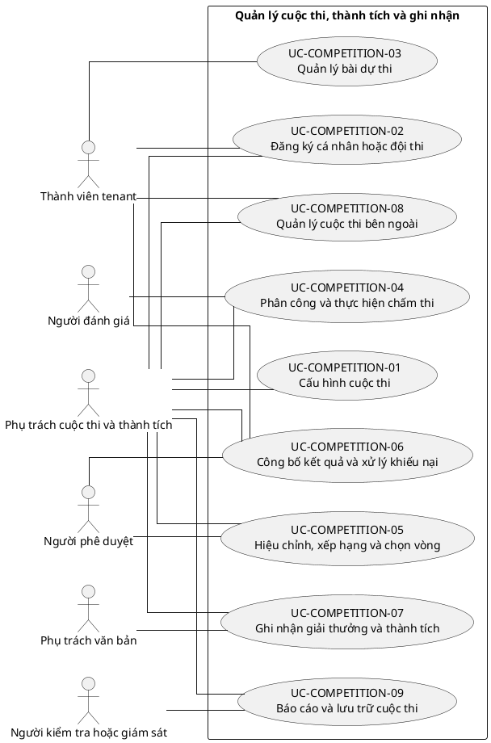

## 9. Ghi chú truy vết từ V3

Các phần tử chi tiết của V3 thuộc nhóm này được giữ làm nguồn phân tích nhưng đã được hợp nhất vào Use Case chính, luồng, quy tắc hoặc yêu cầu hệ thống. Không xem số lượng phần tử V3 là số lượng Use Case nghiệp vụ của V4.

---

<!-- SOURCE: 18_UC-NOTIFICATION.md -->

# UC-NOTIFICATION — Quản lý thông báo và truyền thông nội bộ

## 1. Thông tin tài liệu

| Thuộc tính | Nội dung |
|---|---|
| Mã nhóm Use Case | `UC-NOTIFICATION` |
| Miền nghiệp vụ | Truyền thông nội bộ |
| Mức ưu tiên | Nền tảng hỗ trợ |
| Phiên bản mô hình | V4 — tinh gọn theo mục tiêu actor |

## 2. Mục tiêu

Soạn, phê duyệt, phân phối và theo dõi thông báo đa kênh theo tenant và phạm vi người nhận.

## 3. Nguyên tắc phân rã

> Mỗi Use Case dưới đây đại diện cho một mục tiêu nghiệp vụ có kết quả quan sát được. Các thao tác chi tiết được hợp nhất vào cột **Nội dung bao hàm**, luồng nghiệp vụ và quy tắc; không tiếp tục tách thành các Use Case nhỏ.

## 4. Danh mục Use Case chính

| Mã | Use Case | Actor chính/hỗ trợ | Kết quả nghiệp vụ | Nội dung bao hàm |
|---|---|---|---|---|
| `UC-NOTIFICATION-01` | **Quản lý mẫu thông báo** | `ACT-COMMUNICATION-OFFICER` — Phụ trách truyền thông nội bộ<br>`ACT-TENANT-ADMIN` — Quản trị viên tenant | Mẫu thông báo, biến dữ liệu, bản dịch và phiên bản được quản lý. | Tạo/sửa/version template, biến dữ liệu, preview và localization. |
| `UC-NOTIFICATION-02` | **Soạn và chọn đối tượng nhận** | `ACT-COMMUNICATION-OFFICER` — Phụ trách truyền thông nội bộ<br>`ACT-MODULE-SPECIALIST` — Vai trò chuyên trách mô-đun | Thông báo nháp có nội dung, kênh và nhóm người nhận hợp lệ. | Soạn nháp, chọn tenant/đơn vị/role/người cụ thể, kênh và kiểm tra phạm vi. |
| `UC-NOTIFICATION-03` | **Phê duyệt và lên lịch thông báo** | `ACT-COMMUNICATION-OFFICER` — Phụ trách truyền thông nội bộ<br>`ACT-APPROVER` — Người phê duyệt | Thông báo được duyệt, gửi ngay hoặc lên lịch. | Gửi duyệt, phê duyệt/từ chối, lịch gửi, sửa/hủy lịch và thông báo khẩn cấp. |
| `UC-NOTIFICATION-04` | **Phân phối thông báo đa kênh** | `ACT-NOTIFICATION-SERVICE` — Dịch vụ thông báo | Thông báo được gửi qua kênh đã cấu hình và có trạng thái gửi. | In-app, email, SMS, push, webhook, retry và xử lý bounce. |
| `UC-NOTIFICATION-05` | **Tạo thông báo tự động** | `ACT-MODULE-SPECIALIST` — Vai trò chuyên trách mô-đun<br>`ACT-NOTIFICATION-SERVICE` — Dịch vụ thông báo | Sự kiện hệ thống tạo thông báo, nhắc việc, escalation hoặc digest. | Event-driven, reminder, escalation, digest định kỳ và chống trùng. |
| `UC-NOTIFICATION-06` | **Quản lý hộp thông báo cá nhân** | `ACT-TENANT-MEMBER` — Thành viên tenant | Người dùng tra cứu, đọc, xác nhận và lưu trữ thông báo. | Tìm kiếm/lọc, đánh dấu đọc, xác nhận đã hiểu, lưu trữ/xóa cá nhân. |
| `UC-NOTIFICATION-07` | **Theo dõi hiệu quả gửi** | `ACT-COMMUNICATION-OFFICER` — Phụ trách truyền thông nội bộ<br>`ACT-REPORT-ANALYST` — Phụ trách báo cáo và phân tích | Trạng thái gửi, mở, xác nhận và lỗi được báo cáo. | Delivery status, open/ack rate, lỗi kênh, export và báo cáo. |

## 5. Luồng nghiệp vụ cấp nhóm

1. Actor khởi phát một Use Case theo quyền và tenant context hiện hành.
2. Hệ thống kiểm tra xác thực, membership, permission, trạng thái tenant và module.
3. Hệ thống thực hiện luồng nghiệp vụ chính và các kiểm tra dữ liệu cần thiết.
4. Kết quả nghiệp vụ được lưu, thông báo cho bên liên quan và ghi audit khi thuộc danh mục bắt buộc.

## 6. Quy tắc nghiệp vụ cốt lõi

- Người nhận phải thuộc đúng tenant và phạm vi quyền của người gửi.
- Hệ thống phải tôn trọng tùy chọn người dùng, giờ yên lặng và giới hạn chống spam, trừ thông báo khẩn cấp có quyền.
- Nội dung tự động không được gửi nếu sự kiện nguồn bị rollback.

## 7. Quan hệ với nhóm Use Case khác

[`UC-SETTING`](./08_UC-SETTING.md), [`UC-MEMBER`](./09_UC-MEMBER.md), [`UC-BRAND`](./06_UC-BRAND.md), [`UC-AUDIT`](./21_UC-AUDIT.md)

## 8. Use Case Diagram

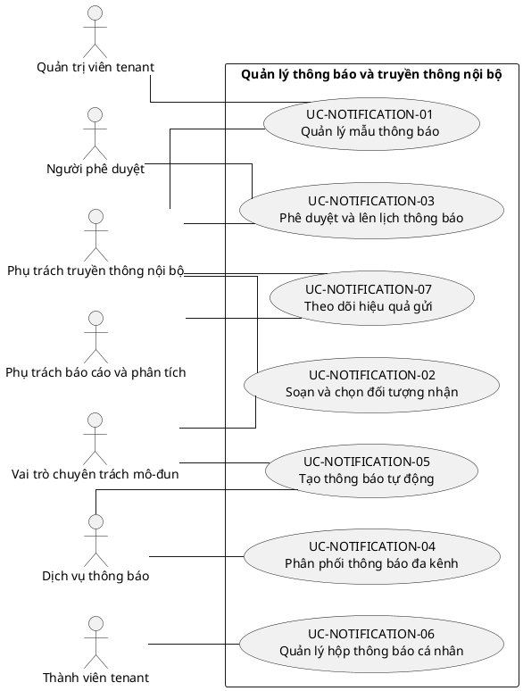

## 9. Ghi chú truy vết từ V3

Các phần tử chi tiết của V3 thuộc nhóm này được giữ làm nguồn phân tích nhưng đã được hợp nhất vào Use Case chính, luồng, quy tắc hoặc yêu cầu hệ thống. Không xem số lượng phần tử V3 là số lượng Use Case nghiệp vụ của V4.

---

<!-- SOURCE: 19_UC-DASHBOARD.md -->

# UC-DASHBOARD — Dashboard, báo cáo và xuất dữ liệu

## 1. Thông tin tài liệu

| Thuộc tính | Nội dung |
|---|---|
| Mã nhóm Use Case | `UC-DASHBOARD` |
| Miền nghiệp vụ | Phân tích vận hành |
| Mức ưu tiên | Nền tảng hỗ trợ |
| Phiên bản mô hình | V4 — tinh gọn theo mục tiêu actor |

## 2. Mục tiêu

Cung cấp chỉ số, báo cáo, cảnh báo và khả năng drill-down theo quyền và tenant context.

## 3. Nguyên tắc phân rã

> Mỗi Use Case dưới đây đại diện cho một mục tiêu nghiệp vụ có kết quả quan sát được. Các thao tác chi tiết được hợp nhất vào cột **Nội dung bao hàm**, luồng nghiệp vụ và quy tắc; không tiếp tục tách thành các Use Case nhỏ.

## 4. Danh mục Use Case chính

| Mã | Use Case | Actor chính/hỗ trợ | Kết quả nghiệp vụ | Nội dung bao hàm |
|---|---|---|---|---|
| `UC-DASHBOARD-01` | **Xem dashboard theo vai trò** | `ACT-TENANT-MEMBER` — Thành viên tenant<br>`ACT-UNIT-ADMIN` — Quản trị viên đơn vị<br>`ACT-TENANT-ADMIN` — Quản trị viên tenant<br>`ACT-PLATFORM-ADMIN` — Quản trị viên nền tảng | Dashboard cá nhân, đơn vị, tenant hoặc nền tảng hiển thị dữ liệu phù hợp quyền. | Chọn dashboard, chỉ số tổng hợp, xu hướng, cảnh báo và nguồn dữ liệu. |
| `UC-DASHBOARD-02` | **Lọc và đi sâu dữ liệu** | `ACT-TENANT-MEMBER` — Thành viên tenant<br>`ACT-REPORT-ANALYST` — Phụ trách báo cáo và phân tích | Người dùng lọc theo thời gian/đơn vị/module/trạng thái và drill-down đến dữ liệu nguồn. | Bộ lọc, so sánh kỳ/đơn vị, drill-down, làm mới và độ mới dữ liệu. |
| `UC-DASHBOARD-03` | **Tùy chỉnh dashboard** | `ACT-TENANT-MEMBER` — Thành viên tenant<br>`ACT-REPORT-ANALYST` — Phụ trách báo cáo và phân tích | Widget và chế độ xem cá nhân hoặc dùng chung được cấu hình. | Thêm/xóa/sắp xếp/resize widget, tham số, lưu/chia sẻ view và template. |
| `UC-DASHBOARD-04` | **Quản lý metric, KPI và cảnh báo** | `ACT-REPORT-ANALYST` — Phụ trách báo cáo và phân tích<br>`ACT-TENANT-ADMIN` — Quản trị viên tenant | Metric, mục tiêu, ngưỡng và cảnh báo được cấu hình. | Danh mục metric, KPI target, threshold, cảnh báo và người nhận. |
| `UC-DASHBOARD-05` | **Tạo báo cáo liên mô-đun** | `ACT-REPORT-ANALYST` — Phụ trách báo cáo và phân tích<br>`ACT-AUDITOR` — Người kiểm tra hoặc giám sát | Báo cáo tổng hợp từ nhiều module được tạo theo phạm vi dữ liệu. | Chọn dataset, cột, bộ lọc, nhóm, công thức và lưu báo cáo. |
| `UC-DASHBOARD-06` | **Xuất, chia sẻ và lên lịch báo cáo** | `ACT-REPORT-ANALYST` — Phụ trách báo cáo và phân tích<br>`ACT-TENANT-ADMIN` — Quản trị viên tenant | Dashboard hoặc báo cáo được xuất/chia sẻ/gửi định kỳ theo quyền. | CSV/XLSX/PDF/image, share view, schedule delivery và audit export. |
| `UC-DASHBOARD-07` | **Xem insight và chất lượng dữ liệu** | `ACT-REPORT-ANALYST` — Phụ trách báo cáo và phân tích<br>`ACT-TENANT-ADMIN` — Quản trị viên tenant | Bất thường, AI insight, dữ liệu thiếu và phản hồi người dùng được hiển thị. | Anomaly, AI insight, lỗi dữ liệu, lineage và feedback. |

## 5. Luồng nghiệp vụ cấp nhóm

1. Actor khởi phát một Use Case theo quyền và tenant context hiện hành.
2. Hệ thống kiểm tra xác thực, membership, permission, trạng thái tenant và module.
3. Hệ thống thực hiện luồng nghiệp vụ chính và các kiểm tra dữ liệu cần thiết.
4. Kết quả nghiệp vụ được lưu, thông báo cho bên liên quan và ghi audit khi thuộc danh mục bắt buộc.

## 6. Quy tắc nghiệp vụ cốt lõi

- Mọi widget và drill-down phải kiểm tra tenant và data permission.
- Báo cáo chia sẻ không được mở rộng quyền của người nhận.
- Chỉ số phải có định nghĩa, nguồn và thời điểm cập nhật.

## 7. Quan hệ với nhóm Use Case khác

[`UC-RBAC`](./04_UC-RBAC.md), [`UC-NOTIFICATION`](./18_UC-NOTIFICATION.md), [`UC-AI`](./20_UC-AI.md), [`UC-AUDIT`](./21_UC-AUDIT.md)

## 8. Use Case Diagram

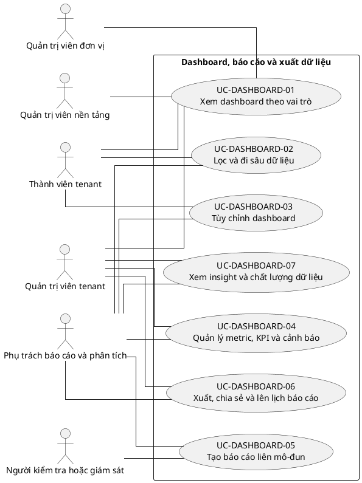

## 9. Ghi chú truy vết từ V3

Các phần tử chi tiết của V3 thuộc nhóm này được giữ làm nguồn phân tích nhưng đã được hợp nhất vào Use Case chính, luồng, quy tắc hoặc yêu cầu hệ thống. Không xem số lượng phần tử V3 là số lượng Use Case nghiệp vụ của V4.

---

<!-- SOURCE: 20_UC-AI.md -->

# UC-AI — Trợ lý AI và AI Gateway

## 1. Thông tin tài liệu

| Thuộc tính | Nội dung |
|---|---|
| Mã nhóm Use Case | `UC-AI` |
| Miền nghiệp vụ | Năng lực AI |
| Mức ưu tiên | Mở rộng có kiểm soát |
| Phiên bản mô hình | V4 — tinh gọn theo mục tiêu actor |

## 2. Mục tiêu

Cung cấp năng lực AI có cấu hình, kiểm soát dữ liệu, xác nhận con người và khả năng giám sát.

## 3. Nguyên tắc phân rã

> Mỗi Use Case dưới đây đại diện cho một mục tiêu nghiệp vụ có kết quả quan sát được. Các thao tác chi tiết được hợp nhất vào cột **Nội dung bao hàm**, luồng nghiệp vụ và quy tắc; không tiếp tục tách thành các Use Case nhỏ.

## 4. Danh mục Use Case chính

| Mã | Use Case | Actor chính/hỗ trợ | Kết quả nghiệp vụ | Nội dung bao hàm |
|---|---|---|---|---|
| `UC-AI-01` | **Cấu hình nhà cung cấp và mô hình AI** | `ACT-PLATFORM-ADMIN` — Quản trị viên nền tảng<br>`ACT-TENANT-ADMIN` — Quản trị viên tenant<br>`ACT-AI-PROVIDER` — Nhà cung cấp AI | Provider, model, secret, fallback và kết nối được cấu hình an toàn. | Danh sách provider, connection, model mặc định/theo use case, fallback và secret. |
| `UC-AI-02` | **Quản lý prompt và use case AI** | `ACT-TENANT-ADMIN` — Quản trị viên tenant<br>`ACT-MODULE-SPECIALIST` — Vai trò chuyên trách mô-đun | Prompt template được tạo, version, kiểm thử và gắn module. | Tạo/sửa/version prompt, biến ngữ cảnh, test dữ liệu mẫu và phê duyệt. |
| `UC-AI-03` | **Sử dụng trợ lý AI trong nghiệp vụ** | `ACT-TENANT-MEMBER` — Thành viên tenant<br>`ACT-MODULE-SPECIALIST` — Vai trò chuyên trách mô-đun<br>`ACT-AI-PROVIDER` — Nhà cung cấp AI | Người dùng nhận kết quả AI cho tác vụ được phép. | Sinh nháp, tóm tắt, trích xuất, phân loại, dịch, viết lại, semantic search, Q&A và insight. |
| `UC-AI-04` | **Rà soát và áp dụng kết quả AI** | `ACT-TENANT-MEMBER` — Thành viên tenant<br>`ACT-MODULE-SPECIALIST` — Vai trò chuyên trách mô-đun | Kết quả AI được chỉnh sửa, chấp nhận, từ chối hoặc phản hồi trước khi áp dụng. | Human review, edit, accept/reject, feedback và lưu provenance. |
| `UC-AI-05` | **Quản lý chính sách dữ liệu AI** | `ACT-TENANT-ADMIN` — Quản trị viên tenant<br>`ACT-AUDITOR` — Người kiểm tra hoặc giám sát | Yêu cầu AI tuân thủ opt-in, role, module và bảo vệ dữ liệu nhạy cảm. | Opt-in/out, scope role/module, redaction, policy check, moderation và chặn dữ liệu. |
| `UC-AI-06` | **Theo dõi sử dụng, chi phí và chất lượng AI** | `ACT-TENANT-ADMIN` — Quản trị viên tenant<br>`ACT-PLATFORM-ADMIN` — Quản trị viên nền tảng<br>`ACT-AUDITOR` — Người kiểm tra hoặc giám sát | Lượt dùng, chi phí, hạn mức, lịch sử và chất lượng được giám sát. | Quota, cost, request history, retention, model evaluation và comparison. |
| `UC-AI-07` | **Xử lý lỗi và chuyển nhà cung cấp** | `ACT-AI-PROVIDER` — Nhà cung cấp AI<br>`ACT-PLATFORM-ADMIN` — Quản trị viên nền tảng | Lỗi, timeout và fallback được xử lý mà không làm hỏng luồng nghiệp vụ chính. | Retry, timeout, circuit breaker, fallback provider/model và thông báo lỗi. |

## 5. Luồng nghiệp vụ cấp nhóm

1. Actor khởi phát một Use Case theo quyền và tenant context hiện hành.
2. Hệ thống kiểm tra xác thực, membership, permission, trạng thái tenant và module.
3. Hệ thống thực hiện luồng nghiệp vụ chính và các kiểm tra dữ liệu cần thiết.
4. Kết quả nghiệp vụ được lưu, thông báo cho bên liên quan và ghi audit khi thuộc danh mục bắt buộc.

## 6. Quy tắc nghiệp vụ cốt lõi

- Kết quả AI không được tự động tạo quyết định nhạy cảm nếu chưa có xác nhận con người.
- Dữ liệu gửi AI phải tuân theo tenant, role, consent và chính sách bảo mật.
- Lỗi AI không được chặn nghiệp vụ lõi khi có phương án thủ công.

## 7. Quan hệ với nhóm Use Case khác

[`UC-MODULE`](./07_UC-MODULE.md), [`UC-RBAC`](./04_UC-RBAC.md), [`UC-DOCUMENT`](./11_UC-DOCUMENT.md), [`UC-DASHBOARD`](./19_UC-DASHBOARD.md), [`UC-AUDIT`](./21_UC-AUDIT.md)

## 8. Use Case Diagram

```plantuml
@startuml
left to right direction
skinparam linetype ortho
skinparam packageStyle rectangle
actor "Quản trị viên nền tảng" as A1
actor "Quản trị viên tenant" as A2
actor "Nhà cung cấp AI" as A3
actor "Vai trò chuyên trách mô-đun" as A4
actor "Thành viên tenant" as A5
actor "Người kiểm tra hoặc giám sát" as A6
rectangle "Trợ lý AI và AI Gateway" {
  usecase "UC-AI-01\nCấu hình nhà cung cấp và mô hình AI" as UUC_AI_01
  usecase "UC-AI-02\nQuản lý prompt và use case AI" as UUC_AI_02
  usecase "UC-AI-03\nSử dụng trợ lý AI trong nghiệp vụ" as UUC_AI_03
  usecase "UC-AI-04\nRà soát và áp dụng kết quả AI" as UUC_AI_04
  usecase "UC-AI-05\nQuản lý chính sách dữ liệu AI" as UUC_AI_05
  usecase "UC-AI-06\nTheo dõi sử dụng, chi phí và chất lượng AI" as UUC_AI_06
  usecase "UC-AI-07\nXử lý lỗi và chuyển nhà cung cấp" as UUC_AI_07
}
A1 -- UUC_AI_01
A2 -- UUC_AI_01
A3 -- UUC_AI_01
A2 -- UUC_AI_02
A4 -- UUC_AI_02
A5 -- UUC_AI_03
A4 -- UUC_AI_03
A3 -- UUC_AI_03
A5 -- UUC_AI_04
A4 -- UUC_AI_04
A2 -- UUC_AI_05
A6 -- UUC_AI_05
A2 -- UUC_AI_06
A1 -- UUC_AI_06
A6 -- UUC_AI_06
A3 -- UUC_AI_07
A1 -- UUC_AI_07
@enduml
```

## 9. Ghi chú truy vết từ V3

Các phần tử chi tiết của V3 thuộc nhóm này được giữ làm nguồn phân tích nhưng đã được hợp nhất vào Use Case chính, luồng, quy tắc hoặc yêu cầu hệ thống. Không xem số lượng phần tử V3 là số lượng Use Case nghiệp vụ của V4.

---

<!-- SOURCE: 21_UC-AUDIT.md -->

# UC-AUDIT — Nhật ký hệ thống và truy vết hoạt động

## 1. Thông tin tài liệu

| Thuộc tính | Nội dung |
|---|---|
| Mã nhóm Use Case | `UC-AUDIT` |
| Miền nghiệp vụ | Audit và tuân thủ |
| Mức ưu tiên | Nền tảng bắt buộc |
| Phiên bản mô hình | V4 — tinh gọn theo mục tiêu actor |

## 2. Mục tiêu

Cung cấp khả năng tra cứu, điều tra, báo cáo và bảo toàn audit trail; việc ghi log được đặc tả như yêu cầu xuyên suốt.

## 3. Nguyên tắc phân rã

> Mỗi Use Case dưới đây đại diện cho một mục tiêu nghiệp vụ có kết quả quan sát được. Các thao tác chi tiết được hợp nhất vào cột **Nội dung bao hàm**, luồng nghiệp vụ và quy tắc; không tiếp tục tách thành các Use Case nhỏ.

## 4. Danh mục Use Case chính

| Mã | Use Case | Actor chính/hỗ trợ | Kết quả nghiệp vụ | Nội dung bao hàm |
|---|---|---|---|---|
| `UC-AUDIT-01` | **Tra cứu audit log** | `ACT-AUDITOR` — Người kiểm tra hoặc giám sát<br>`ACT-TENANT-ADMIN` — Quản trị viên tenant<br>`ACT-PLATFORM-ADMIN` — Quản trị viên nền tảng | Audit event được tìm kiếm, lọc và xem chi tiết theo quyền. | Danh sách, filter theo actor/action/time/entity/tenant, detail và dữ liệu trước-sau được phép. |
| `UC-AUDIT-02` | **Truy vết thực thể, người dùng hoặc quy trình** | `ACT-AUDITOR` — Người kiểm tra hoặc giám sát | Chuỗi thay đổi được truy vết theo entity, user, tenant hoặc correlation ID. | Entity history, user activity, tenant activity và process trace. |
| `UC-AUDIT-03` | **Điều tra sự cố từ audit trail** | `ACT-AUDITOR` — Người kiểm tra hoặc giám sát<br>`ACT-PLATFORM-ADMIN` — Quản trị viên nền tảng | Sự cố được lập hồ sơ, ghi chú, gắn bằng chứng và chain of custody. | Tạo case, lọc timeline, ghi chú, nhãn, bằng chứng và trạng thái điều tra. |
| `UC-AUDIT-04` | **Quản lý cảnh báo và tích hợp audit** | `ACT-AUDITOR` — Người kiểm tra hoặc giám sát<br>`ACT-PLATFORM-ADMIN` — Quản trị viên nền tảng | Quy tắc bất thường tạo cảnh báo hoặc gửi sự kiện tới hệ thống ngoài. | Detection rule, alert, SIEM/webhook, xử lý cảnh báo và escalation. |
| `UC-AUDIT-05` | **Xuất và báo cáo audit** | `ACT-AUDITOR` — Người kiểm tra hoặc giám sát<br>`ACT-PLATFORM-ADMIN` — Quản trị viên nền tảng | Audit log và báo cáo tuân thủ được xuất hoặc gửi định kỳ. | Export, scheduled report, dashboard compliance và audit export access. |
| `UC-AUDIT-06` | **Quản lý lưu giữ và tính toàn vẹn audit** | `ACT-PLATFORM-ADMIN` — Quản trị viên nền tảng<br>`ACT-AUDITOR` — Người kiểm tra hoặc giám sát | Audit log được lưu giữ, archive, legal hold, kiểm chứng và xóa hết hạn theo chính sách. | Retention, long-term archive, legal hold, integrity verification và purge. |
| `UC-AUDIT-07` | **Đánh giá độ đầy đủ của audit** | `ACT-AUDITOR` — Người kiểm tra hoặc giám sát<br>`ACT-PLATFORM-ADMIN` — Quản trị viên nền tảng | Hệ thống kiểm tra loại sự kiện bắt buộc đã được ghi nhận đầy đủ. | Coverage check, missing event report, schema validation và theo dõi khắc phục. |

## 5. Luồng nghiệp vụ cấp nhóm

1. Actor khởi phát một Use Case theo quyền và tenant context hiện hành.
2. Hệ thống kiểm tra xác thực, membership, permission, trạng thái tenant và module.
3. Hệ thống thực hiện luồng nghiệp vụ chính và các kiểm tra dữ liệu cần thiết.
4. Kết quả nghiệp vụ được lưu, thông báo cho bên liên quan và ghi audit khi thuộc danh mục bắt buộc.

## 6. Quy tắc nghiệp vụ cốt lõi

- Ghi audit là yêu cầu xuyên suốt, không phải Use Case do người dùng khởi phát.
- Audit log không được người dùng thông thường sửa hoặc xóa.
- Dữ liệu nhạy cảm phải được che hoặc loại bỏ khỏi audit theo chính sách.
- Việc xem hoặc xuất audit nhạy cảm cũng phải được audit.

## 7. Quan hệ với nhóm Use Case khác

[`UC-AUTH`](./02_UC-AUTH.md), [`UC-TENANT`](./01_UC-TENANT.md), [`UC-RBAC`](./04_UC-RBAC.md), [`UC-NOTIFICATION`](./18_UC-NOTIFICATION.md), [`UC-DASHBOARD`](./19_UC-DASHBOARD.md)

## 8. Use Case Diagram

```plantuml
@startuml
left to right direction
skinparam linetype ortho
skinparam packageStyle rectangle
actor "Người kiểm tra hoặc giám sát" as A1
actor "Quản trị viên tenant" as A2
actor "Quản trị viên nền tảng" as A3
rectangle "Nhật ký hệ thống và truy vết hoạt động" {
  usecase "UC-AUDIT-01\nTra cứu audit log" as UUC_AUDIT_01
  usecase "UC-AUDIT-02\nTruy vết thực thể, người dùng hoặc quy trình" as UUC_AUDIT_02
  usecase "UC-AUDIT-03\nĐiều tra sự cố từ audit trail" as UUC_AUDIT_03
  usecase "UC-AUDIT-04\nQuản lý cảnh báo và tích hợp audit" as UUC_AUDIT_04
  usecase "UC-AUDIT-05\nXuất và báo cáo audit" as UUC_AUDIT_05
  usecase "UC-AUDIT-06\nQuản lý lưu giữ và tính toàn vẹn audit" as UUC_AUDIT_06
  usecase "UC-AUDIT-07\nĐánh giá độ đầy đủ của audit" as UUC_AUDIT_07
}
A1 -- UUC_AUDIT_01
A2 -- UUC_AUDIT_01
A3 -- UUC_AUDIT_01
A1 -- UUC_AUDIT_02
A1 -- UUC_AUDIT_03
A3 -- UUC_AUDIT_03
A1 -- UUC_AUDIT_04
A3 -- UUC_AUDIT_04
A1 -- UUC_AUDIT_05
A3 -- UUC_AUDIT_05
A3 -- UUC_AUDIT_06
A1 -- UUC_AUDIT_06
A1 -- UUC_AUDIT_07
A3 -- UUC_AUDIT_07
@enduml
```

## 9. Ghi chú truy vết từ V3

Các phần tử chi tiết của V3 thuộc nhóm này được giữ làm nguồn phân tích nhưng đã được hợp nhất vào Use Case chính, luồng, quy tắc hoặc yêu cầu hệ thống. Không xem số lượng phần tử V3 là số lượng Use Case nghiệp vụ của V4.