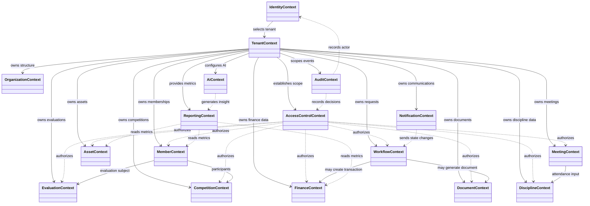
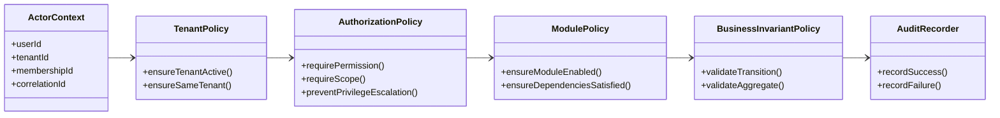

# Class Diagram tổng quát theo miền nghiệp vụ

## 1. Mục tiêu

Sơ đồ này dùng để trình bày cấu trúc miền của toàn bộ Operations Hub mà không đưa toàn bộ thuộc tính của hơn 21 mô-đun vào một hình duy nhất.

## 2. Sơ đồ tổng quát

## 3. Luồng kiểm soát chung

## 4. Nguyên tắc trình bày trong báo cáo

Không nên dùng sơ đồ này để thay thế các sơ đồ chi tiết. Sơ đồ tổng quát chỉ trả lời:

- Có những miền nghiệp vụ nào?
- Miền nào sở hữu dữ liệu?
- Miền nào phụ thuộc hoặc cung cấp dữ liệu cho miền khác?
- Các kiểm soát xuyên suốt được áp dụng ở đâu?
