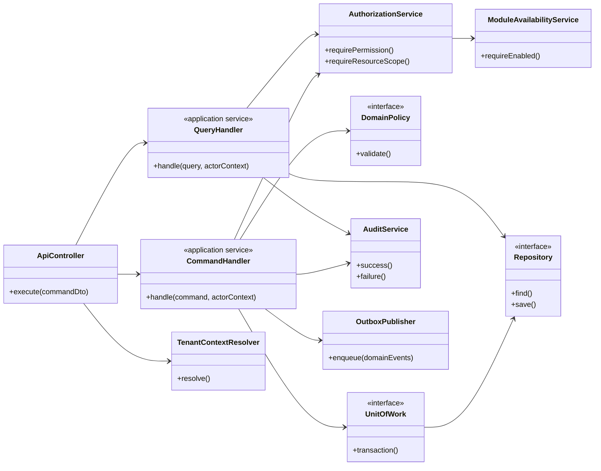

# Class Diagram lớp ứng dụng và kiểm soát truy cập

## 1. Mục tiêu

Sơ đồ này không mô tả bảng dữ liệu. Nó mô tả cách controller, application service, policy, repository và audit phối hợp trong backend.

## 2. Class Diagram

## 3. Trách nhiệm

| Lớp | Trách nhiệm |
|---|---|
| Controller | Nhận HTTP request, validate DTO cơ bản, không chứa nghiệp vụ lõi |
| Handler/Application service | Điều phối một use case |
| AuthorizationService | Kiểm tra permission và phạm vi |
| DomainPolicy | Kiểm tra bất biến nghiệp vụ |
| UnitOfWork | Bảo đảm transaction |
| Repository | Truy cập aggregate theo tenant |
| AuditService | Ghi kết quả và correlation ID |
| OutboxPublisher | Phát domain event đáng tin cậy sau transaction |

## 4. Đối chiếu repo

Repository hiện tại đã có các guard toàn cục cho JWT, tenant, module và permission. Bộ sơ đồ mục tiêu giữ nguyên ý tưởng kiểm soát ở backend nhưng tách rõ lớp điều phối và lớp chính sách.
