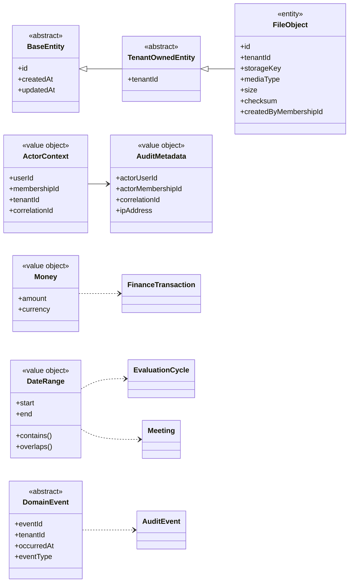

# Shared Kernel Class Diagram

## 1. Mục tiêu

Shared Kernel chỉ chứa các khái niệm thật sự dùng chung. Không đưa quy tắc riêng của một mô-đun vào đây vì sẽ tạo phụ thuộc ngược và làm mờ bounded context.

## 2. Class Diagram

## 3. Cảnh báo thiết kế

- Không tạo một `CommonService` chứa mọi nghiệp vụ.
- Không dùng `tenantId` từ client mà không đối chiếu membership.
- `FileObject` phải duy trì tenant boundary tương tự dữ liệu nguồn.
- Value object phải được kiểm tra hợp lệ tại thời điểm khởi tạo.
