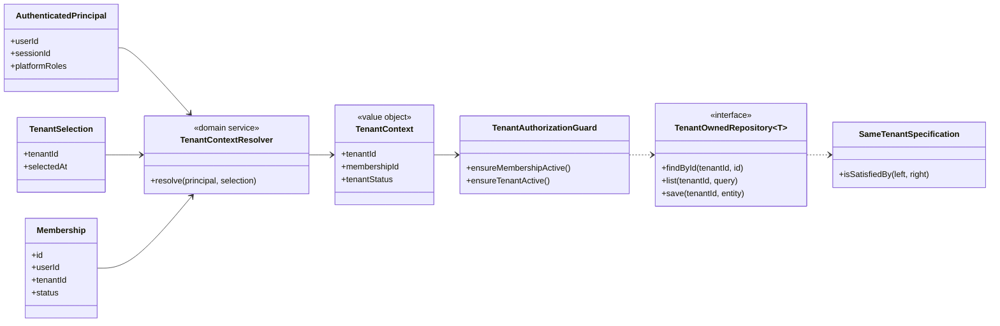

# Class Diagram cô lập dữ liệu tenant

## 1. Mục tiêu

Mô hình này diễn tả các lớp chịu trách nhiệm xác định tenant context và ngăn truy cập chéo tenant.

## 2. Class Diagram

## 3. Chuỗi kiểm tra bắt buộc

1. Xác thực danh tính.
2. Xác định tenant được chọn.
3. Đối chiếu User–Tenant bằng Membership.
4. Kiểm tra trạng thái Tenant.
5. Kiểm tra trạng thái Membership.
6. Kiểm tra mô-đun.
7. Kiểm tra Permission và scope.
8. Kiểm tra tất cả đối tượng tham chiếu cùng tenant.
9. Thực hiện transaction.
10. Ghi audit.

## 4. Sai lầm cần tránh

- Lọc tenant ở frontend.
- Nhận `tenantId` từ body và tin cậy trực tiếp.
- Dùng `findUnique(id)` trước rồi mới kiểm tra tenant.
- Tạo cache key không chứa tenant.
- Sinh file export mà không gắn tenant ownership.
