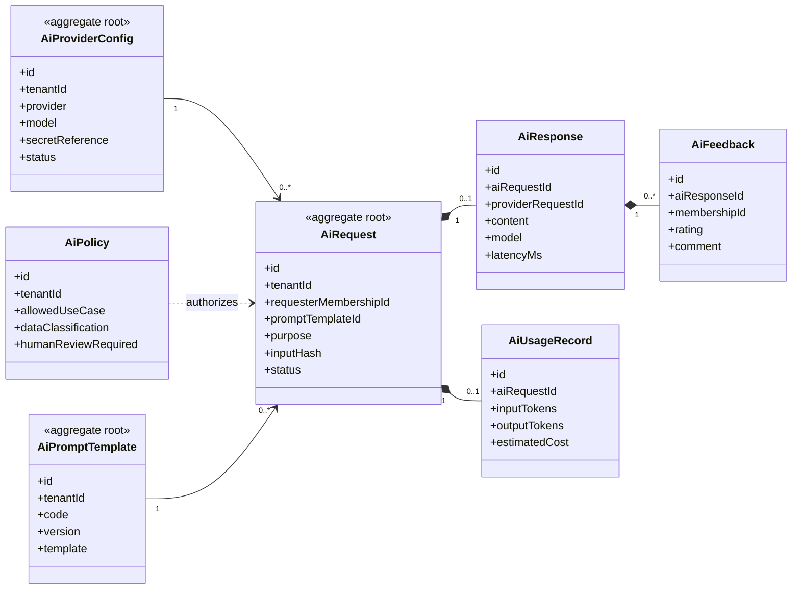

# UC-AI — Trợ lý AI và AI Gateway

## 1. Phạm vi

Mô hình hóa cấu hình provider, chính sách AI, prompt template, yêu cầu, phản hồi, mức sử dụng và đánh giá chất lượng.

- **Trạng thái trong repository hiện tại:** **Planned**
- **Loại sơ đồ:** UML Class Diagram ở mức miền nghiệp vụ.
- **Nguyên tắc:** các lớp nghiệp vụ thuộc tenant phải bảo toàn `tenantId` hoặc quan hệ sở hữu tương đương.

## 2. Class Diagram

## 3. Danh mục lớp

| Lớp | Loại | Trách nhiệm |
|---|---|---|
| `AiProviderConfig` | Aggregate root | Provider, model và secret reference. |
| `AiPolicy` | Policy entity | Giới hạn loại dữ liệu và yêu cầu human review. |
| `AiPromptTemplate` | Aggregate root | Prompt được version hóa. |
| `AiRequest` | Aggregate root | Yêu cầu AI có mục đích và actor. |
| `AiResponse` | Entity | Kết quả từ provider. |
| `AiUsageRecord` | Entity | Token, chi phí và quota. |
| `AiFeedback` | Entity | Phản hồi người dùng về kết quả. |

## 4. Bất biến nghiệp vụ

1. AI không được là dependency bắt buộc của nghiệp vụ lõi.
2. Secret không lưu trực tiếp trong dữ liệu trả về hoặc log.
3. Dữ liệu nhạy cảm chỉ được gửi khi policy cho phép.
4. Kết quả cần human review không được tự động ban hành.
5. Mọi request phải xác định tenant, actor và mục đích.

## 5. Ánh xạ với repository hiện tại

Chưa có model AI trong Prisma schema hiện tại.
