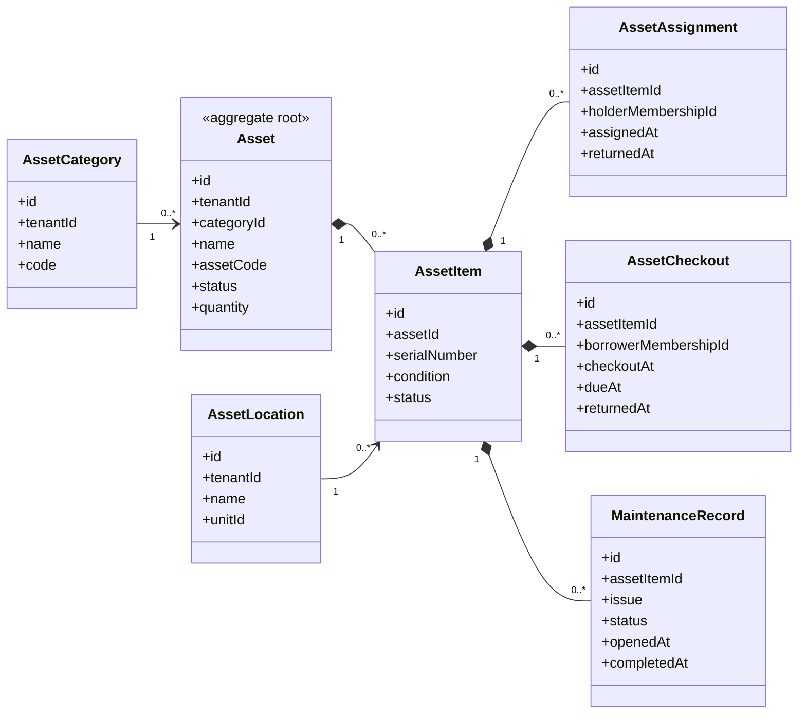

# UC-ASSET — Quản lý tài sản và hậu cần

## 1. Phạm vi

Mô hình hóa danh mục tài sản, từng đơn vị tài sản, vị trí, cấp phát/mượn trả, bảo trì và lịch sử trạng thái.

- **Trạng thái trong repository hiện tại:** **Planned**
- **Loại sơ đồ:** UML Class Diagram ở mức miền nghiệp vụ.
- **Nguyên tắc:** các lớp nghiệp vụ thuộc tenant phải bảo toàn `tenantId` hoặc quan hệ sở hữu tương đương.

## 2. Class Diagram

## 3. Danh mục lớp

| Lớp | Loại | Trách nhiệm |
|---|---|---|
| `Asset` | Aggregate root | Loại tài sản được quản lý số lượng. |
| `AssetItem` | Entity | Đơn vị vật lý có serial hoặc trạng thái riêng. |
| `AssetLocation` | Entity | Vị trí hoặc đơn vị chịu trách nhiệm. |
| `AssetAssignment` | Entity | Cấp phát dài hạn cho thành viên. |
| `AssetCheckout` | Entity | Mượn và trả có thời hạn. |
| `MaintenanceRecord` | Entity | Sự cố và bảo trì. |

## 4. Bất biến nghiệp vụ

1. Không cho mượn một AssetItem đang được mượn hoặc bảo trì.
2. Người mượn và AssetItem phải thuộc cùng tenant.
3. Trả tài sản phải ghi nhận tình trạng sau trả.
4. Không xóa tài sản đã có lịch sử mượn hoặc bảo trì.
5. Số lượng khả dụng không được âm.

## 5. Ánh xạ với repository hiện tại

Chưa có model Asset trong Prisma schema hiện tại.
