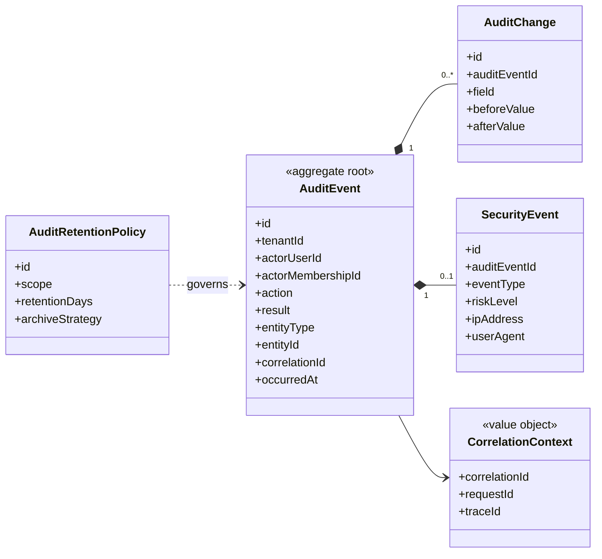

# UC-AUDIT — Nhật ký hệ thống và truy vết hoạt động

## 1. Phạm vi

Mô hình hóa sự kiện audit bất biến, thay đổi trước–sau, ngữ cảnh tương quan, sự kiện bảo mật và chính sách lưu giữ.

- **Trạng thái trong repository hiện tại:** **Partial**
- **Loại sơ đồ:** UML Class Diagram ở mức miền nghiệp vụ.
- **Nguyên tắc:** các lớp nghiệp vụ thuộc tenant phải bảo toàn `tenantId` hoặc quan hệ sở hữu tương đương.

## 2. Class Diagram

## 3. Danh mục lớp

| Lớp | Loại | Trách nhiệm |
|---|---|---|
| `AuditEvent` | Aggregate root | Sự kiện append-only có actor và tenant context. |
| `AuditChange` | Entity | Chi tiết trường thay đổi trước–sau. |
| `CorrelationContext` | Value object | Liên kết sự kiện cùng luồng xử lý. |
| `SecurityEvent` | Entity | Sự kiện truy cập sai tenant hoặc nâng quyền. |
| `AuditRetentionPolicy` | Policy entity | Thời hạn lưu giữ và lưu trữ. |

## 4. Bất biến nghiệp vụ

1. Audit event không được người dùng thông thường sửa hoặc xóa.
2. Sự kiện phải ghi cả thành công và từ chối quan trọng.
3. Actor tenant nên tham chiếu Membership, không chỉ User.
4. Log không được chứa secret hoặc dữ liệu nhạy cảm không cần thiết.
5. Platform Admin không được dùng audit như cơ chế truy cập tùy ý dữ liệu tenant.

## 5. Ánh xạ với repository hiện tại

`AuditLog` đã tồn tại với before/after và correlationId; actor hiện chỉ tham chiếu `User`, chưa có membership context và retention policy.
