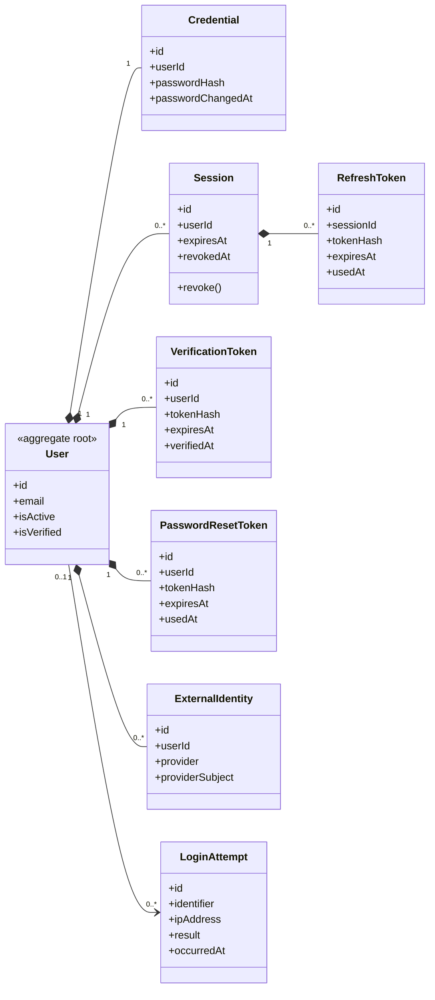

# UC-AUTH — Xác thực và quản lý phiên

## 1. Phạm vi

Mô hình hóa thông tin xác thực, phiên đăng nhập, token làm mới, xác minh tài khoản, đặt lại mật khẩu và danh tính ngoài.

- **Trạng thái trong repository hiện tại:** **Partial**
- **Loại sơ đồ:** UML Class Diagram ở mức miền nghiệp vụ.
- **Nguyên tắc:** các lớp nghiệp vụ thuộc tenant phải bảo toàn `tenantId` hoặc quan hệ sở hữu tương đương.

## 2. Class Diagram

## 3. Danh mục lớp

| Lớp | Loại | Trách nhiệm |
|---|---|---|
| `Credential` | Entity | Lưu thông tin xác thực tách khỏi hồ sơ người dùng. |
| `Session` | Entity | Quản lý phiên và khả năng thu hồi. |
| `RefreshToken` | Entity | Luân chuyển token làm mới theo phiên. |
| `ExternalIdentity` | Entity | Liên kết OAuth/SSO nếu được bật. |
| `LoginAttempt` | Audit entity | Hỗ trợ rate limit và điều tra đăng nhập. |

## 4. Bất biến nghiệp vụ

1. Không lưu mật khẩu hoặc token dạng rõ.
2. Phiên bị thu hồi không được tiếp tục làm mới.
3. User bị vô hiệu hóa làm mất hiệu lực truy cập ở mọi tenant.
4. Token xác minh và reset chỉ sử dụng một lần.
5. Đăng nhập thất bại liên tiếp phải bị giới hạn theo chính sách.

## 5. Ánh xạ với repository hiện tại

`User` và `Session` đã tồn tại; `passwordHash` hiện nằm trực tiếp trong `User`. Các token và external identity chưa có model riêng.
