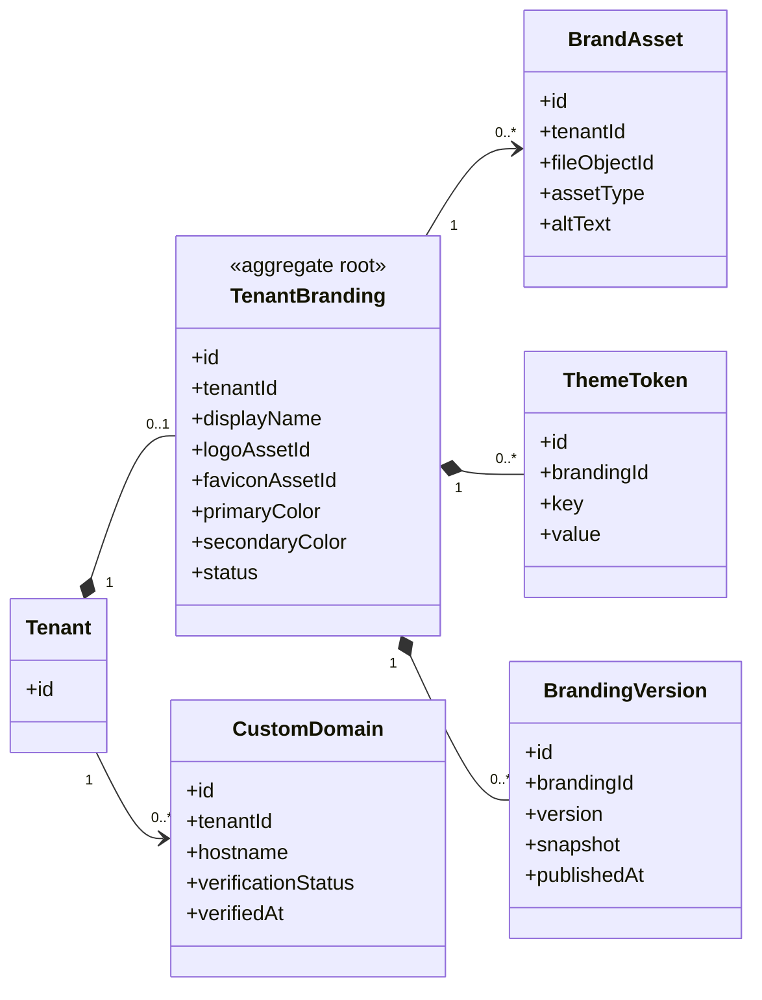

# UC-BRAND — Quản lý branding và giao diện tổ chức

## 1. Phạm vi

Mô hình hóa nhận diện tenant, tài sản thương hiệu, token giao diện, phiên bản cấu hình và tên miền tùy chỉnh.

- **Trạng thái trong repository hiện tại:** **Partial**
- **Loại sơ đồ:** UML Class Diagram ở mức miền nghiệp vụ.
- **Nguyên tắc:** các lớp nghiệp vụ thuộc tenant phải bảo toàn `tenantId` hoặc quan hệ sở hữu tương đương.

## 2. Class Diagram

## 3. Danh mục lớp

| Lớp | Loại | Trách nhiệm |
|---|---|---|
| `TenantBranding` | Aggregate root | Cấu hình nhận diện đang áp dụng. |
| `BrandAsset` | Entity | Logo, favicon, ảnh nền và tài sản liên quan. |
| `ThemeToken` | Value-like entity | Biến màu, font và token giao diện. |
| `BrandingVersion` | Entity | Lịch sử cấu hình đã công bố. |
| `CustomDomain` | Entity | Tên miền hoặc subdomain theo tenant. |

## 4. Bất biến nghiệp vụ

1. Branding chỉ có hiệu lực trong tenant sở hữu.
2. Tenant chưa cấu hình phải dùng branding mặc định nền tảng.
3. Tệp tải lên phải được kiểm tra loại, kích thước và nội dung.
4. Tên miền tùy chỉnh chỉ hoạt động sau khi xác minh.
5. Công bố phiên bản mới phải có khả năng truy vết người thực hiện.

## 5. Ánh xạ với repository hiện tại

`Tenant.brandColor` đã tồn tại. Logo, asset, token, version và custom domain chưa có model riêng.
