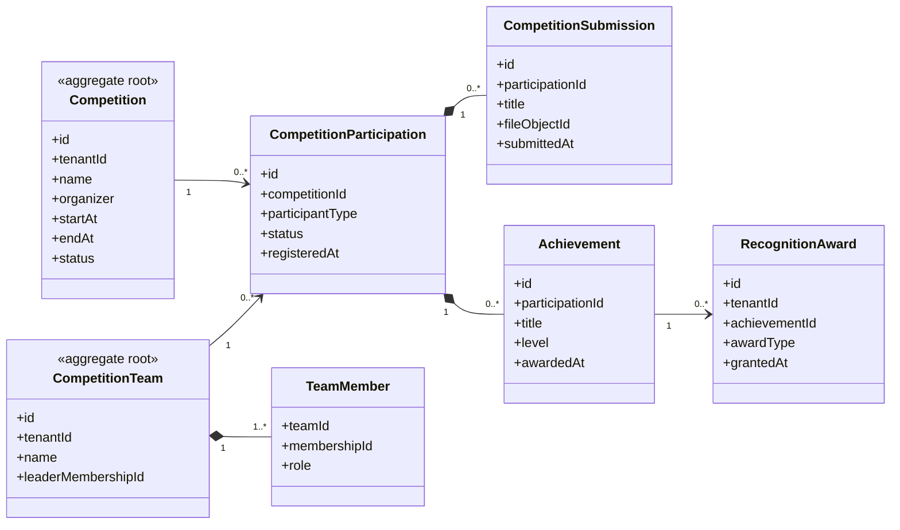

# UC-COMPETITION — Quản lý cuộc thi, thành tích và ghi nhận

## 1. Phạm vi

Mô hình hóa cuộc thi, đội dự thi, thành viên đội, bài nộp, thành tích và giải thưởng.

- **Trạng thái trong repository hiện tại:** **Planned**
- **Loại sơ đồ:** UML Class Diagram ở mức miền nghiệp vụ.
- **Nguyên tắc:** các lớp nghiệp vụ thuộc tenant phải bảo toàn `tenantId` hoặc quan hệ sở hữu tương đương.

## 2. Class Diagram

## 3. Danh mục lớp

| Lớp | Loại | Trách nhiệm |
|---|---|---|
| `Competition` | Aggregate root | Thông tin và thời gian cuộc thi. |
| `CompetitionParticipation` | Entity | Lần tham gia cá nhân hoặc đội. |
| `CompetitionTeam` | Aggregate root | Đội dự thi trong tenant. |
| `TeamMember` | Association entity | Thành viên và vai trò trong đội. |
| `CompetitionSubmission` | Entity | Bài dự thi hoặc minh chứng. |
| `Achievement` | Entity | Kết quả đạt được. |

## 4. Bất biến nghiệp vụ

1. Thành viên đội phải thuộc cùng tenant.
2. Bài nộp sau hạn chỉ được chấp nhận theo chính sách.
3. Achievement phải liên kết một participation hợp lệ.
4. Không ghi nhận cùng một giải thưởng trùng lặp.
5. Kết thúc membership không xóa thành tích lịch sử.

## 5. Ánh xạ với repository hiện tại

Chưa có model Competition trong Prisma schema hiện tại.
