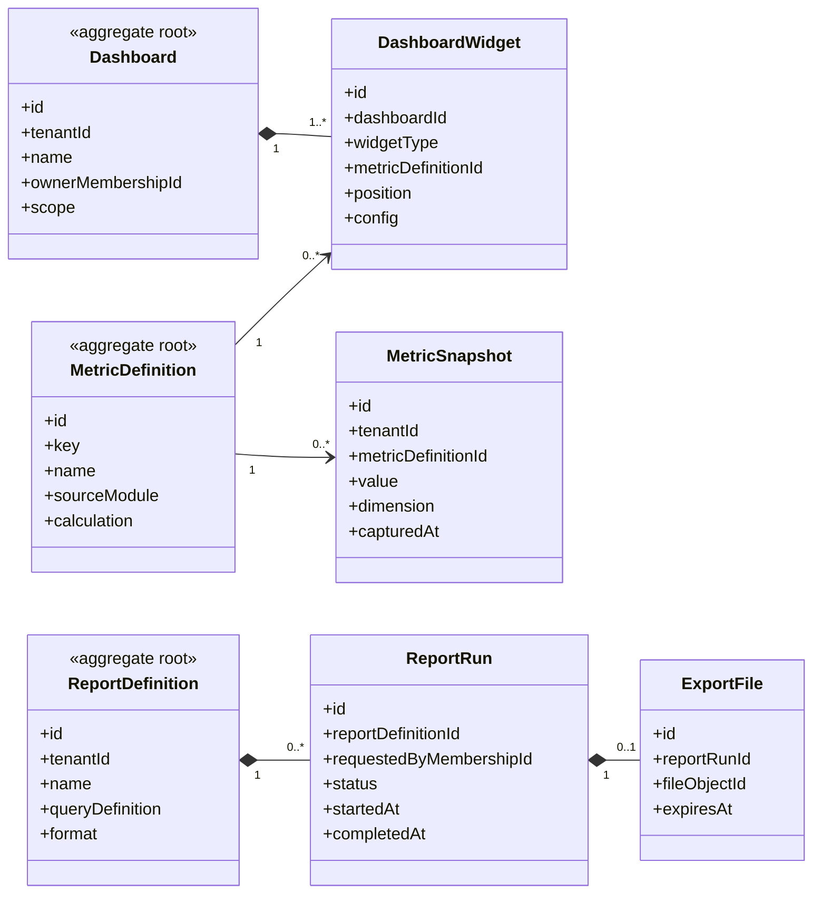

# UC-DASHBOARD — Dashboard, báo cáo và xuất dữ liệu

## 1. Phạm vi

Mô hình hóa dashboard cấu hình, widget, định nghĩa metric, snapshot, báo cáo và lần chạy xuất dữ liệu.

- **Trạng thái trong repository hiện tại:** **Partial**
- **Loại sơ đồ:** UML Class Diagram ở mức miền nghiệp vụ.
- **Nguyên tắc:** các lớp nghiệp vụ thuộc tenant phải bảo toàn `tenantId` hoặc quan hệ sở hữu tương đương.

## 2. Class Diagram

## 3. Danh mục lớp

| Lớp | Loại | Trách nhiệm |
|---|---|---|
| `Dashboard` | Aggregate root | Bố cục dashboard theo phạm vi. |
| `DashboardWidget` | Entity | Widget và vị trí hiển thị. |
| `MetricDefinition` | Aggregate root | Định nghĩa metric dùng chung. |
| `MetricSnapshot` | Read model | Giá trị metric theo thời điểm. |
| `ReportDefinition` | Aggregate root | Cấu hình báo cáo. |
| `ReportRun` | Entity | Một lần chạy báo cáo. |
| `ExportFile` | Entity | Tệp kết quả có thời hạn. |

## 4. Bất biến nghiệp vụ

1. Metric phải được tính trong đúng tenant và phạm vi quyền.
2. Không dùng cache chung làm lẫn dữ liệu giữa tenant.
3. Export file phải có quyền và thời hạn truy cập.
4. Dashboard không được suy diễn quyền truy cập từ việc widget được hiển thị.
5. Metric snapshot phải ghi rõ thời điểm và nguồn dữ liệu.

## 5. Ánh xạ với repository hiện tại

`DashboardMetric` đã tồn tại nhưng mới là key–value theo tenant. Chưa có dashboard layout, metric definition, report và export lifecycle.
