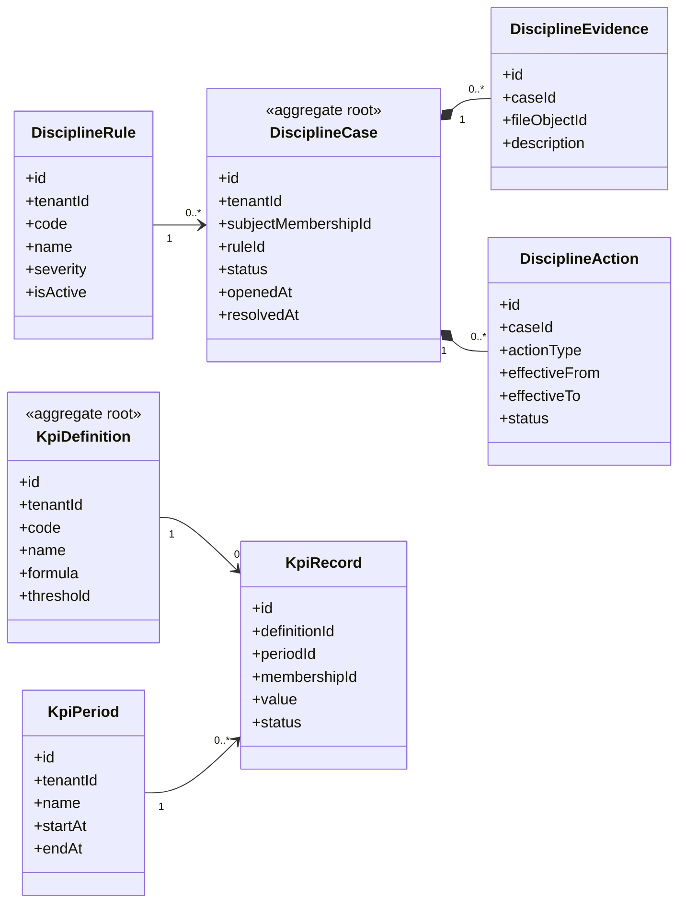

# UC-DISCIPLINE — Quản lý kỷ luật và KPI

## 1. Phạm vi

Mô hình hóa quy tắc kỷ luật, vụ việc, bằng chứng, hành động xử lý, định nghĩa KPI và kết quả KPI theo kỳ.

- **Trạng thái trong repository hiện tại:** **Planned**
- **Loại sơ đồ:** UML Class Diagram ở mức miền nghiệp vụ.
- **Nguyên tắc:** các lớp nghiệp vụ thuộc tenant phải bảo toàn `tenantId` hoặc quan hệ sở hữu tương đương.

## 2. Class Diagram

## 3. Danh mục lớp

| Lớp | Loại | Trách nhiệm |
|---|---|---|
| `DisciplineRule` | Reference entity | Quy tắc và mức độ vi phạm. |
| `DisciplineCase` | Aggregate root | Vụ việc kỷ luật của thành viên. |
| `DisciplineEvidence` | Entity | Minh chứng và tài liệu. |
| `DisciplineAction` | Entity | Hình thức xử lý có thời hạn. |
| `KpiDefinition` | Aggregate root | Định nghĩa chỉ số và công thức. |
| `KpiRecord` | Entity | Giá trị KPI của thành viên theo kỳ. |

## 4. Bất biến nghiệp vụ

1. Không áp dụng quy tắc của tenant khác.
2. Mức xử lý phải phù hợp trạng thái và quyền phê duyệt.
3. KPI phải truy vết được nguồn dữ liệu.
4. Đồng bộ chuyên cần không tạo bản ghi trùng.
5. Kết thúc membership không xóa lịch sử kỷ luật và KPI.

## 5. Ánh xạ với repository hiện tại

Chưa có model Discipline hoặc KPI trong Prisma schema hiện tại.
