# UC-DOCUMENT — Quản lý văn bản, biểu mẫu và mẫu tài liệu

## 1. Phạm vi

Mô hình hóa tài liệu, phiên bản, mẫu tài liệu, sinh tài liệu, phê duyệt, phân loại và tệp lưu trữ.

- **Trạng thái trong repository hiện tại:** **Planned**
- **Loại sơ đồ:** UML Class Diagram ở mức miền nghiệp vụ.
- **Nguyên tắc:** các lớp nghiệp vụ thuộc tenant phải bảo toàn `tenantId` hoặc quan hệ sở hữu tương đương.

## 2. Class Diagram

```mermaid
classDiagram
direction LR
class FileObject {
  +id
  +tenantId
  +storageKey
  +mediaType
  +size
  +checksum
}
class Document {
  <<aggregate root>>
  +id
  +tenantId
  +code
  +title
  +documentType
  +status
  +currentVersionId
}
class DocumentVersion {
  +id
  +documentId
  +versionNumber
  +fileObjectId
  +createdByMembershipId
  +createdAt
}
class DocumentTemplate {
  <<aggregate root>>
  +id
  +tenantId
  +name
  +templateFileId
  +schema
  +isActive
}
class GeneratedDocument {
  +id
  +templateId
  +sourceEntityType
  +sourceEntityId
  +outputFileId
  +generatedAt
}
class DocumentApproval {
  +id
  +documentId
  +approverMembershipId
  +status
  +decidedAt
}
class DocumentTag {
  +id
  +tenantId
  +name
}
class DocumentTagAssignment {
  +documentId
  +tagId
}
Document "1" *-- "1..*" DocumentVersion
DocumentVersion "1" --> "1" FileObject
DocumentTemplate "1" --> "1" FileObject : template
DocumentTemplate "1" --> "0..*" GeneratedDocument
GeneratedDocument "1" --> "1" FileObject : output
Document "1" *-- "0..*" DocumentApproval
Document "1" --> "0..*" DocumentTagAssignment
DocumentTag "1" --> "0..*" DocumentTagAssignment
```

## 3. Danh mục lớp

| Lớp | Loại | Trách nhiệm |
|---|---|---|
| `FileObject` | Shared entity | Metadata tệp và khóa lưu trữ. |
| `Document` | Aggregate root | Danh tính và trạng thái văn bản. |
| `DocumentVersion` | Entity | Phiên bản nội dung không ghi đè lịch sử. |
| `DocumentTemplate` | Aggregate root | Mẫu và schema dữ liệu đầu vào. |
| `GeneratedDocument` | Entity | Kết quả sinh từ template và dữ liệu nguồn. |
| `DocumentApproval` | Entity | Quy trình xác nhận hoặc ban hành. |

## 4. Bất biến nghiệp vụ

1. Mọi phiên bản phải thuộc cùng tenant với Document.
2. Phiên bản đã ban hành không bị ghi đè.
3. Tệp phải được kiểm tra checksum, loại và quyền truy cập.
4. Template riêng của tenant A không được dùng tại tenant B.
5. Document code phải duy nhất theo phạm vi được quy định.

## 5. Ánh xạ với repository hiện tại

Chưa có model Document hoặc FileObject trong Prisma schema hiện tại.
