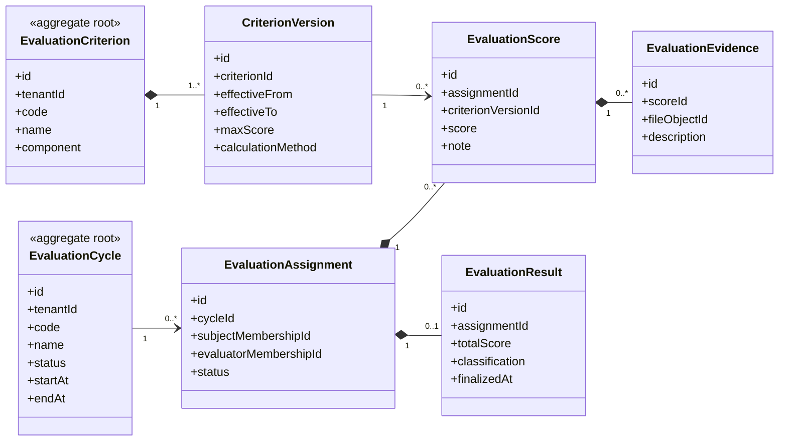

# UC-EVALUATION — Quản lý đánh giá thành viên

## 1. Phạm vi

Mô hình hóa chu kỳ đánh giá, phiên bản tiêu chí, phân công đánh giá, điểm, minh chứng và kết quả tổng hợp.

- **Trạng thái trong repository hiện tại:** **Planned**
- **Loại sơ đồ:** UML Class Diagram ở mức miền nghiệp vụ.
- **Nguyên tắc:** các lớp nghiệp vụ thuộc tenant phải bảo toàn `tenantId` hoặc quan hệ sở hữu tương đương.

## 2. Class Diagram

## 3. Danh mục lớp

| Lớp | Loại | Trách nhiệm |
|---|---|---|
| `EvaluationCycle` | Aggregate root | Kỳ đánh giá và trạng thái khóa. |
| `EvaluationCriterion` | Aggregate root | Tiêu chí định danh ổn định. |
| `CriterionVersion` | Entity | Phiên bản điểm tối đa và công thức. |
| `EvaluationAssignment` | Entity | Phân công đối tượng và người đánh giá. |
| `EvaluationScore` | Entity | Điểm theo tiêu chí. |
| `EvaluationResult` | Entity | Kết quả tổng hợp đã chốt. |

## 4. Bất biến nghiệp vụ

1. Tiêu chí phải dùng đúng phiên bản có hiệu lực tại chu kỳ.
2. Điểm không vượt giới hạn của CriterionVersion.
3. Chu kỳ đã khóa không nhận chỉnh sửa trực tiếp.
4. Evaluator và subject phải thuộc đúng phạm vi tenant.
5. Mỗi thay đổi điểm phải truy vết nguồn và người thực hiện.

## 5. Ánh xạ với repository hiện tại

Chưa có model Evaluation trong Prisma schema hiện tại.
