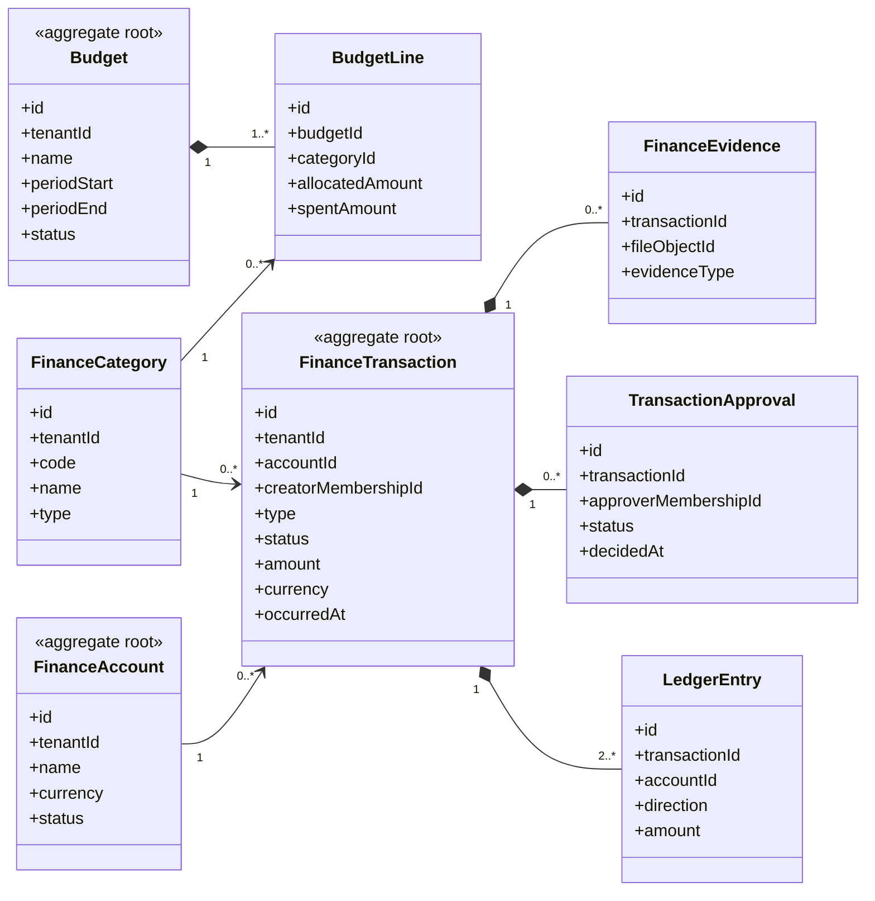

# UC-FINANCE — Quản lý tài chính và ngân sách

## 1. Phạm vi

Mô hình hóa tài khoản quỹ, ngân sách, giao dịch, bút toán sổ cái, danh mục, chứng từ và phê duyệt.

- **Trạng thái trong repository hiện tại:** **Partial**
- **Loại sơ đồ:** UML Class Diagram ở mức miền nghiệp vụ.
- **Nguyên tắc:** các lớp nghiệp vụ thuộc tenant phải bảo toàn `tenantId` hoặc quan hệ sở hữu tương đương.

## 2. Class Diagram

## 3. Danh mục lớp

| Lớp | Loại | Trách nhiệm |
|---|---|---|
| `FinanceAccount` | Aggregate root | Quỹ, tiền mặt hoặc tài khoản theo dõi. |
| `FinanceCategory` | Reference entity | Phân loại thu, chi và điều chỉnh. |
| `Budget` | Aggregate root | Ngân sách theo kỳ. |
| `BudgetLine` | Entity | Hạn mức theo danh mục. |
| `FinanceTransaction` | Aggregate root | Giao dịch và vòng đời phê duyệt. |
| `LedgerEntry` | Entity | Bút toán làm nguồn sự thật cho số dư. |
| `FinanceEvidence` | Entity | Chứng từ hoặc minh chứng. |

## 4. Bất biến nghiệp vụ

1. Số tiền giao dịch phải lớn hơn 0.
2. Giao dịch và account/category phải cùng tenant.
3. Giao dịch yêu cầu duyệt không được ghi sổ trước khi được chấp nhận.
4. Tổng debit và credit của giao dịch phải cân bằng nếu dùng double-entry.
5. Xóa giao dịch phải là void/soft delete và giữ lịch sử.

## 5. Ánh xạ với repository hiện tại

`FinanceAccount` và `FinanceTransaction` đã tồn tại; số dư đang lưu trực tiếp. Chưa có budget, ledger entry, approval riêng và evidence.
