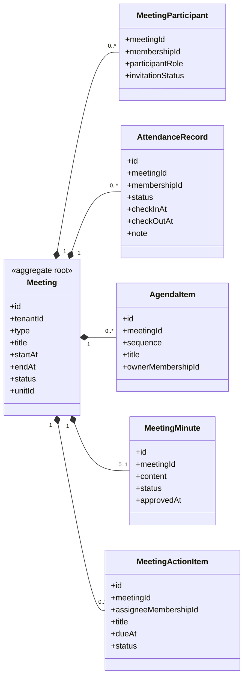

# UC-MEETING — Quản lý cuộc họp, sự kiện và chuyên cần

## 1. Phạm vi

Mô hình hóa buổi họp/sự kiện, người tham gia, chuyên cần, chương trình, biên bản và công việc sau họp.

- **Trạng thái trong repository hiện tại:** **Planned**
- **Loại sơ đồ:** UML Class Diagram ở mức miền nghiệp vụ.
- **Nguyên tắc:** các lớp nghiệp vụ thuộc tenant phải bảo toàn `tenantId` hoặc quan hệ sở hữu tương đương.

## 2. Class Diagram

## 3. Danh mục lớp

| Lớp | Loại | Trách nhiệm |
|---|---|---|
| `Meeting` | Aggregate root | Buổi họp, sinh hoạt hoặc sự kiện. |
| `MeetingParticipant` | Association entity | Danh sách được mời và vai trò tham dự. |
| `AttendanceRecord` | Entity | Trạng thái chuyên cần của từng membership. |
| `AgendaItem` | Entity | Nội dung theo thứ tự. |
| `MeetingMinute` | Entity | Biên bản và trạng thái xác nhận. |
| `MeetingActionItem` | Entity | Nhiệm vụ sau cuộc họp. |

## 4. Bất biến nghiệp vụ

1. Attendance chỉ được ghi cho participant hoặc đối tượng được chính sách cho phép.
2. Meeting và participant phải cùng tenant.
3. Thời gian kết thúc không trước thời gian bắt đầu.
4. Biên bản đã phê duyệt phải được version hóa khi chỉnh sửa.
5. Đồng bộ chuyên cần sang kỷ luật phải idempotent.

## 5. Ánh xạ với repository hiện tại

Chưa có model Meeting hoặc Attendance trong Prisma schema hiện tại.
