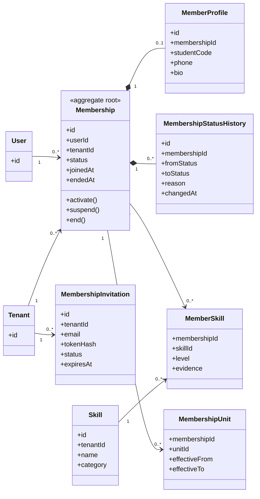

# UC-MEMBER — Quản lý thành viên

## 1. Phạm vi

Mô hình hóa vòng đời membership, lời mời tham gia, hồ sơ thành viên, đơn vị, kỹ năng và lịch sử trạng thái.

- **Trạng thái trong repository hiện tại:** **Partial**
- **Loại sơ đồ:** UML Class Diagram ở mức miền nghiệp vụ.
- **Nguyên tắc:** các lớp nghiệp vụ thuộc tenant phải bảo toàn `tenantId` hoặc quan hệ sở hữu tương đương.

## 2. Class Diagram

## 3. Danh mục lớp

| Lớp | Loại | Trách nhiệm |
|---|---|---|
| `Membership` | Aggregate root | Quan hệ User–Tenant và vòng đời tham gia. |
| `MembershipInvitation` | Entity | Lời mời chưa được chấp nhận. |
| `MemberProfile` | Entity | Hồ sơ nghiệp vụ trong tổ chức. |
| `MembershipStatusHistory` | Entity | Truy vết thay đổi trạng thái. |
| `Skill` | Reference entity | Danh mục kỹ năng theo tenant. |
| `MemberSkill` | Association entity | Mức độ và minh chứng kỹ năng. |

## 4. Bất biến nghiệp vụ

1. Mỗi cặp User–Tenant chỉ có một membership hiện hành.
2. Chỉ membership `ACTIVE` được thực hiện nghiệp vụ.
3. Kết thúc membership không xóa lịch sử nghiệp vụ.
4. Không được đình chỉ hoặc kết thúc Owner cuối cùng.
5. MembershipUnit và Skill phải thuộc cùng tenant với Membership.

## 5. Ánh xạ với repository hiện tại

`Membership` và `MemberProfile` đã tồn tại. Skills đang lưu bằng mảng chuỗi; chưa có invitation, history, skill catalog và multi-unit association.
