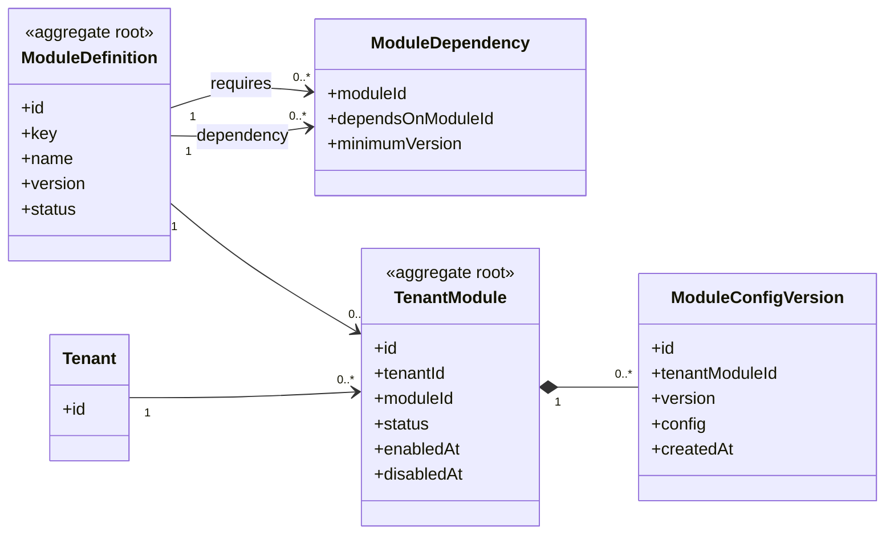

# UC-MODULE — Cấu hình mô-đun và phụ thuộc

## 1. Phạm vi

Mô hình hóa danh mục mô-đun nền tảng, phụ thuộc giữa mô-đun, trạng thái kích hoạt theo tenant và phiên bản cấu hình.

- **Trạng thái trong repository hiện tại:** **Partial**
- **Loại sơ đồ:** UML Class Diagram ở mức miền nghiệp vụ.
- **Nguyên tắc:** các lớp nghiệp vụ thuộc tenant phải bảo toàn `tenantId` hoặc quan hệ sở hữu tương đương.

## 2. Class Diagram

## 3. Danh mục lớp

| Lớp | Loại | Trách nhiệm |
|---|---|---|
| `ModuleDefinition` | Aggregate root | Catalog mô-đun do nền tảng quản lý. |
| `ModuleDependency` | Association entity | Khai báo phụ thuộc và phiên bản tối thiểu. |
| `TenantModule` | Aggregate root | Trạng thái mô-đun trong một tenant. |
| `ModuleConfigVersion` | Entity | Phiên bản cấu hình mô-đun. |

## 4. Bất biến nghiệp vụ

1. Bật hoặc tắt mô-đun ở tenant A không ảnh hưởng tenant B.
2. Không tắt mô-đun nền khi mô-đun phụ thuộc còn hoạt động.
3. Tắt mô-đun không xóa dữ liệu đã phát sinh.
4. Backend phải chặn endpoint của mô-đun bị tắt.
5. Module key phải xuất phát từ catalog, không dùng chuỗi tùy ý.

## 5. Ánh xạ với repository hiện tại

`TenantModule` đã tồn tại nhưng `key` là chuỗi tự do; chưa có catalog, dependency và versioned config.
