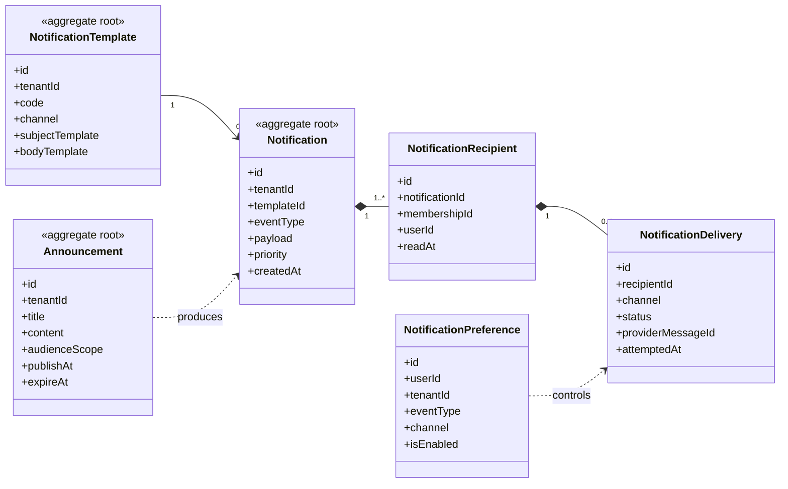

# UC-NOTIFICATION — Quản lý thông báo và truyền thông nội bộ

## 1. Phạm vi

Mô hình hóa thông báo, mẫu nội dung, đối tượng nhận, từng lần gửi, tùy chọn kênh và thông báo bắt buộc.

- **Trạng thái trong repository hiện tại:** **Planned**
- **Loại sơ đồ:** UML Class Diagram ở mức miền nghiệp vụ.
- **Nguyên tắc:** các lớp nghiệp vụ thuộc tenant phải bảo toàn `tenantId` hoặc quan hệ sở hữu tương đương.

## 2. Class Diagram

## 3. Danh mục lớp

| Lớp | Loại | Trách nhiệm |
|---|---|---|
| `NotificationTemplate` | Aggregate root | Mẫu nội dung theo tenant và kênh. |
| `Notification` | Aggregate root | Thông điệp phát sinh từ sự kiện. |
| `NotificationRecipient` | Entity | Người nhận và trạng thái đọc. |
| `NotificationDelivery` | Entity | Lần gửi qua email, SMS hoặc push. |
| `NotificationPreference` | Entity | Tùy chọn nhận theo loại sự kiện. |
| `Announcement` | Aggregate root | Thông báo nội bộ có phạm vi người xem. |

## 4. Bất biến nghiệp vụ

1. Không gửi dữ liệu tenant A cho người nhận tenant B.
2. Retry delivery phải idempotent.
3. Thông báo bảo mật bắt buộc không bị vô hiệu hóa bởi preference.
4. Template và payload phải được kiểm tra trước khi gửi.
5. Announcement hết hạn không hiển thị như nội dung hiện hành.

## 5. Ánh xạ với repository hiện tại

Chưa có model Notification trong Prisma schema hiện tại.
