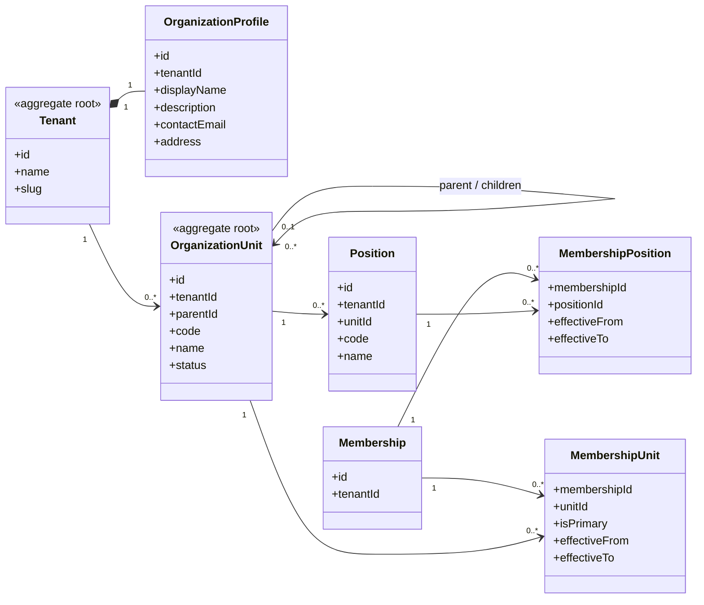

# UC-ORG — Quản lý thông tin và cơ cấu tổ chức

## 1. Phạm vi

Mô hình hóa hồ sơ tổ chức, cây đơn vị, chức vụ và quan hệ thành viên–đơn vị theo thời gian.

- **Trạng thái trong repository hiện tại:** **Partial**
- **Loại sơ đồ:** UML Class Diagram ở mức miền nghiệp vụ.
- **Nguyên tắc:** các lớp nghiệp vụ thuộc tenant phải bảo toàn `tenantId` hoặc quan hệ sở hữu tương đương.

## 2. Class Diagram

## 3. Danh mục lớp

| Lớp | Loại | Trách nhiệm |
|---|---|---|
| `OrganizationProfile` | Entity | Thông tin mô tả và liên hệ của tổ chức. |
| `OrganizationUnit` | Aggregate root | Ban, phòng, tổ, đội hoặc nhóm dự án. |
| `Position` | Entity | Chức vụ gắn với đơn vị. |
| `MembershipUnit` | Association entity | Quan hệ thành viên–đơn vị theo thời gian. |
| `MembershipPosition` | Association entity | Chức vụ của thành viên theo thời gian. |

## 4. Bất biến nghiệp vụ

1. Đơn vị cha và con phải thuộc cùng tenant.
2. Cây cơ cấu không được tạo vòng lặp.
3. Đơn vị có dữ liệu liên quan không bị xóa vật lý trực tiếp.
4. Một membership có thể thuộc nhiều đơn vị nếu chính sách cho phép.
5. Tên ban hoặc chức vụ riêng của MTEC không được mã hóa thành mặc định bắt buộc.

## 5. Ánh xạ với repository hiện tại

`Unit` đã tồn tại nhưng `MemberProfile.unitId` chỉ hỗ trợ một đơn vị. Chưa có `Position`, lịch sử và association nhiều–nhiều.
