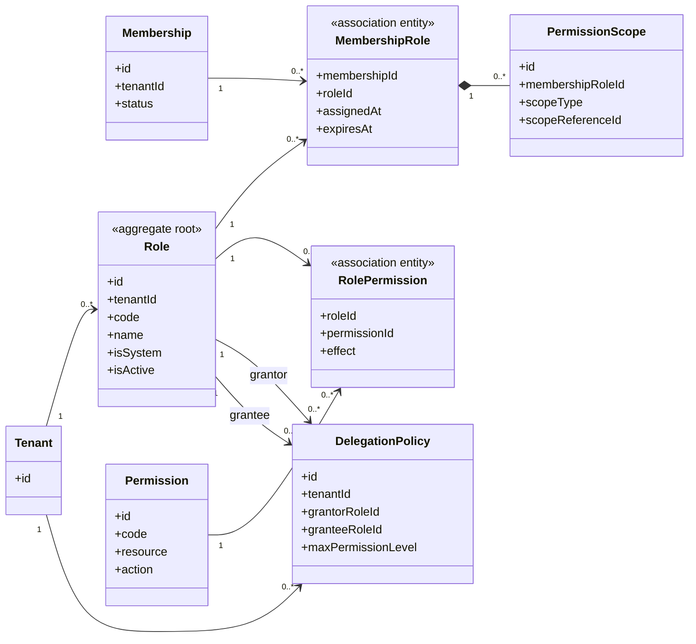

# UC-RBAC — Quản lý vai trò và phân quyền

## 1. Phạm vi

Mô hình hóa role theo tenant, permission dùng chung, gán role cho membership, phạm vi quyền và chính sách ủy quyền.

- **Trạng thái trong repository hiện tại:** **Partial**
- **Loại sơ đồ:** UML Class Diagram ở mức miền nghiệp vụ.
- **Nguyên tắc:** các lớp nghiệp vụ thuộc tenant phải bảo toàn `tenantId` hoặc quan hệ sở hữu tương đương.

## 2. Class Diagram

## 3. Danh mục lớp

| Lớp | Loại | Trách nhiệm |
|---|---|---|
| `Role` | Aggregate root | Tập quyền có tên trong một tenant. |
| `Permission` | Reference entity | Hành động trên tài nguyên. |
| `RolePermission` | Association entity | Liên kết role và permission. |
| `MembershipRole` | Association entity | Gán role cho membership. |
| `PermissionScope` | Entity | Giới hạn quyền theo đơn vị hoặc tài nguyên. |
| `DelegationPolicy` | Policy entity | Giới hạn quyền có thể ủy quyền. |

## 4. Bất biến nghiệp vụ

1. Role tenant A không được gán cho Membership tenant B.
2. Người dùng không được tự nâng quyền.
3. Có permission nhưng membership hoặc module không hợp lệ thì vẫn bị từ chối.
4. Quyền xem, tạo, cập nhật, xóa, phê duyệt và xuất dữ liệu là độc lập.
5. Platform role không thay thế role nội bộ tenant.

## 5. Ánh xạ với repository hiện tại

`Role`, `Permission`, `RolePermission`, `MembershipRole` đã tồn tại. Chưa có scope, thời hạn role và delegation policy.
