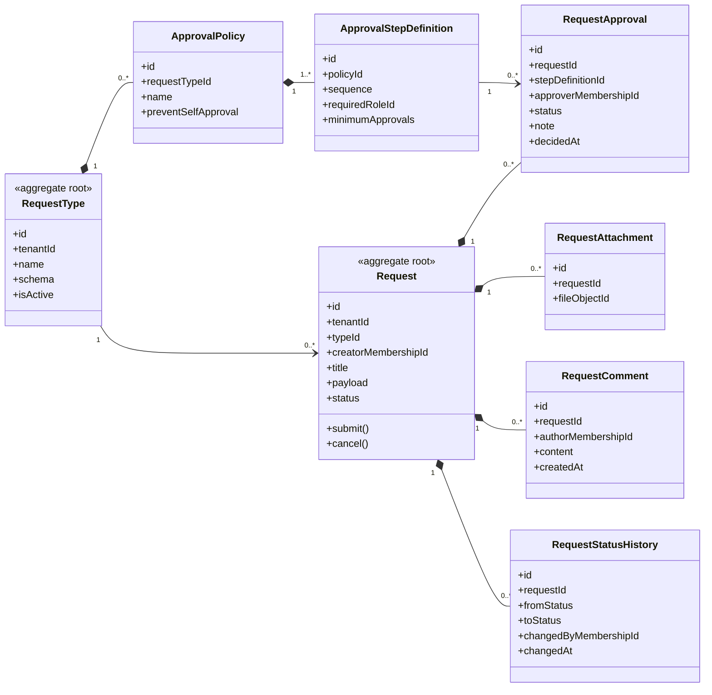

# UC-REQUEST — Quản lý đơn từ và yêu cầu nội bộ

## 1. Phạm vi

Mô hình hóa loại yêu cầu động, dữ liệu yêu cầu, file đính kèm, workflow phê duyệt nhiều bước, bình luận và lịch sử trạng thái.

- **Trạng thái trong repository hiện tại:** **Partial**
- **Loại sơ đồ:** UML Class Diagram ở mức miền nghiệp vụ.
- **Nguyên tắc:** các lớp nghiệp vụ thuộc tenant phải bảo toàn `tenantId` hoặc quan hệ sở hữu tương đương.

## 2. Class Diagram

## 3. Danh mục lớp

| Lớp | Loại | Trách nhiệm |
|---|---|---|
| `RequestType` | Aggregate root | Cấu hình form và workflow theo loại yêu cầu. |
| `ApprovalPolicy` | Entity | Chính sách phê duyệt của loại yêu cầu. |
| `ApprovalStepDefinition` | Entity | Bước duyệt, thứ tự và vai trò yêu cầu. |
| `Request` | Aggregate root | Yêu cầu nghiệp vụ và chuyển trạng thái. |
| `RequestApproval` | Entity | Quyết định của người duyệt tại một bước. |
| `RequestStatusHistory` | Entity | Lịch sử chuyển trạng thái. |

## 4. Bất biến nghiệp vụ

1. Request và mọi bước phê duyệt phải thuộc cùng tenant.
2. Không duyệt lại yêu cầu không còn ở trạng thái chờ.
3. Không tự phê duyệt khi policy bật phân tách trách nhiệm.
4. Thứ tự bước phải được tuân thủ.
5. Mọi chuyển trạng thái quan trọng phải được audit.

## 5. Ánh xạ với repository hiện tại

`RequestType`, `Request`, `RequestApproval` đã tồn tại. Chưa có policy, step sequence, attachment, comment và status history; creator hiện tham chiếu `User` thay vì `Membership`.
