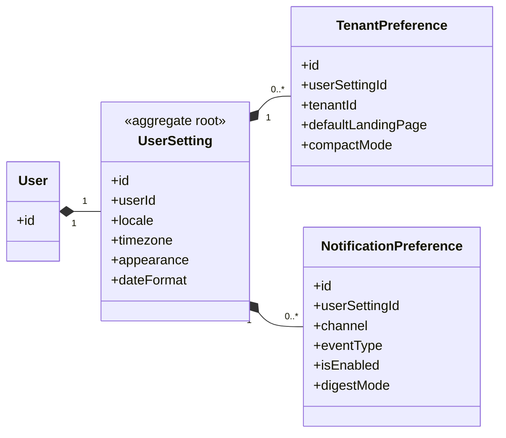

# UC-SETTING — Thiết lập cá nhân

## 1. Phạm vi

Mô hình hóa tùy chọn cá nhân, ngôn ngữ, múi giờ, giao diện và tùy chọn nhận thông báo.

- **Trạng thái trong repository hiện tại:** **Planned**
- **Loại sơ đồ:** UML Class Diagram ở mức miền nghiệp vụ.
- **Nguyên tắc:** các lớp nghiệp vụ thuộc tenant phải bảo toàn `tenantId` hoặc quan hệ sở hữu tương đương.

## 2. Class Diagram

## 3. Danh mục lớp

| Lớp | Loại | Trách nhiệm |
|---|---|---|
| `UserSetting` | Aggregate root | Thiết lập toàn nền tảng của người dùng. |
| `TenantPreference` | Entity | Tùy chọn riêng khi làm việc trong một tenant. |
| `NotificationPreference` | Entity | Bật/tắt kênh và loại thông báo. |

## 4. Bất biến nghiệp vụ

1. Thiết lập cá nhân không được làm thay đổi quyền.
2. Tenant preference chỉ áp dụng trong tenant tương ứng.
3. Tắt nhận thông báo không được chặn thông báo bắt buộc về bảo mật.
4. Locale và timezone phải có giá trị được nền tảng hỗ trợ.

## 5. Ánh xạ với repository hiện tại

Chưa có model thiết lập cá nhân trong Prisma schema hiện tại.
