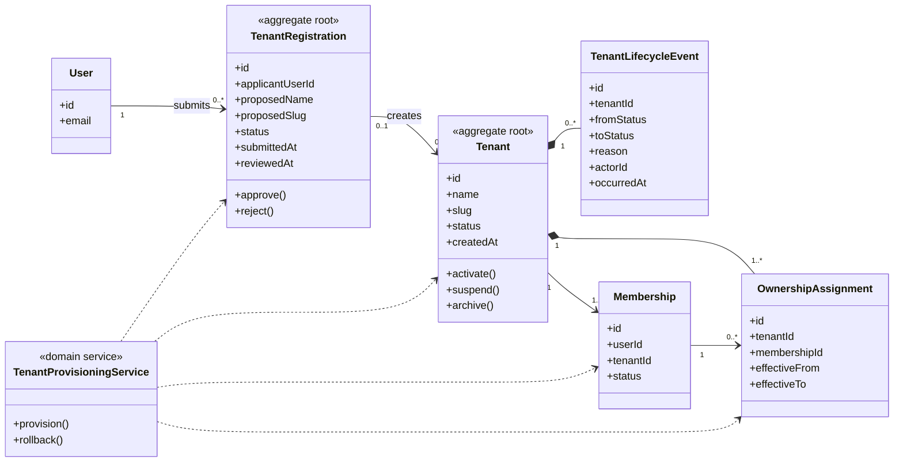

# UC-TENANT — Quản trị nền tảng SaaS và tenant

## 1. Phạm vi

Mô hình hóa đăng ký tổ chức, khởi tạo tenant, vòng đời tenant, chủ sở hữu ban đầu và lịch sử trạng thái.

- **Trạng thái trong repository hiện tại:** **Partial**
- **Loại sơ đồ:** UML Class Diagram ở mức miền nghiệp vụ.
- **Nguyên tắc:** các lớp nghiệp vụ thuộc tenant phải bảo toàn `tenantId` hoặc quan hệ sở hữu tương đương.

## 2. Class Diagram

## 3. Danh mục lớp

| Lớp | Loại | Trách nhiệm |
|---|---|---|
| `TenantRegistration` | Aggregate root | Quản lý yêu cầu đăng ký trước khi tenant được tạo. |
| `Tenant` | Aggregate root | Đại diện tổ chức và vòng đời sử dụng nền tảng. |
| `TenantLifecycleEvent` | Entity | Ghi lịch sử chuyển trạng thái tenant. |
| `OwnershipAssignment` | Entity | Theo dõi Owner có hiệu lực theo thời gian. |
| `TenantProvisioningService` | Domain service | Tạo tenant, membership và Owner trong một transaction. |

## 4. Bất biến nghiệp vụ

1. Slug phải duy nhất sau khi chuẩn hóa.
2. Khởi tạo Tenant, Membership và Owner là một đơn vị giao dịch thống nhất.
3. Tenant `ACTIVE` phải có ít nhất một Owner đang hoạt động.
4. Tạm khóa hoặc lưu trữ tenant không xóa dữ liệu.
5. Người đăng ký chỉ trở thành Owner sau khi provisioning hoàn tất.

## 5. Ánh xạ với repository hiện tại

`Tenant`, `Membership` đã tồn tại. `TenantRegistration`, `TenantLifecycleEvent`, `OwnershipAssignment` và provisioning transaction chưa được biểu diễn đầy đủ.
