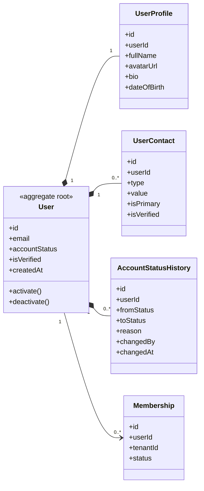

# UC-USER — Quản lý tài khoản người dùng

## 1. Phạm vi

Mô hình hóa tài khoản toàn nền tảng, hồ sơ cá nhân, thông tin liên hệ và lịch sử trạng thái tài khoản.

- **Trạng thái trong repository hiện tại:** **Partial**
- **Loại sơ đồ:** UML Class Diagram ở mức miền nghiệp vụ.
- **Nguyên tắc:** các lớp nghiệp vụ thuộc tenant phải bảo toàn `tenantId` hoặc quan hệ sở hữu tương đương.

## 2. Class Diagram

## 3. Danh mục lớp

| Lớp | Loại | Trách nhiệm |
|---|---|---|
| `User` | Aggregate root | Danh tính và trạng thái tài khoản toàn nền tảng. |
| `UserProfile` | Entity | Thông tin mô tả không dùng trực tiếp cho xác thực. |
| `UserContact` | Entity | Email, điện thoại hoặc kênh liên hệ có thể xác minh. |
| `AccountStatusHistory` | Entity | Truy vết thay đổi trạng thái tài khoản. |

## 4. Bất biến nghiệp vụ

1. Email hoặc định danh đăng nhập phải duy nhất.
2. Trạng thái User độc lập với trạng thái Membership.
3. Thay đổi đặc quyền không được thực hiện qua cập nhật hồ sơ thông thường.
4. Vô hiệu hóa User phải chặn tất cả phiên hoạt động.

## 5. Ánh xạ với repository hiện tại

`User` hiện gộp hồ sơ cơ bản và thông tin xác thực. Chưa có `UserProfile`, `UserContact` và lịch sử trạng thái riêng.
