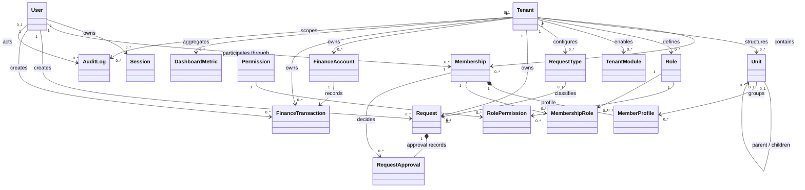
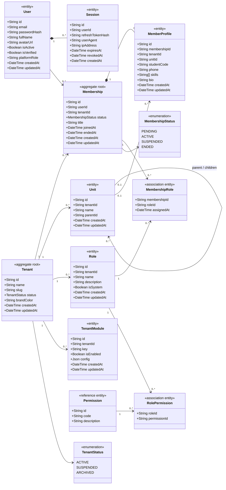
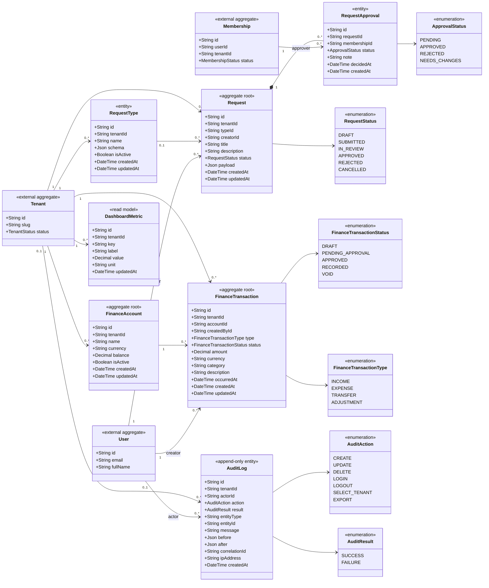

# Class Diagram — Operations Hub

## 1. Mục đích và phạm vi

Tài liệu này mô tả **mô hình lớp miền đang được hiện thực** trong repository `operations-hub`.

Nguồn đối chiếu chính:

- `apps/api/prisma/schema.prisma`: các entity, thuộc tính, enum và quan hệ dữ liệu.
- `apps/api/src/app.module.ts`: các module nghiệp vụ đang được nạp trong NestJS.

Phạm vi hiện tại gồm:

- Xác thực và phiên đăng nhập.
- Tenant, cơ cấu tổ chức và cấu hình mô-đun.
- Membership, hồ sơ thành viên và RBAC.
- Yêu cầu, quy trình phê duyệt.
- Tài chính.
- Dashboard và audit log.

> **Lưu ý:** Đây là sơ đồ **as-is** của mã nguồn hiện tại, không khẳng định toàn bộ 21 nhóm Use Case đã được hiện thực. Các mô-đun chưa tồn tại trong Prisma schema phải được xem là phạm vi mở rộng.

---

## 2. Sơ đồ quan hệ lớp tổng quát

---

## 3. Chi tiết lớp nền tảng, tổ chức và RBAC

### Ràng buộc dữ liệu chính

| Ràng buộc | Biểu diễn hiện tại |
|---|---|
| Email người dùng duy nhất toàn nền tảng | `User.email @unique` |
| Slug tenant duy nhất toàn nền tảng | `Tenant.slug @unique` |
| Một User chỉ có một Membership trong một Tenant | `@@unique([userId, tenantId])` |
| Tên Role duy nhất trong Tenant | `@@unique([tenantId, name])` |
| Một cấu hình mô-đun duy nhất theo Tenant và key | `@@unique([tenantId, key])` |
| Một Membership có tối đa một MemberProfile | `MemberProfile.membershipId @unique` |
| Role–Permission là quan hệ nhiều-nhiều | `RolePermission` |
| Membership–Role là quan hệ nhiều-nhiều | `MembershipRole` |

---

## 4. Chi tiết lớp yêu cầu, tài chính, dashboard và audit

### Ràng buộc dữ liệu chính

| Ràng buộc | Biểu diễn hiện tại |
|---|---|
| Tên loại yêu cầu duy nhất trong Tenant | `RequestType @@unique([tenantId, name])` |
| Truy vấn Request được tối ưu theo Tenant và trạng thái | `Request @@index([tenantId, status])` |
| Tên tài khoản tài chính duy nhất trong Tenant | `FinanceAccount @@unique([tenantId, name])` |
| Truy vấn giao dịch được tối ưu theo Tenant và trạng thái | `FinanceTransaction @@index([tenantId, status])` |
| Metric dashboard duy nhất theo Tenant và key | `DashboardMetric @@unique([tenantId, key])` |
| Audit log được đánh chỉ mục theo Tenant/người thực hiện và thời gian | Hai index trong `AuditLog` |

---

## 5. Bất biến nghiệp vụ mà sơ đồ phải bảo toàn

1. `User` là danh tính toàn nền tảng; quyền trong tổ chức phải đi qua `Membership`.
2. Mọi dữ liệu nghiệp vụ phải xác định được tenant sở hữu.
3. `Role` của tenant chỉ được gán cho `Membership` thuộc cùng tenant.
4. Tenant bị tạm khóa không đồng nghĩa dữ liệu tenant bị xóa.
5. Membership không hoạt động không được tạo, cập nhật hoặc phê duyệt dữ liệu nghiệp vụ.
6. Việc có `Permission` chưa đủ; quyền hiệu lực còn phụ thuộc tenant, membership, module và phạm vi tài nguyên.
7. Các thao tác quản trị quan trọng phải tạo `AuditLog` và duy trì `correlationId` khi thuộc cùng một luồng xử lý.
8. Tenant đang hoạt động phải có ít nhất một Owner đang hoạt động; ràng buộc này hiện cần được kiểm tra tại service/transaction layer.

---

## 6. Ánh xạ sang module NestJS hiện tại

| Nhóm lớp | Module |
|---|---|
| `User`, `Session` | `AuthModule`, `UsersModule` |
| `Tenant`, `TenantModule`, `Unit` | `TenantsModule`, `ModulesModule` |
| `Membership`, `MemberProfile` | `MembersModule` |
| `Role`, `Permission`, các association entity | `RbacModule` |
| `RequestType`, `Request`, `RequestApproval` | `RequestsModule` |
| `FinanceAccount`, `FinanceTransaction` | `FinanceModule` |
| `DashboardMetric` | `DashboardModule` |
| `AuditLog` | `AuditModule` |
| Kiểm tra xác thực, tenant, module và permission | `JwtAuthGuard`, `TenantGuard`, `ModuleGuard`, `PermissionGuard` |

---

## 7. Các khoảng trống thiết kế phát hiện từ class model hiện tại

Các điểm dưới đây chưa đồng nghĩa mã nguồn đang lỗi, nhưng là rủi ro cần xử lý trước khi mở rộng nền tảng.

| Mức độ | Khoảng trống | Hệ quả | Hướng xử lý đề xuất |
|---|---|---|---|
| Critical | `Request.creatorId` và `FinanceTransaction.createdById` tham chiếu `User`, không tham chiếu `Membership` | Không lưu trực tiếp tư cách và phạm vi của người tạo trong tenant tại thời điểm nghiệp vụ | Dùng `creatorMembershipId` hoặc lưu đồng thời `actorMembershipId` |
| Critical | Các quan hệ có `tenantId` lặp lại nhưng chưa có ràng buộc DB bảo đảm cùng tenant | Có thể tạo quan hệ chéo tenant nếu service bỏ sót kiểm tra | Dùng khóa ghép/composite relation hoặc validation transaction bắt buộc |
| Critical | Bất biến “tenant hoạt động phải có Owner” không được biểu diễn trong schema | Có thể vô hiệu hóa hoặc gỡ Owner cuối cùng nếu service xử lý thiếu | Đóng gói thay đổi role/membership trong transaction và kiểm tra Owner cuối cùng |
| High | `TenantStatus` thiếu `PENDING` và `REJECTED` theo vòng đời đăng ký đã phân tích | Quy trình đăng ký tenant chưa có trạng thái độc lập rõ ràng | Bổ sung `TenantRegistration` hoặc mở rộng state model |
| High | Branding chỉ có `brandColor` trong `Tenant` | Không biểu diễn logo, favicon, theme, tên hiển thị và phiên bản cấu hình | Tách `TenantBranding` thành entity 1–1 với Tenant |
| High | `TenantModule.key` là chuỗi tự do; chưa có catalog và quan hệ phụ thuộc mô-đun | Sai key, khó quản lý dependency và metadata mô-đun | Thêm `ModuleDefinition` và `ModuleDependency` |
| High | `MemberProfile.unitId` chỉ hỗ trợ một đơn vị | Không đáp ứng trường hợp thành viên kiêm nhiệm nhiều ban/nhóm | Dùng association entity `MembershipUnit` |
| High | `RequestApproval` chưa có thứ tự bước, chính sách và nguyên tắc phân tách trách nhiệm | Khó hiện thực workflow nhiều cấp và chặn tự phê duyệt | Thêm `ApprovalPolicy`, `ApprovalStep`, `sequence` và `requiredRoleId` |
| Medium | `AuditLog.actorId` chỉ tham chiếu `User` | Không xác định trực tiếp membership/role/ngữ cảnh actor tại thời điểm hành động | Bổ sung `actorMembershipId` và snapshot vai trò/phạm vi cần thiết |
| Medium | `FinanceAccount.balance` là giá trị lưu trực tiếp | Có nguy cơ lệch với tổng giao dịch nếu cập nhật không nguyên tử | Dùng ledger làm nguồn sự thật hoặc cập nhật balance trong transaction có kiểm soát |

---

## 8. Quy tắc cập nhật tài liệu

Khi thay đổi `schema.prisma`, pull request phải kiểm tra và cập nhật tài liệu này nếu thay đổi một trong các nội dung sau:

- Thêm, xóa hoặc đổi tên model.
- Thay đổi quan hệ hoặc multiplicity.
- Thêm trạng thái enum.
- Thay đổi khóa duy nhất hoặc tenant ownership.
- Thay đổi actor của Request, Finance hoặc Audit.
- Thêm module nghiệp vụ mới vào `AppModule`.
