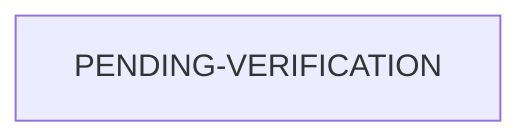

> Đặc tả nhóm Use Case `UC-TENANT`

#UC-TENANT
# 1. Định nghĩa nhóm `UC-TENANT`

`UC-TENANT` là một nhóm Use Case quản trị vòng đời tenant trên nền tảng #SaaS.
Đặc tả hệ thống:
- Tenant là một không gian sử dụng độc lậ của một tổ chức sinh viên.
- Một tenant sở hữu dữ liệu, thành viên, cơ cấu, vai trò, branding, module và cấu hình nghiệp vụ riêng.
- Một tài khoản người dùng có thể tham gia một hoặc nhiều tenant
- Mọi thao tác nghiệp vụ phải được thực hiện trong một `tenant context` hợp lệ.

# 2. Thông tin tổng quát

| Fields              | Descriptions                                                                                                                    |
| ------------------- | ------------------------------------------------------------------------------------------------------------------------------- |
| Mã nhóm             | `UC-TENANT`                                                                                                                     |
| Tên nhóm            | Quản trị nền tảng SaaS và tenant                                                                                                |
| Mục tiêuu           | Cho phép tổ chức đăng ký, khởi tạo, vận hành, tạm ngừng và chấm dứt không gian sử dụng độc lập trên Operations Hub              |
| Phạm vi             | Vòng đời tenant, thành viên tenant, quản trị viên tenant, tenant context, module, gói dịch vụ, usage, domain và dữ liệu tenant. |
| Tác nhân chính      | Khách đăng ký (Visitor), Platform Administrator, Tenant Owner, Tenant Administrator                                             |
| Tác nhân phụ        | Người dùng đã đăng ký, dịch vụ email, hệ thống xác thực, hệ thống lưu trữ, hệ thống thanh toán                                  |
| Điều kiện chung     | Nền tảng đang hoạt động; các dịch vụ xác thực và cơ sở dữ liệu khả dụng                                                         |
| Hai điều kiện chung | Mọi thay đổi tenant được lưu, kiểm tra quyền và ghi audit log                                                                   |
| Mức ưu tiên nhóm    | MUST                                                                                                                            |
| Use Case liên quan  | `UC-AUTH`, `UC-USER`, `UC-RBAC`, `UC-ORG`, `UC-BRAND`, `UC-MODULE`, `UC-NOTIFICATION`, `UC-AUDIT`                               |

# Trạng thái tenant

# Danh mục Use Case con
|Mã|Tên Use Case|Tác nhân chính|Ưu tiên|
|---|---|---|---|
|`UC-TENANT-01`|Đăng ký và khởi tạo tenant mới|Visitor, Platform User|Must|
|`UC-TENANT-02`|Cập nhật thông tin tenant|Tenant Owner, Tenant Administrator|Must|
|`UC-TENANT-03`|Gán và chuyển quyền quản trị tenant|Tenant Owner|Must|
|`UC-TENANT-04`|Mời và quản lý thành viên tenant|Tenant Administrator|Must|
|`UC-TENANT-05`|Xác định tenant context hiện hành|Hệ thống, Platform User|Must|
|`UC-TENANT-06`|Chuyển đổi tenant hiện hành|Platform User|Should|
|`UC-TENANT-07`|Tạm ngừng và kích hoạt lại tenant|Platform Administrator, Tenant Owner|Must|
|`UC-TENANT-08`|Cấu hình module cho tenant|Tenant Administrator, Platform Administrator|Must|
|`UC-TENANT-09`|Theo dõi usage và quota|Tenant Owner, Platform Administrator|Should|
|`UC-TENANT-10`|Xuất, sao lưu và phục hồi dữ liệu tenant|Tenant Owner, Platform Administrator|Should|
|`UC-TENANT-11`|Quản lý gói dịch vụ|Platform Administrator, Tenant Owner|Could|
|`UC-TENANT-12`|Quản lý đăng ký và thanh toán SaaS|Tenant Owner|Could|
|`UC-TENANT-13`|Quản lý domain riêng|Tenant Owner, Tenant Administrator|Could|
|`UC-TENANT-14`|Đóng và xóa tenant|Tenant Owner, Platform Administrator|Should|

## Đặc tả chi tiết

