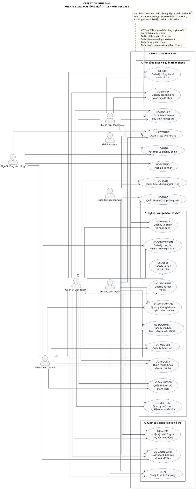

```plantuml
@startuml Operations_Hub_21_UseCase_Groups

title OPERATIONS HUB SaaS\nUSE CASE DIAGRAM TỔNG QUÁT — 21 NHÓM USE CASE

left to right direction

skinparam shadowing false
skinparam packageStyle rectangle
skinparam actorStyle awesome
skinparam linetype ortho
skinparam ArrowColor #4B5563
skinparam ActorBorderColor #1F2937
skinparam ActorFontColor #111827
skinparam UsecaseBorderColor #374151
skinparam UsecaseFontColor #111827
skinparam UsecaseBackgroundColor #F9FAFB
skinparam PackageBorderColor #6B7280
skinparam PackageFontColor #111827
skinparam PackageBackgroundColor #FFFFFF
skinparam NoteBorderColor #9CA3AF
skinparam NoteBackgroundColor #FFFDF5

actor "Khách truy cập" as Visitor
actor "Người dùng nền tảng" as PlatformUser
actor "Thành viên tenant" as TenantMember
actor "Quản trị viên tenant" as TenantAdmin
actor "Chủ sở hữu tenant" as TenantOwner
actor "Quản trị viên nền tảng" as PlatformAdmin
actor "Dịch vụ bên ngoài" as ExternalService

PlatformUser <|-- TenantMember
TenantMember <|-- TenantAdmin
TenantAdmin <|-- TenantOwner

rectangle "OPERATIONS HUB SaaS" as SystemBoundary {

  package "A. Nền tảng SaaS và quản trị hệ thống" {

    usecase "UC-TENANT\nQuản trị SaaS và tenant" as UC_TENANT
    usecase "UC-AUTH\nXác thực và quản lý phiên" as UC_AUTH
    usecase "UC-USER\nQuản lý tài khoản người dùng" as UC_USER
    usecase "UC-RBAC\nQuản lý vai trò và phân quyền" as UC_RBAC
    usecase "UC-ORG\nQuản lý thông tin và\ncơ cấu tổ chức" as UC_ORG
    usecase "UC-BRAND\nQuản lý branding và\ngiao diện tổ chức" as UC_BRAND
    usecase "UC-MODULE\nCấu hình module và\nquy trình nghiệp vụ" as UC_MODULE
    usecase "UC-SETTING\nThiết lập cá nhân" as UC_SETTING
  }

  package "B. Nghiệp vụ vận hành tổ chức" {

    usecase "UC-MEMBER\nQuản lý thành viên" as UC_MEMBER
    usecase "UC-REQUEST\nQuản lý đơn từ và\nyêu cầu nội bộ" as UC_REQUEST
    usecase "UC-DOCUMENT\nQuản lý văn bản,\nbiểu mẫu và mẫu tài liệu" as UC_DOCUMENT
    usecase "UC-FINANCE\nQuản lý tài chính\nvà ngân sách" as UC_FINANCE
    usecase "UC-ASSET\nQuản lý tài sản\nvà hậu cần" as UC_ASSET
    usecase "UC-MEETING\nQuản lý cuộc họp,\nsự kiện và chuyên cần" as UC_MEETING
    usecase "UC-DISCIPLINE\nQuản lý kỷ luật\nvà KPI" as UC_DISCIPLINE
    usecase "UC-EVALUATION\nQuản lý đánh giá\nthành viên" as UC_EVALUATION
    usecase "UC-COMPETITION\nQuản lý cuộc thi,\nthành tích và ghi nhận" as UC_COMPETITION
    usecase "UC-NOTIFICATION\nQuản lý thông báo và\ntruyền thông nội bộ" as UC_NOTIFICATION
  }

  package "C. Giám sát, phân tích và hỗ trợ" {

    usecase "UC-DASHBOARD\nDashboard, báo cáo\nvà xuất dữ liệu" as UC_DASHBOARD
    usecase "UC-AI\nTrợ lý AI và AI Gateway" as UC_AI
    usecase "UC-AUDIT\nNhật ký hệ thống và\ntruy vết hoạt động" as UC_AUDIT
  }
}

' Khách truy cập
Visitor --> UC_AUTH
Visitor --> UC_TENANT

' Người dùng nền tảng
PlatformUser --> UC_AUTH
PlatformUser --> UC_SETTING
PlatformUser --> UC_TENANT

' Thành viên tenant
TenantMember --> UC_MEMBER
TenantMember --> UC_REQUEST
TenantMember --> UC_DOCUMENT
TenantMember --> UC_MEETING
TenantMember --> UC_EVALUATION
TenantMember --> UC_COMPETITION
TenantMember --> UC_NOTIFICATION
TenantMember --> UC_DASHBOARD

' Quản trị viên tenant
TenantAdmin --> UC_USER
TenantAdmin --> UC_RBAC
TenantAdmin --> UC_ORG
TenantAdmin --> UC_BRAND
TenantAdmin --> UC_MODULE
TenantAdmin --> UC_MEMBER
TenantAdmin --> UC_REQUEST
TenantAdmin --> UC_DOCUMENT
TenantAdmin --> UC_FINANCE
TenantAdmin --> UC_ASSET
TenantAdmin --> UC_MEETING
TenantAdmin --> UC_DISCIPLINE
TenantAdmin --> UC_EVALUATION
TenantAdmin --> UC_COMPETITION
TenantAdmin --> UC_NOTIFICATION
TenantAdmin --> UC_DASHBOARD
TenantAdmin --> UC_AI
TenantAdmin --> UC_AUDIT

' Chủ sở hữu tenant
TenantOwner --> UC_TENANT
TenantOwner --> UC_ORG
TenantOwner --> UC_BRAND
TenantOwner --> UC_MODULE
TenantOwner --> UC_FINANCE
TenantOwner --> UC_DASHBOARD
TenantOwner --> UC_AUDIT

' Quản trị viên nền tảng
PlatformAdmin --> UC_TENANT
PlatformAdmin --> UC_USER
PlatformAdmin --> UC_RBAC
PlatformAdmin --> UC_MODULE
PlatformAdmin --> UC_DASHBOARD
PlatformAdmin --> UC_AI
PlatformAdmin --> UC_AUDIT

' Dịch vụ tích hợp
ExternalService --> UC_AUTH
ExternalService --> UC_TENANT
ExternalService --> UC_DOCUMENT
ExternalService --> UC_NOTIFICATION
ExternalService --> UC_AI

note bottom of UC_TENANT
UC-TENANT là nhóm chức năng xuyên suốt:
- Xác định tenant context
- Cô lập dữ liệu giữa các tenant
- Quản lý membership theo tenant
- Quản lý vòng đời tenant
- Quản lý gói, quota và trạng thái sử dụng
end note

note bottom of SystemBoundary
Mọi nhóm Use Case có dữ liệu nghiệp vụ phải vận hành
trong tenant context hợp lệ và chịu kiểm soát RBAC,
audit log và cơ chế cô lập dữ liệu phía backend.
end note

@enduml
```